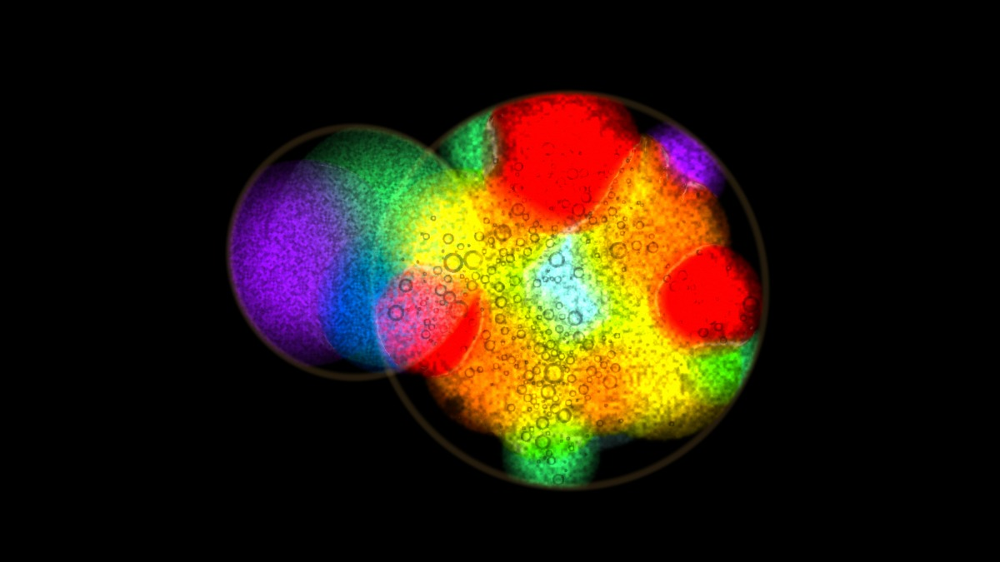
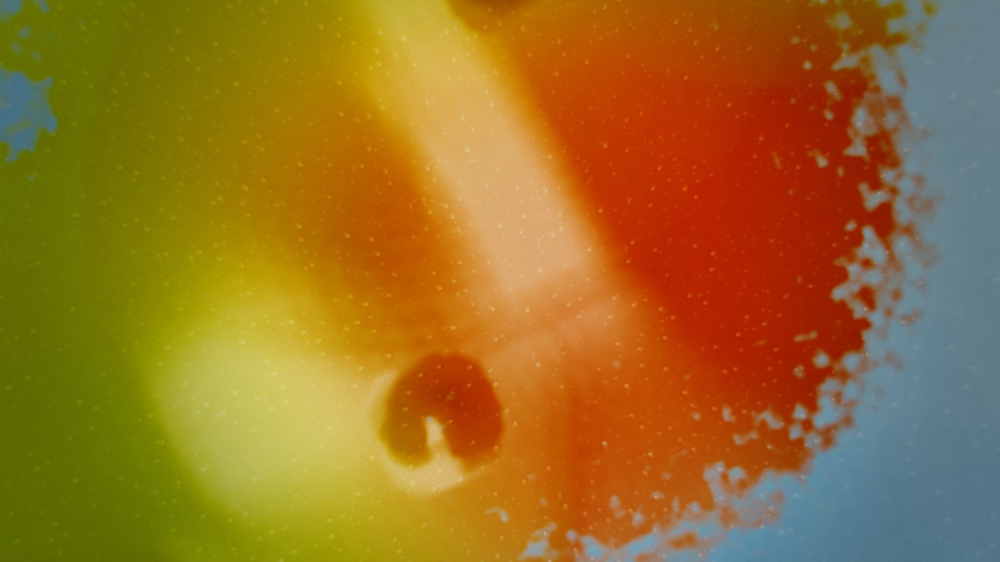
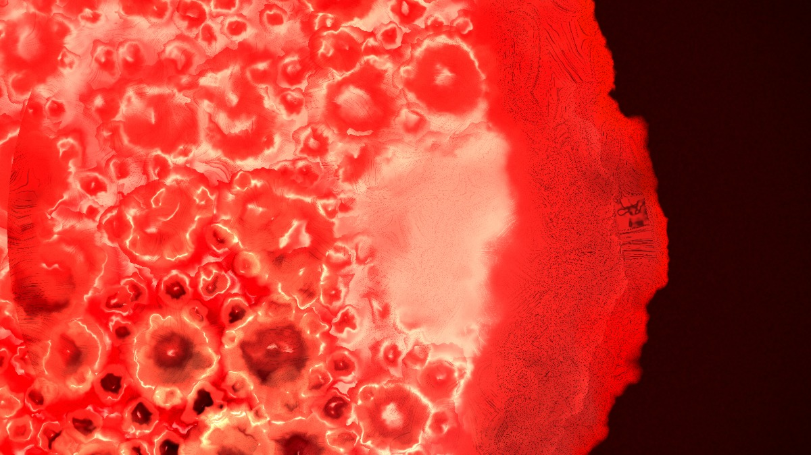
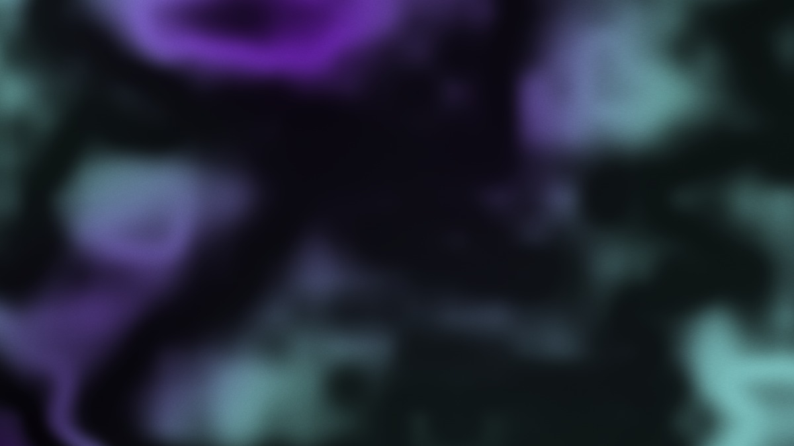

# ChromaGlass

A psychedelic liquid light show visualizer that reacts to your microphone or system audio in real time. Inspired by 1960s overhead projector light shows — colored oils squeezed between glass plates, heated from below, and projected onto a wall.

**[Open it →](https://chromaglass.web.app)** — it needs no microphone and no permission to show you what it is: a synthesised band plays itself into the show on your first click.

| | |
|---|---|
|  |  |
| *Fillmore East, 1969* — each layer its own dish on a black screen, pressed into a sunburst on every kick | *Oil on Water* — the photographic render: domes with dark menisci, satellite droplets, a camera pass with real depth of field |
|  |  |
| *Macro Bead* — a tracking camera chasing a single bead at high magnification | *Lumia* — Thomas Wilfred's slow folded sheets of light, under the plate |

Frames from the app itself, written by `npm run shots`. These were made on a
machine rasterising in software, so they undersell what a real GPU draws;
re-run it anywhere with a graphics card and they will be replaced with better
ones.

## Features

- **Real-time fluid simulation** — incompressible Navier-Stokes (Stam stable fluids) with squeeze-film flow, buoyancy, immiscibility and fingering instabilities; MacCormack advection keeps thin filaments alive
- **GPU solver with a frame-time governor** — the whole solve runs as WGSL compute passes on a 256–768² grid; a governor measures the real frame rate and what the GPU spent on it, and picks the largest grid and pixel density the machine holds at 60 fps (Settings → Simulation → Fluid Grid)
- **Audio-reactive** — Microphone or system audio drives fluid velocity, density, color, rotation, and bubbles via configurable mappings
- **Beats ahead of the microphone** — a phase-locked beat clock listens to the onsets, settles on the tempo, and once confident fires every kick a little before the onset would be heard, absorbing the real onset when it arrives; a breakdown or silence hands back to plain detection (Settings → Sound → Beat Prediction and Beat Lead)
- **A new song, a new look** — when a new song starts (heard as a gap of a few seconds between tracks, or named by track identification) the show switches to another preset or rolls a random look; Settings → Sound → On a New Song, with Keep to turn it off
- **Automatic room calibration** — learns the room's noise floor and dynamics, fits the analyser's dB window to it and normalises every band against its own range, so the same visuals read well in a quiet living room or a loud bar
- **Built-in presets** — Classic Light Show, Deep Ocean, Cyberpunk Neon, Lava Lamp, Acid Trip, Bass Drop, Timbre Shifter, Boiling Point, Microscopic Chaos, Lumia, Sensual Laboratory, Oil Wheel, Poster 1969, three photographs (Oil on Water, Colorful Cosmos, Sunny Side Up), and three macro closeups: Macro Bead, Cell Bloom, Lacing Run
- **Your presets and sequences as files** — save the current look as a plain JSON preset file (every setting named, plus the dyes the plate may use and how the automation injects), load anyone's preset file from a file chooser, and keep a library of your own presets apart from the built-ins, listed under *Yours* in the preset menu. Sequences save and load the same way, and a sequence file carries any of your presets its stages use, so it arrives whole. Either kind of file can be **made for a song** (title and artist, ISRC when known): a preset made for a song is applied whenever that song is identified, and a sequence made for a song starts when it is identified, at the right point in it, and stops when the song ends or the next one begins
- **Show Sequencer** — a script for how the show evolves over a song or a set instead of dice: stages that adopt a preset, glide chosen settings over a transition, open the palette from one dye to the full set, and hand over on a clock or when the song changes section. Three built-in sequences (Slow Build, Verse / Chorus, Set Journey), an editor for your own, and a transport on the phone
- **The photograph** — a second render style: a lit paper backdrop in two colours, dye as transmission over it, every drop a dome with a dark meniscus, a softbox crescent and a rim that catches the sky, hundreds of satellite droplets on the glass, interference colour where the oil runs thinnest; then a camera pass over the finished plate with real refraction through drops and bubbles, a focal plane with depth of field, bloom, chromatic aberration, a filmic roll-off, vignette and grain (Settings → Camera). Presets Oil on Water, Colorful Cosmos and Sunny Side Up
- **One lamp for everything** — a projector lamp under the plate that every material is lit from: bubbles shaded as lenses (dark rim toward the lamp, a caustic arc on the far side, the lamp's reflection on the lamp side, the plate magnified inside), dye rims bright toward the lamp and shadowed away from it, a hot-spot that falls away toward the rim, the lamp wandering and following the plate's rock, an optional second cooler lamp from the other side, and thin-film iridescence round bubble rims (Settings → Lamp & Light)
- **The show over minutes** — a hue journey that walks the preset's dyes one at a time (a set drifts its colours, never jumps), a rhythm plate pressed on every kick, a slower background loop on the plates behind the live one, a kaleidoscope mirror rig (2, 4, 6 or 8 folds, in Settings → Kaleidoscope) and the round edge of a projected dish (Settings → Show)
- **Multi-layer compositing** — Up to 5 independent fluid layers with configurable blend modes (screen, lighter, exclusion, multiply, overlay)
- **LED platform modes** — Simulated backlight with rainbow, ocean, fire, cyberpunk, or single-color conic gradients
- **Macro closeup** — a tracking camera magnifies the plate and chases a single bead of liquid, with synthesised paint cells, lacing filaments and shallow depth of field for extreme detail at high magnification
- **The room drives the plate** — a camera pointed at the floor is read back rather than shown: the movement in front of it stirs the liquid, everyone it can hold becomes a hand on the glass carrying a dye of their own, and any feature of the room — how busy, how many, how spread out, where, which way, how light, what colour — can ride any control, through the patch bay below (Settings → The Room and Settings → Patches; preset *Crowd Plate*)
- **A band in the box** — a synthesised kick, snare, hats, bass and pad in verses and choruses, played silently into the analyser so the show can be built and rehearsed with no microphone, no stereo and no permission
- **Interactive tools** — Dropper (add colored dye) and Blow (straw air bubbles) with touch support
- **Liquids that stay liquids** — the dropper's nine bottles are not nine colours. Water, oil, alcohol, ink and syrup put dye on the glass; **soap**, **milk**, **silicone** and **glycerine** also write themselves into a field the plate carries and keeps acting on for the next half-minute: soap breaks the film so colour runs away from it and curls into filaments, glycerine crawls where it lands while the plate flows past, milk holds its own edge instead of feathering out, silicone shoulders colour aside into a ring. Every preset names what is in its dish, and the automation pours from that — mostly water with a drop of soap now and then for *Classic Light Show*, nothing but soap and silicone for *Lacing Run*. Measured by `npm run liquids`
- **Automation mode** — Auto-generates dye drops and air bursts driven by audio energy
- **The wall, not the look** — rear-projection mirror, a four-corner keystone, feathered edge masks that stop the light before a face or a ceiling, and an output gain and gamma for the room. Kept on the machine rather than in the preset, because it describes the venue; measured by `npm run wall`
- **Three flashes a second, and no more** — a probe reads back what actually reached the screen and holds the whole field under the clinical limit for photosensitive seizures, by counting flashes rather than smoothing fast changes, so a single hard hit on a kick is untouched
- **A tempo you can hand it** — MIDI clock from the desk on the port the faders are already on, four taps, or a typed bpm; each sets the bar as well as the tempo, and the microphone can no longer drag it around while one of them is driving
- **Shift layers on the controller** — four banks, so nine faders reach forty settings; a binding on the base layer stays live on all of them, and changing layer drops every fader out of soft takeover so nothing jumps
- **Light Show Look controls** — Multi-octave curl-noise turbulence, blob surface tension, dye-boundary glow, meniscus edge relief, trapped-air bubbles, plate rocking on the beat, a second layer at its own magnification, saturation grade, glossiness (default: flat matte backlit dye) and post-blur, all exposed in Settings
- **The other projectors** — a Wilfred lumia layer (slow folded sheets of light under the plate), a rotating gel wheel over the lamp, a film projector that plays a video loop or a live camera through the dye, a reaction-diffusion "chemistry" mode that grows coral and cells on the plate the way Mark Boyle's Sensual Laboratory projected reactions, and a halogen grade for the sealed oil-wheel look — with presets Lumia, Sensual Laboratory and Oil Wheel
- **Bubbles in the dye, not over it** — a bubble is air between the plates: a standing squeeze on its footprint keeps the dye pumping out to its rim so the field flows round it, dye dropped on a bubble bursts it into satellites, and dye or air landing nearby shoves the bubbles along the spreading front, from the dropper, the phone pad, replayed performances and automation alike
- **Two projectionists** — the phone remote has a pad: a finger on it blows air or drops dye at that point of the laptop's plate, each phone works one layer, and tilting the phone rocks the plate
- **Palette contracts** — each preset names the two to four dyes it may use, and everything that adds colour (seeding, automation, beat hits, the slow harmony rotation, a song's identity) stays inside them, the way a projected plate carries a few dyes rather than a rainbow
- **Music intelligence** — Identifies the playing song (fingerprint proxy or manual tag), records the first listen and analyzes it offline into a song map (verse/chorus structure, pitch and energy curves, cached in IndexedDB), then drives visuals from known structure on every later listen
- **Lyrics layer** — Time-synced lyrics from LRCLIB with themed word-triggers (fire, water, sky…), per-section sentiment arc, and an optional kinetic typography overlay
- **Evolving per-track identity** — Each song's ISRC seeds a stable visual identity that grows more complex with every listen; replay any past listen's exact look from the history panel

## Music Intelligence Setup (optional)

Everything except automatic identification works out of the box. For automatic song ID:

1. Deploy the fingerprint proxy (holds your API key server-side):
   ```bash
   wrangler deploy server/fingerprint-worker.js --name chromaglass-fingerprint
   wrangler secret put AUDD_API_TOKEN   # token from https://audd.io (or set ACR_* for ACRCloud)
   ```
2. Set `VITE_FINGERPRINT_PROXY_URL` in `.env` to the worker URL.

Without the proxy, use the **Tag Track** form in the Track panel — song maps, lyrics, and evolution all work from a manual tag.

## Quick Start

**Prerequisites:** Node.js 18+

```bash
git clone https://github.com/jstevoh/chromaglass.git
cd chromaglass
npm install
npm run dev
```

Open [http://localhost:3000](http://localhost:3000) and allow microphone access when prompted.

## A projector on HDMI

The best picture is the cable. Plug the projector in as a second display, then **Cast → Second display**. The show window opens on the projector's screen, moves itself there, and mirrors the laptop's canvas: the laptop renders once, at the projector's pixel size, and shows itself a scaled copy letterboxed behind the controls. With the window-management permission it opens fullscreen on the projector; if not, the next click anywhere on the laptop's show fills it (or click the projector window, or press F on it). Nothing is encoded or sent; the projector shows the same frame the laptop drew, so brush strokes, presets, the sequencer and the phone remote all land on the wall as they happen. Keep the laptop window visible (not minimised), since the browser stops drawing a hidden window.

In System Settings → Displays, give the projector its native resolution and keep it as a separate display rather than mirroring, so the controls stay off the wall.

When macOS asks *What do you want to show on the projector?*, choose **Extended Display** (not Mirror): the projector becomes a second screen the show window can move to, and the menus stay on the laptop.

The app also notices the cable itself. With the window-management permission granted (the Cast menu's **Second display**, or the chip below, asks for it once), the app sees every screen and hears one being plugged in; a screen that is not built in is the projector. **Settings → Wall → Second Screen** chooses what happens then:

- **Ask** (the default): a chip names the projector and offers to send the show there in one click.
- **Automatic**: the show goes there by itself, fullscreen on the projector, on your next click or key press anywhere in the app (a browser opens no window without a gesture, so the first one is the earliest it can), and again whenever the projector is plugged back in. Closing the projector window by hand does not send it back until the cable is unplugged and replugged.
- **Off**: nothing is offered; the Cast menu still works.

The chip has the same **automatic** switch, and its × turns the offer off. The choice is kept on this machine.

**A title bar on the projector window** (the app's name, or the laptop's address) is the browser's window frame. The Mac's green full-screen button keeps it; only the browser's own full screen removes it, and that takes a click. The window asks for one along its bottom edge until it fills the screen, and a chip on the laptop says so: any click or key on the laptop's show is passed to the projector window (Chrome hands the gesture over), or click the projector window itself, or press F on it. Esc on the projector window brings the frame back.

## Phone and Tablet Remote

The laptop runs the show — microphone, GPU, full UI — and your phone or iPad becomes a
control surface for it over the local network.

On a phone the remote is one column. On an iPad (or any screen wider than a phone) it is two: the **projectionist's pad** fills the left half as a plate you work with your fingers, and the dials, sequencer and presets sit on the right. Several fingers are several hands. An Apple Pencil or any stylus adds two things a finger cannot: how hard it presses sets how much dye a drop lays down, and which way it leans sets which way a blow of air goes; the pen's barrel button blows even in drop mode. A row of dye colours under the pad picks what the pad drops (and the laptop's dropper with it), the **Full** button gives the pad the whole screen (add the page to the home screen on iOS for no browser chrome at all), the screen stays awake while linked, and the preset list is the laptop's own — the presets you have saved as files included.

```bash
npm run build
npm run remote
```

The server also prints a **network display** address, `http://<laptop-ip>:3000/?cast=true&key=…`. Open it in any browser on the same network — a projector or TV that runs its own browser, a tablet on a stand — and it shows the show, fed the settings and audio bands by the laptop through the relay. Nothing needs to be discovered by Chrome.

## On stage

Playing the visuals for a band is a different job from running them in a living room: the audio-reactive code does the micro-syncing (the kick lands on the plate), and the projectionist does the macro-syncing (the mood, the transitions, the energy). What the app gives that projectionist:

- **A clean feed, not a microphone.** Ask the sound desk for an aux send or matrix out into a USB audio interface (a Scarlett 2i2 is plenty) and pick it under Settings → Sound → **Input**. Ask for a mix heavy on kick, snare and bass. The choice is remembered.
- **A music file, played here.** The **File** button under the Mic and System buttons plays an MP3, WAV, FLAC or OGG through the speakers and drives the show from it: the straightest signal there is, for rehearsing a set to the studio recordings.
- **The dimmer and blackout.** `dimmer` is the house lights for the plate; ride it from a fader (it is the master fader on the APC40 mkII and Launch Control XL factory maps). **B** on the keyboard, the Blackout button on the phone and in Settings → Master, or the *Blackout* action from any controller fades the plate to black in a second and back again when the band comes in.
- **A tempo that is not a guess.** The beat clock works the tempo out from what it hears, which is right on a clean aux send and hard in a loud bar or under a DJ set whose low end never stops. Three ways to tell it instead, in Settings → Sound → **Tempo**: **MIDI clock** on the port the faders are already on (nothing to set up — if the desk is sending it, the show locks to it), **Tap** (four taps; it sets the bar as well as the tempo, so tap on the downbeats and the plate is pressed on the downbeats, and one tap on its own re-phases a tempo that is already running), and a typed **bpm** off the setlist. While one of them is driving, what the microphone hears is still used to fire beats but can no longer drag the tempo around. **Listen** hands back; a MIDI clock that stops sending hands back by itself.
- **Pressing the plate.** The **Press** tool, the pad's *press* mode on a tablet, the left trigger on a game controller, or `/chromaglass/press` over OSC: a hand on the top glass. The film thins under it and the dye spreads out in a ring, the way the Joshua Light Show worked its rhythm plate; **Beat Squeeze** (Settings → Show) does the same on every kick. With **Fingering** up, the press breaks into radial spokes instead of a smooth ring: the thin liquid shooting through the thick one, the Fillmore sunburst.
- **The Fillmore look.** The *Fillmore East, 1969* preset (and the *Fillmore East* sequence) is the Joshua Light Show behind the Mothers: **Dish Spread** (Settings → Show) spreads the layers into their own dishes on a black screen, each dish a whole plate, the lead large and right of centre and the second smaller at the left; **Oil Beads** fills the dye with hundreds of small dark-rimmed droplets that ride the flow and merge; **Plate Cells** lays the fine cell network in the dish core; fingering and beat squeeze press the big dish into a sunburst on every kick.
- **Freeze, pause, wash out.** Play/Pause holds the plate where it is; Drain washes it; a breakdown can also be a stage in the sequencer with the turbulence low and the palette narrow.
- **The cue sheet is the sequencer.** Write the song as stages (verse: cool, slow; chorus: bright, fast; bridge: hard cut to red), bind it to the song, and it starts itself when the song is identified.
- **Record it.** The red button by the Cast button (or the *Record* action) writes the show to a `.webm` file straight from the canvas, with the music muxed in, for the band's socials.
- **A patch bay, the way a modular does it.** **Settings → Patches**, a section of its own after the sources it reads. A patch is a *source*, something that changes in it, a control it moves, how far, and which plate it lands on. Four sources — the room's camera, the film projector, the sound, and the shapes (the LFOs and envelopes below) — reading the same nine room features, the sound's own seven or the six shapes, onto any of eighty-six controls, listed by the settings section each one lives in. Twenty-two of those can be aimed at *one* plate rather than all of them: speed, turbulence, evolve rate, dye budget, sound drive, and most of the physics. So a reel can drive layer 1 while the bass drives layer 2, and each source has a master fader beside the bay (Room Impact, Film Impact, Sound Impact, Shapes Impact) to pull all of its patches down at once; a master stays greyed until a patch reads its source. Anything aimed at the finished picture — bloom, the lens, the output grade — is global whatever you point it at, and the plate selector greys out rather than pretending otherwise.

- **The film as a force, not only a light.** The projector used to be a slide: light through the dye and nothing else. **Film Drive** puts the reel's own motion into the liquid — a pan drags the dye the way it pans, a crowd scene stirs it, a locked-off shot does nothing, because nothing is moving. A patch can take any of the film's features onto any control (Settings → Patches), so *how busy → Turbulence* works off a reel as well as off a floor, and **Film Impact** is the master over those patches. It is the same analysis on both: one sensor, two sources. Both default to zero, so a look saved before this shows the same picture and moves the same way. One warning: capture this app's own window with Film Drive up and you have built a feedback loop — it saturates rather than runs away, since the stir is capped per cell, but a plate stirred by a picture of itself is a plate stirred by nothing in particular.

- **A film that is not on your laptop.** The film projector's third source (Settings → Film) is **Window**: press it, pick a tab, and whatever is playing there goes through the dye. It reaches what a link cannot — a video from another site will play in a page but taints the texture the moment the GPU reads it back, and almost nothing on the web sends the header that would allow it (the Internet Archive does not: no CORS on `/download/`, none on its data nodes, and no preflight). A captured window has no origin, only pixels. The Archive's Prelinger collection is thousands of public-domain reels from exactly this era; open one in a tab, mute it, and let the room's own sound drive the plate.

- **The wall, squared and masked.** **Settings → Wall** is load-in: **Rear** mirrors the picture for projection through a screen or a gauze from behind (which is how most of these shows were rigged, and the surest way to keep the light off the band's faces), the four **corners** pull a projector that could not be hung on axis back into a rectangle, and the **masks** are tape on the light — pull an edge in until the spill stops short of a face, a ceiling or the end of the screen, with **Mask Edge** deciding whether that stop is a hard line or a fade. **Output Gain** and **Gamma** are for the room, so **Dimmer** stays free for riding the song. None of it is saved into a preset and no fader can reach it: it describes the venue, not the look, and nothing here should move during a song.
- **Nothing dims, sleeps or screensaves.** The show window holds a screen wake lock while the plate is running, and the projector window always. (It needs a secure context, so it works from the hosted site and from `localhost` — where the show is run — and the panel says plainly when an address cannot have it.)
- **A lost GPU comes back by itself.** Plugging a projector into a running laptop, a Mac switching between its integrated and discrete GPU, a driver resetting under load: the device is lost and everything in it. WebGPU has no event for getting it back — so the app asks for a new one, lays the look again and carries on, rather than going black until someone reloads and loses the cue list and the sequencer's place with it.
- **Three flashes a second, and no more.** A probe reads back what actually reached the screen and holds the whole field under the clinical limit for photosensitive seizures. It counts flashes rather than smoothing fast changes, so one hard hit on a kick is left completely alone and only a sustained strobe is pulled back. On by default, in Settings → Wall (and beside the Dimmer in Settings → Master), and out of reach of every preset and every fader — because no look should be able to switch off a safety.
- **Someone else's rig.** A browser cannot output Syphon, NDI or Spout, but the projector window is a plain window: **Cast → Second display**, then capture it in OBS (Window Capture) and send it on with the NDI or Syphon plugin into Resolume, HeavyM, MadMapper or whatever the house runs. A **network display** address (`?cast=true&key=…`) is the same picture in any browser on the network, which some capture cards and media servers will take directly.
- **Fewer things to go wrong.** Install the app (below), turn off sleep and updates on the laptop, run the show from `npm run remote`, and put the phone or the controller in charge so nobody has to reach for the trackpad in the dark.

### Which controller

The APC mini mk2 is the cheap, right answer: an 8×8 RGB grid for presets and dyes, nine faders, and USB power. Better, if the budget stretches: the **APC40 mkII** adds a master fader (the dimmer), sixteen knobs and a crossfader, and is what most VJs carry; the **Launch Control XL** is the fader-and-knob desk with no pads; a **Launchpad Mini mk3 / Launchpad X** is the pad grid with no faders, so pair it with a nanoKONTROL2. Factory maps for all of them are in the MIDI panel. Endless encoders (a MIDI Fighter Twister, a Faderfox) work through learn with *Endless encoder* ticked.

## Installing the app

ChromaGlass is a Progressive Web App. In Chrome or Edge, open the site (or the show server's address) and use the install icon at the right of the address bar: it gets its own dock or taskbar icon and opens in a window with no tabs or address bar. The installed app is the same code, updated on the next open.

With the window-management permission granted (the Cast menu's **Second display** asks for it once), the app notices a projector on load and when it is plugged in, and either offers to send the show there in one click or, in Automatic mode, sends it fullscreen on the next click (see *A projector on HDMI*).

## OSC

The show server listens for OSC on UDP port 9000 (`OSC_PORT` to change, `OSC_PORT=0` to turn it off), from the local network only, so Resolume, TouchDesigner, Max, Ableton (Connection Kit) and phone OSC apps can drive the show:

```
/chromaglass/setting/<key> <number>    any numeric setting, e.g. /chromaglass/setting/audioImpact 0.8
/chromaglass/action/<name>             seed clear drain lucky play pause automate-on automate-off
                                       overlays-on overlays-off seq-play seq-pause seq-next seq-prev seq-stop
                                       preset-next preset-prev blackout-toggle record-toggle
/chromaglass/preset <id>               cue a preset (galaxy, oil-on-water, or a user-… id)
/chromaglass/blow x y [amount] [dx dy] air at a point (0..1, y up)
/chromaglass/drop x y [amount]         dye at a point
/chromaglass/press x y [amount]        press the glass at a point
/chromaglass/tilt x y                  rock the plate (-1..1)
/chromaglass/dye #rrggbb               the dropper's colour
```

## A logo that survives the plate

Dropping an image into the liquid is the lovely thing to do with it — the dye
takes the picture and the plate pulls it apart over about four seconds — and
exactly the wrong thing to do with the mark of whoever is paying for the room.
**Settings → Logo & Titles** loads a still that sits over the finished frame
instead: opacity, size, and where it sits.

A PNG with transparency is what you want; the plate shows through wherever the
file is transparent.

It is composited in the shader rather than as an element over the canvas, so it
reaches everything that reads the canvas — the projector window, a cast to
another screen, a recording, and another machine capturing this window — and
not merely the laptop's own display. It sits below the house dimmer, so a
blackout leaves the mark on the wall; its own opacity is the control for
taking it off.

## Timecode

A festival or a theatre runs to a timeline, and a visual on its own timer
drifts away from it over an evening. If the desk sends **MIDI timecode** down
the cable the faders are already on, the show follows it: the position decides
which stage of the running sequence is up and how far into it we are, so a
locate at the desk puts the visuals where the sound and the lights are rather
than wherever its own clock had got to. Nothing to set up — it appears in
**Settings → Sound** while a desk is sending, and the moment the desk stops the
show takes its own clock back.

All four rates are read (24, 25, 29.97, 30), full-frame locates as well as
rolling quarter-frames, and the two frames a quarter-frame message spends
spelling itself out are put back — without that a show sits permanently eighty
milliseconds behind the desk. `npm run timecode` checks all of it.

LTC over an audio input is not here. It is a different problem — a decoder
rather than a parser — and worth doing only for rooms that have no MIDI to the
desk at all.

## Judging what a sandbox cannot

Four decisions in here were made on evidence a software rasteriser can produce —
kernels, deterministic simulations, arithmetic — and none has been seen on a
machine that draws the plate at sixty frames a second. Each is a query parameter
away from its alternative, so they can be judged in a minute rather than taken
on trust: see [docs/judging.md](docs/judging.md).

## Shapes: LFOs and envelopes

The patch bay already routed a source onto any setting with a bipolar depth —
it just had nothing to plug in that was not a sensor. The room, the film and the
sound all answer "what is happening out there"; **Shapes** answers "what did you
ask for".

Four LFOs and two envelopes, a source in the patch bay (**Settings → Patches**) alongside the room, the film and the sound, with **Shapes Impact** as their master:

| | |
|---|---|
| LFO 1 | sine, eight bars |
| LFO 2 | sine, two bars |
| LFO 3 | triangle, one bar |
| LFO 4 | stepped — a new value held flat, every beat |
| Envelope 1 | snap: up in a frame, gone in a third of a second |
| Envelope 2 | swell: up in a tenth, gone in a second and a half |

**The LFOs run on bars, not on seconds.** A free-running LFO against music
drifts in and out of time and everything it touches looks almost-but-not-quite
deliberate. These are divisions of a bar and stay put against MIDI clock, a
tapped tempo or the beat clock listening; with no tempo at all they run the same
divisions at 120.

**The envelopes are fired, not free.** Every MIDI note fires both, whatever else
that pad is bound to — an envelope is not something you assign a pad to, it is
what the pad being hit feels like. Velocity scales them, so a soft note is a
small one. Without a controller they sit at zero, which is the honest answer.

`npm run shapes` checks the arithmetic: that a one-bar LFO is back where it
started one bar later and gets there twice as fast at twice the tempo, that the
triangle climbs at one rate and the sine does not, that the stepped one holds
and jumps, and that the snap is over while the swell is still going.

## Art-Net: the room's lights follow the plate

Every lighting box takes Art-Net *in* so a desk can drive the visuals. This does
that too, but the direction worth having is the other one. The plate already
knows what colour it is, layer by layer, so the par cans washing the room can be
the same blue the dye just went, and the projection and the rig stop being two
things somebody matches by hand.

The browser cannot open a UDP socket, so the show server does the sending — run
`npm run remote` and give it a host:

```
ARTNET_HOST=10.0.0.255 npm run remote          # broadcast to the lighting network
ARTNET_HOST=10.0.0.9 ARTNET_FIXTURES=6 ARTNET_ORDER=rgbw ARTNET_START=17 npm run remote
```

| | |
|---|---|
| `ARTNET_HOST` | where to send. Nothing is sent until this is set. A broadcast address works. |
| `ARTNET_UNIVERSE` | 0 by default; anything up to 32767, net and sub-net handled for you |
| `ARTNET_FIXTURES` | how many, 4 by default. They take the plate's layers in turn, so two layers over six pars alternate. |
| `ARTNET_START` | the first channel, 1 by default |
| `ARTNET_ORDER` | `rgb` (default), `grb`, `brg`, `rgbw`, `drgb`, `drgbw` — `d` is a dimmer taking the brightest channel, `w` a white taking the colour's own white content |
| `ARTNET_RATE` | frames a second, 30 by default, 44 is the spec's ceiling |
| `ARTNET_PORT` | 6454 by default |

The plate's own thickness rides the level, so the room dims when the glass thins
instead of sitting at full over nothing, and a blackout on the desk is a
blackout on the rig.

**The other direction.** `ARTNET_IN` maps channels onto settings, for a show
where the desk holds the running order:

```
ARTNET_IN=1:audioImpact,2:gooeyEffect,10:globalSpeed:0:0.1 npm run remote
```

A channel is 0–255 and maps onto 0–1 unless the pair carries its own range, as
`globalSpeed` does above. A desk sends its universe forty times a second whether
anything moved or not, so only a channel that actually changed becomes a change
here. `npm run lights` checks the packet, the patch and a universe over a real
socket.

## MIDI and game controllers

A controller on the desk becomes the show's hands: faders ride settings, pads cue presets and dye colours, buttons fire the one-shots and drive the sequencer. Chrome, Edge or Opera — Safari and Firefox have no Web MIDI.

**Setting one up.** Plug it in by USB, then either click the **MIDI** dot in the top-right of Perform or Design, or open **Settings → Inputs → Controller**. Turn MIDI on, and if the port is one of the five below the section offers its map as a single button — *Set up the APC40 mkII* — so a new controller is two clicks from playing the show. Everything past that (learn, shift banks, the bindings list, the controller drawn to scale) is in the MIDI panel behind **Learn controls, banks and bindings…**.

- **Auto-map, for everything else.** The factory maps below cover five controllers; **Auto-map this controller** covers the rest. Press it, sweep every fader and knob end to end, press each pad and button you want, then **Map them**. It works the surface out from the shape of the messages — a fader sends many values spread across its range, an endless encoder only ever reports nudges at the two ends, a pad sends a note, a button wired to a CC sends 0 and 127 and nothing between — so it needs no device list and nothing kept up to date. Then it assigns for a show: the **rightmost** continuous control becomes the dimmer (the master fader's place since the seventies, and the one control that takes the room down), the rest ride Sound Drive, Speed, Evolve, Turbulence, Beat Squeeze, Macro Zoom in that order, a block of pads becomes the preset grid with its last row kept for dyes, and stray buttons become the transport — Go first, then blackout, then tap tempo. More settings than faders spill onto shift layers and a spare button is given **Bank +** to reach them. Nothing reaches the show while it is listening, so sweeping the dimmer does not black the room out on the way to building a map.

- **Factory maps** for the Akai APC mini mk2 (pads top-down are presets, the bottom two rows dyes, scene buttons run the sequencer and one-shots, faders ride Sound Drive / Evolve Speed / Speed / Dye Budget / Turbulence / Plate Rock / Bubbles / Saturation / Camera), the Akai APC40 mkII (clip grid presets with the bottom row of pads the dye palette, master fader the dimmer, device knobs the lamp and camera, track knobs the plate, crossfader Sharpness and the cue encoder Granulation, arrows step presets, transport play / blackout / record, and Drain and Clear alone under the scene column, away from Seed), the Novation Launchpad Mini mk3 and Launchpad X in programmer mode (pads presets and dyes, top row one-shots and sequencer, side column toggles), the Novation Launch Control XL (faders, three rows of knobs, two rows of buttons) and the Korg nanoKONTROL2 (faders and knobs, S buttons one-shots, M buttons toggles, transport keys the sequencer). Anything else is a few minutes of learn away.
- **The controller, drawn.** The **APC40 mkII picture** button in the MIDI panel opens the whole panel to scale: forty clip pads, the five button rows under the grid, nine faders, sixteen knobs, the crossfader and the transport, every one carrying the MIDI address it really sends (taken from Akai's Communications Protocol v1.2). Touch a control on the desk and the picture selects it; pick what it should do from the list beside it and it is bound. Every control shows what it does, coloured by what kind of thing that is, with dyes in their own colour. Labels are measured against the type they are drawn in, so they shrink and wrap to fit rather than being cut short, and a colour that would disappear into the panel is lifted or dropped until it reads. **On paper** turns the whole sheet — picture and list — to black on white, and **Save PNG** writes it out at twice size, so the same picture that made the map is the cheat sheet on the phone or taped to the desk. It works before the hardware arrives, and Escape closes it.
- **Banks.** Nine faders cannot reach forty settings, so a binding may name one of four shift layers. A binding learned on bank **1** is live on every layer, which is where presets, dyes and the transport belong; learn a fader on bank 2, 3 or 4 and it belongs to that layer. Put **Bank +** on a button (it is on Shift and the Nudge pair in the APC40 map) to step them in the dark. Changing layer drops every fader out of soft takeover, so nothing jumps to wherever the hardware happens to be standing, and a pad on a layer that is not live is unlit rather than lying about what it does.
- **Cue and Go, and the tempo, on a pad.** *Go*, *Back* and stepping the **armed** look are actions, so the desk's safe way to change a look in front of a room is finally something a controller can do — as are *Tap Tempo* and *Tempo: Listen Again*. On the APC40 map Go is Session Rec, the left and right arrows arm the next look (the up and down arrows still step the live one, for building), Tap Tempo is the button Akai printed *Tap Tempo* on, and Back is the fifth clip-stop button.
- **MIDI learn**: pick what a control should do in the panel (any of forty settings, every action, every preset, every dye), then touch the control. Tick *Endless encoder* first for a knob with no stop (relative "two's-complement" nudges); the binding list flips any CC between `abs` and `enc` later.
- **The screen says what you hit.** A fader always showed itself — the bar and the hardware go through the same number — but a pad showed nothing at all: press a preset and the look changes while the row it lives on sits there exactly as it did, which in a dark room reads as *did that work?* Now the cue row, the dye swatch or the button rings white the moment the pad fires it, and a ride's **CC** chip lights while a fader is moving so you can tell which of ten you have hold of. White rather than a colour, because violet, red and green each mean one thing here and a fourth meaning in one of them would make that one stop reading.

- **Soft takeover**: a fader that disagrees with the app is ignored until it passes through the app's value, so a slider dragged on the phone does not jump back the moment a fader twitches. Turn it off for a controller with motorised faders.
- **Knob rings follow the show.** A knob with an LED ring round it now shows where its setting actually is, and keeps showing it when something else moves the setting — load a preset and forty rings jump to the look you just put on the wall, which is the one thing a controller cannot work out for itself. Absolute controls only: an endless encoder has no position to show, and a motorised fader is driven to the value, which is what a motorised fader is for. Nothing is sent twice, so a ring that is already right costs no traffic on a cable that is also carrying the clock.

- **What the controller is doing, on the desk.** ⌘K → *Show what the controller is doing*, or the checkbox in the MIDI panel. A running list in the corner of what was just changed and where it landed, so a setting can be ridden from a knob without spending one of the six ride slots on it — or riding blind. Nothing in it can be clicked except the button that hides it: a thing that reports the controller should not become a second place to argue with it. The choice is remembered.

- **LED feedback**: preset pads light in the preset's lead dye (dim until it is the active one), dye pads in their colour, toggle buttons on or off, on the APC mini mk2 / Launchpad velocity palette; CC-driven LEDs get 127/0. *LEDs: Auto* picks the output that shares a name with the input.
- **Maps are files**: **Save file** writes a `.chromaglass-midi.json` next to your presets and sequences; **Load file** reads one in. The map also lives in the browser, and MIDI comes back on by itself on the next visit.

A **game controller** needs no setup: plug it in (or pair it) and press a button. The left stick moves a cursor over the plate, the right stick blows air from the cursor in the direction it is pushed, the right trigger drops dye (as much as it is pulled), the left trigger presses the glass, the shoulders cycle the dye colour, the d-pad steps presets (left/right) and plates (up/down), A seeds, B drains, X rolls a random look, Y cleans the screen, Start is play/pause, Back is Random Evolve, R3 is Macro, L3 recentres the cursor. The Gamepad API carries no gyro, so rocking the plate stays with the phone's tilt.

### The show key

Every start prints a four-digit **show key**, and phones and network displays must carry it in their address (`&key=1234`) to join; the printed addresses include it. Set `SHOW_KEY=1234 npm run remote` for one that stays the same. The key is what makes it safe to expose the server beyond the room.

### Across buildings, other access points, or the internet

A home with several access points often puts devices on segments that cannot see each other, and a projector in another building may not be on the laptop's network at all. Rather than fight the network, open a tunnel: the projector reaches the laptop's show server through the internet, with the key keeping strangers out.

```bash
brew install cloudflared
npm run tunnel
```

The tunnel prints an `https://….trycloudflare.com` address. On the projector open `https://<that address>/?cast=true&key=<show key>`, and on a phone `…/?remote=1&key=<show key>`. Keep `npm run remote` running in its own window; the tunnel only forwards to it. The tunnel adds tens of milliseconds, which the show absorbs, and it closes when its window does.

The server prints two URLs: open the first on the laptop, the second
(`?remote=1`) on the phone. Both devices need to be on the same network.

The phone gets presets, sound drive, speed, the macro camera and the one-shot
gestures (seed, random, drain, clear) — the things you reach for mid-show. The
laptop stays authoritative and publishes a state snapshot on every change, so a
phone that joins or reloads mid-show immediately shows what's actually running.

This runs over plain http on your LAN, which is deliberate: a slider should move
the visuals in a couple of milliseconds rather than a couple of hundred through
a datacentre, and the show keeps working when the internet doesn't. The tradeoff
is that a page loaded from the hosted `https://` site can't open a `ws://` socket
to your laptop (mixed content), so remote control means running the show from
`npm run remote`.

## The room in the plate

The **Room** section of Settings points a camera at the floor rather than at the
screen, and reads it back instead of showing it. Movement in front of the lens
becomes movement in the liquid.

- **Room Drive** stirs the lead plate from what the camera sees. An arm swept
  across the room sweeps the dye the same way, about a tenth of a second later.
- **Hands** puts each person on the glass: standing still is a palm pressed on
  the plate (so **Fingering** breaks it into spokes), walking is a puff of air
  the way they are going, and arriving drops dye. The dye is theirs — picked
  from the preset's palette by who they are, so the same dancer stays the same
  colour all set, and a room of six is six colours rather than a wash.
- **On the controls** is the rest of it: how busy the floor is, how many people,
  how spread out, where they are, which way they are going, how light the room
  is and what colour — any of them on any control, as a patch in **Patches**,
  with one master depth over the lot, **Room Impact**. A floor filling up can
  open the turbulence; a crowd going still can settle the plate; someone
  crossing left to right can walk the lamp across with them. The *Crowd Plate*
  preset arrives with it on.

The preview in the panel draws what the sensor sees, with the flow it found
over it and a ring round everyone it is holding: a camera in a dark venue is
otherwise aimed by guesswork. `Deadzone` is how much movement counts as
somebody rather than the room breathing, `Smoothing` how long the liquid
remembers a gesture, and `Flip Camera` is for a camera facing the audience.

**Aim it at the floor or the crowd, not at the screen.** A camera that can see
the projection makes the plate drive itself. That settles rather than running
away — the per-cell cap and the solver's damping give it a ceiling, measured
over forty closed-loop seconds at about what one wave of an arm peaks at — but
what it settles into is a plate stirred by nothing in particular.

Frames are read in the page and never leave it. Nothing is recorded, and the
camera stops the moment the panel's switch goes off. Chrome, Edge or Opera; a
click is what lets the browser ask for the camera, and a remembered setting
never prompts on its own.

## A band in the box

The **Band** button, next to Mic, System and File, plays a synthesised band into
the show and nothing else: a kick on the floor, a snare on two and four, hats, a
bassline and a pad that changes chord, arranged into verses and choruses so the
sequencer and the song-structure work have something shaped like a song. It is
silent — it goes to the analyser, not to the speakers — and it opens no device,
so it needs no permission and asks for nothing. For building a look at a desk,
for demonstrating the show without a stereo, and for rehearsing the sequencer.

Nothing is opened on its own any more, either: where the show listened last is
remembered, and the microphone only comes back if the browser already has
permission, so a reload never puts a prompt over the plate.

## Simulation Engine

The solver is Jos Stam's stable-fluids scheme — diffuse, project, advect,
project — with the extras a liquid light show needs: a Hele-Shaw squeeze-film
term for the plate pressure, immiscibility and fingering forces, curl-noise
turbulence and a self-regulating dye budget. Two things are worth knowing:

- **Where it runs.** On the GPU, as a chain of WGSL compute passes — there is
  no second path. On `auto` (the default) a governor picks the grid from what
  the GPU's own timestamps say a frame costs: it starts from a guess for the
  hardware, steps down within a couple of seconds if frames are being dropped,
  and climbs one rung at a time when there is sustained room. Settings →
  Simulation → Fluid Grid pins a size instead, and shows the live grid and
  frame rate. A browser without WebGPU gets a screen saying so.
- **Advection.** MacCormack advection (a forward and a backward semi-Lagrangian
  pass, corrected and clamped), which is what lets a thin filament of dye
  survive more than a few steps instead of blurring away.

### One build, three tiers

The same build serves three situations, and only the assumed headroom differs:

| Tier | How it runs | Ladder |
|---|---|---|
| **Hosted** | chromaglass.web.app | up to 512² at 1.5x pixels — starts low and climbs only if the machine holds it |
| **Local** | `npm run remote` on your own machine | up to 768² at native pixel density, plus the phone remote |
| **Native** | a desktop shell around `dist/` (not built yet) | as local |

The tier is detected from where the page was loaded (`localhost`, a private
LAN address or `.local` is local; an Electron/Tauri shell is native), and the
GPU class from the adapter's own description. When the hosted page has had to
step down, it shows a card with the three commands to run the show locally.

For testing, `?sim=auto|<size>`, `?tier=hosted|local|native` and
`?gpu=software|weak|mid|strong` override detection for that page load,
`?warp=N` lifts the solver's catch-up cap (steps per frame) so a slow renderer
still keeps up with wall-clock time, and `?debug` exposes
`window.chromaglassDebug()` with the live solver state and governor.

### What a frame costs on your machine — `?bench`

Open any ChromaGlass URL with **`?bench`** on the end and it measures itself:
it walks the solver down every grid in turn, waits for each to settle, samples
it, and hands back a block of text with a Copy button. It takes about a minute
and puts the grid back where it found it.

```
grid       fps   frame   solver    other  steps/s  speed
256²        52  19.2ms    3.3ms   15.4ms       60    100%
384²        36  27.8ms    7.4ms   15.1ms       60    100%
512²        20  50.0ms   13.2ms   16.4ms       40     67%
```

Two columns are the point. **solver** is one step across every layer; **other**
is the frame minus the solver — the renderer, the readback, React, everything
that does not get cheaper when the grid does. If `other` stays flat while the
grid falls, the grid was never what was costing you.

**speed** is separate and easy to miss. When a solver step costs more than a
frame's budget the loop stops asking for four steps and asks for one, so the
plate advances slower than wall-clock while every frame still arrives on time.
A frame rate cannot show that; at 25% the liquid is moving at a quarter speed
and the show only looks a bit choppy. The engine readout in Settings →
Simulation prints it too, whenever it is not 100%.

`npm run bench` runs the same sweep from the command line, and
`chromaglassBench()` starts it by hand on a `?debug` page. Nothing is sent
anywhere — the report is text, printed and shown, for you to do what you like
with.

## Controls

| Control | Description |
|---------|-------------|
| Play/Pause | Start or stop the simulation |
| Mic / Monitor | Toggle microphone or system audio input |
| Lucky | Randomize all settings |
| Dropper tool | Click/tap to add colored dye — and with soap, milk, silicone or glycerine selected, to change what that part of the plate does for the next half-minute |
| Blow tool | Click/tap to blow air bubbles |
| Press tool | Hold to press the top glass: the film thins under the hand and the dye spreads out in a ring, or into radial fingers with **Fingering** up |
| Macro zoom | With the closeup on: + and − (or = and _), the wheel over the plate, or the − / + chip below the title, from 1× to 16×; + with the closeup off turns it on at 2× |
| Dish Spread / Oil Beads / Plate Cells | Settings → Show: each layer its own dish on a black screen; a field of dark-rimmed oil droplets; a fine cell network in the dish core. The Fillmore East, 1969 preset uses all three |
| Mic / System / File | Where the show listens: the microphone (or the input chosen in Settings → Sound), system audio, or a music file played here with its own small player |
| Dimmer / Blackout | Settings → Master: the house lights for the plate; **B** fades to black and back, as does the Blackout button on the phone or from a controller |
| Record | The red button by Cast: the show to a `.webm` file, music included |
| Layer buttons | Switch active fluid layer |
| Clear | Wipe the active layer |
| Random Evolve | Automated dye drops and air blows driven by the music; the **Evolve Speed** slider under it sets how often, from a drop every second or so to a frenzy |
| Macro toggle | Magnify the plate and chase a single bead of liquid |
| Sequence | Open the Show Sequencer: pick a sequence, play, pause, skip stages, or edit and save your own |
| Phone remote | Presets, drive, speed, macro and gestures from `?remote=1` on another device |
| Projectionist pad | On the phone or iPad: drag to blow air, tap to drop dye, pick a dye colour, pick which plate the device works, stream the device's tilt into the plate, or give the pad the whole screen. A pen's pressure sets how much dye, its tilt which way the air goes |
| MIDI | Turn a MIDI controller on, load a factory map (APC mini mk2, APC40 mkII, nanoKONTROL2, Launchpad, Launch Control XL), assign from a picture of the controller that doubles as a printable cheat sheet, or teach yours with MIDI learn; soft takeover, endless encoders, LED feedback; maps saved as `.chromaglass-midi.json` |
| Game controller | Sticks move a cursor and blow, triggers drop dye, shoulders cycle the dye, d-pad steps presets and plates, face buttons are the one-shots |
| The Room | Settings → The Room: a camera on the floor stirs the plate, people become hands carrying their own dye, and (in Settings → Patches) any feature of the room can ride any control |
| Band | A synthesised band played silently into the show — no microphone, no permission |
| Wall | Settings → Wall: second screen, rear-projection flip, corner pin, edge masks, output grade, flash limit — the load-in, none of it saved into a look |
| Film | Settings → Film: a film projector fed by a video file, the camera or another window; Film Mix and Film Key for how it shows, Film Drive to let it move the liquid rather than only light it |
| Patches | Settings → Patches: the patch bay — any feature of the room, the film, the sound or a shape onto any control, on every plate or one — and the four masters over it |
| Tempo | Settings → Sound: MIDI clock from the desk, four taps, or a typed bpm, instead of working it out from the microphone |
| Show | Settings → Show: hue journey, beat squeeze, background loop, kaleidoscope, round dish |
| Lamp & Light | Settings → Lamp & Light: light play, lamp motion, hot-spot, second lamp, iridescence, then the other machines — lumia, chemistry, gel wheel, lamp warmth, exposure |
| Camera | Settings → Camera: light show or photograph, paper colours, lens, focus, aperture, bloom, chromatic aberration, refraction, micro-droplets, thin film |
| All settings | Every section, on a rail grouped Live, Inputs, Look, Plate and Stage, one section at a time. **All settings…** sits under the rides on Perform and under the recipe on Design, and ⌘K reaches a section by name ("the room", "wall", "patches") or by anything in it ("keystone", "film mix"). The sheet's search box finds a section by what it is *about* — "camera", "people" and "crowd" all reach The Room, and none of those words is in its heading — or by the name on any of its controls, old names included |
| About / `?` | The manual, in the app: getting started, a reference for every group of controls, how they interact, and a history of the project |
| Eye toggle | Minimize/maximize the UI |
| Clean Screen | Hide every overlay and the cursor for a projected show; **Esc** (or a finger held still on a touch screen) brings them back. Also on the phone remote |
| Preset name / Presets | The preset's name under the title, and the Presets button in the toolbar, open a menu of every preset, grouped Light show / Photograph / Closeup, with *Yours* on top; **Save current** writes the look to a `.chromaglass-preset.json` file and your library, **Load file** reads one back |
| Sequence files | In the Show Sequencer, **Save file** writes the selected sequence to a `.chromaglass-sequence.json` file (with any of your presets it uses); **Load file** reads one in |
| Cast | A menu: **Second display** (a projector on HDMI) opens a window on the second screen that mirrors this very canvas pixel for pixel — one render, at the projector's own resolution, every stroke on the laptop on the wall the same frame, the laptop keeping all the controls and a scaled copy (click the window once for fullscreen); **Network display** shows the address any browser on the same Wi-Fi can open to show the show — a projector or TV running its own browser, a tablet — fed through the show server's relay, no Chrome discovery involved; **Chromecast** uses Chrome's device picker — Nest displays take the show directly; a Google TV that does not appear or connect there is reached by opening Second display and then, on that window, Chrome's menu → Cast → the TV → Cast tab. Either way the receiver runs its own copy of the visualizer, fed the settings and audio bands by the show window |
| Settings gear | Open the full settings panel |
| All settings… | On both desks, under the rides and under the recipe: the whole panel, on a rail of named sections rather than one long scroll |
| MIDI dot | The status dot in the header opens the controller panel — lit when one is connected |

## Judging it by numbers

Ten harnesses, so a change to any of this is judged the same way every time
rather than by watching a plate and forming an impression. Every push to main
runs them before anything reaches the live site (`.github/workflows/checks.yml`).

| | |
|---|---|
| `npm run detail` | How much structure a frame carries, and at what scale — the plate against filmed liquid |
| `npm run liquids` | Soap, milk, silicone and glycerine, each measured on the thing it is for — and first that an empty plate is left completely alone |
| `npm run desk` | That changing the look never cuts the plate to black in front of a room: a real fade through the real blend, watched for a sag below both ends |
| `npm run panel` | That every control the settings panel draws can be put on a desk, that every row on its rail has a section behind it, and that the words people search for reach the section that answers them |
| `npm run plate` | What is on every preset's plate: that its dyes, injection styles and liquids all name things that exist, and an audit of which presets use which liquid |
| `npm run scene` | The room sensor: painted rooms through the real analysis, a closed feedback loop, a person who walks in and stops — and the mapping fold, where the room and the film ride one list of mappings between them |
| `npm run music` | The ear: level traces through the real calibration into the boundary detector, and synthetic songs through the real matcher |
| `npm run wall` | The projector: which pixels the flip, the corner pin and the masks leave black, and how many times a second the whole screen is allowed to change |
| `npm run qa` | The app itself — it builds, serves, and walks a browser through a show night, watching the console |
| `npm run layout` | The show night's layout checks on their own, with no GPU: every control fits, reads and is not painted over at six widths, and the mode switch stays put. About twenty seconds after the build |
| | Both browser harnesses render the plate at a fraction of the window (`?dpr=`), because with no GPU the browser spends three of four cores shading fragments and every step queues behind it. Everything they assert is resolution-independent. `QA_DPR=1` / `WALL_DPR=1` run them at full size |
| `npm run shots` | Pictures of the plate, for the README. Run it on a machine with a real GPU: it says which engine drew them |

`qa` needs a Chromium; it looks for one at `/opt/pw-browsers/chromium` and takes
`PW_CHROMIUM` for anywhere else. `npm run qa -- --head` watches it happen.

**Before a push, `npm run check`.** It runs everything above that needs no GPU
(the ubuntu job's list, read from `checks.yml`), the shader compile and the layout,
in about a minute, and reports every failure rather than the first. What reads the
plate is left to the macOS job, and it says so.

## Tech Stack

- **React 19** + **TypeScript**
- **Vite** for dev/build
- **Tailwind CSS v4** for UI styling
- **Framer Motion** (via `motion/react`) for UI animations
- **simplex-noise** for coherent noise fields
- **Web Audio API** for real-time FFT analysis (1024-point)
- **WebGPU** for the whole picture: the fluid solve as compute passes, and the compositor, camera, post chain and projector as WGSL render passes. A browser without WebGPU is told so plainly rather than given a lesser show — it needs Chrome or Edge on the desktop, Safari 26, or Firefox on Windows

## Project Structure

```
src/
  App.tsx                  # Main app shell, audio source management, UI overlay
  types.ts                 # TypeScript interfaces and default settings
  constants.ts             # Shared color palettes, audio utilities
  presets.ts               # 10 built-in visualizer presets
  hooks/
    useAudioAnalyzer.ts        # Web Audio FFT hook (bass/mid/treble/energy/timbre/complexity)
    useMusicIntelligence.ts    # Orchestrates identification, song maps, lyrics, evolution
    useRemoteLink.ts           # WebSocket link, either end, with reconnect
    useMidi.ts                 # Web MIDI: devices, bindings, learn, soft takeover, LED feedback
    useGamepad.ts              # Gamepad API: cursor, blow, drop, press, buttons
    useRecorder.ts             # MediaRecorder: the canvas and the music to a video file
    useWakeLock.ts             # Nothing dims, sleeps or screensaves while a show is running
  lib/
    musicTypes.ts              # Music intelligence interfaces
    musicDb.ts                 # IndexedDB persistence (song maps, track evolution)
    evolution.ts               # ISRC-seeded visual identity + per-listen evolution
    outputConfig.ts            # The projector and the wall: flip, corner pin, masks, grade — per machine, never in a preset
    outputPass.ts              # The last pass before the light: the corner-pin warp, the blanking and the grade
    frameProbe.ts              # What the frame that just went to the wall actually looked like
    flashGuard.ts              # Three flashes a second, and no more
    tempo.ts                   # MIDI clock, tap and a typed bpm, for when the microphone is not the best source
    timecode.ts                # MIDI timecode: the desk's position, so the sequence follows the running order
    modulators.ts              # LFOs on the bar and fired envelopes, as patch-bay sources
    bubbles.ts                 # Trapped-air bubbles: ride the flow, merge, pop; drawn as lenses
    beads.ts                   # Oil beads: hundreds of dark-rimmed droplets, drawn from a mask texture
    chemistry.ts               # Gray-Scott reaction-diffusion: patterns that grow on the plate and deposit dye
    governor.ts                # Frame-time governor: walks the quality ladder
    platform.ts                # Tier (hosted/local/native), GPU class, quality ladders
    macroCamera.ts             # Macro closeup: bead detection, tracking, whip cuts
    audioCalibration.ts        # Room calibration: adaptive floor/ceiling per feature
    remoteProtocol.ts          # Phone-remote message types and socket URL
    midi.ts                    # MIDI messages, bindings, factory maps, pad colours, map files
    controllerSurface.ts       # Where every control sits on a controller's face, and what it sends
    fingerprint.ts             # Snippet capture + fingerprint proxy client
    songMap.ts                 # Listen recorder, offline analysis orchestration
    songMapWorker.ts           # Web Worker: FFT, chroma, segmentation, pitch tracking
    lyrics.ts                  # LRCLIB fetch, LRC parsing, word-triggers, sentiment
  components/
    LiquidVisualizer.tsx       # the plate's own state, the show's frame loop, and the stage
    SettingsPanel.tsx          # Full settings UI panel
    TrackPanel.tsx             # Now playing, evolution, listen history/replay
    LyricsOverlay.tsx          # Kinetic typography lyric overlay
  components/
    RemoteControl.tsx          # The phone and tablet control surface
    MidiPanel.tsx              # MIDI: devices, factory maps, learn, bindings, files
    ControllerSurface.tsx      # The controller drawn to scale: assign by touching, and the cheat sheet
    RunLocallyCard.tsx         # Hosted-build nudge to run the show locally
    OutputPanel.tsx            # Load-in: drag the corners square, pull the masks in, grade for the room
server/
  fingerprint-worker.js        # Cloudflare Worker proxy for AudD/ACRCloud
  remote-server.js             # LAN static server + control relay + OSC in + Art-Net (npm run remote)
  artnet.js                    # Art-Net packet and patch: the plate's colour out to the rig, a desk's faders in
public/
  manifest.webmanifest         # PWA manifest: installable, standalone window
  sw.js                        # Service worker: light cache, never the relay
```

## Updating everything at once

From the clone on the machine that runs the show:

```bash
npm run show
```

That pulls main, installs, builds, and starts the show server in the same window (Ctrl+C stops it). It does not publish, because pushes to `main` already deploy themselves — so a show-night run has nothing to re-publish, and no way to put a local working tree over what was released.

`npm run ship` is the same thing with a deploy in the middle, for publishing from this machine when something has to be live that isn't on `main` yet. The pieces are also separate: `npm run update` (pull, install, build), `npm run deploy` (publish the build), `npm run remote` (the show server).

## Deploying

Pushes to `main` are typechecked, built and published to Firebase Hosting by
`.github/workflows/deploy.yml`. It authenticates with the repository secret
`FIREBASE_SERVICE_ACCOUNT`, a service-account JSON key with the **Firebase
Hosting Admin** role on the `chromaglass` project (Firebase console → Project
settings → Service accounts → Generate new private key) — already set, and
recreated the same way if the key is ever rotated. Optionally add
`VITE_FINGERPRINT_PROXY_URL` to enable automatic song identification.

A run that cannot find the secret fails rather than passing without publishing,
so a green check on `main` means the site moved.

Deploying by hand authenticates as you (`npx firebase-tools login`, once) rather
than with that key, and lands on the same live channel: last write wins, and the
workflow's concurrency guard cannot see it coming. It also publishes whatever is
in the working tree, uncommitted work included, leaving no record of what went
up — so prefer letting `main` do it. Firebase console → Hosting → Release
history → **Rollback** undoes a release that shouldn't have happened.

To deploy by hand instead:

```bash
npm run build
npx firebase deploy --only hosting
```

## Licence

**[Business Source License 1.1](LICENSE)**, converting automatically to Apache 2.0
on 2030-09-19.

In plain terms: **performing with it is free, selling it is not.** Run it,
modify it, play a show with it, charge for that show, sell the footage a plate
renders — none of that needs permission. What the licence reserves is offering
ChromaGlass itself, or a derivative, to other people as a product: as software,
as a hosted service, or on a box.

Versions **1.2.0 and earlier were MIT**, and that grant is permanent for anyone
who has them. See [LICENSE-HISTORY.md](LICENSE-HISTORY.md) for what applies to
what, and why this line rather than the usual non-commercial one.
