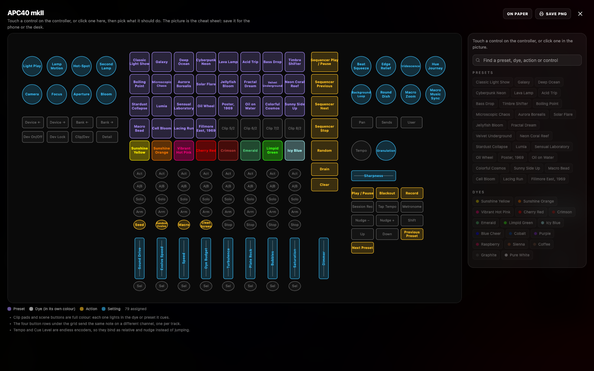
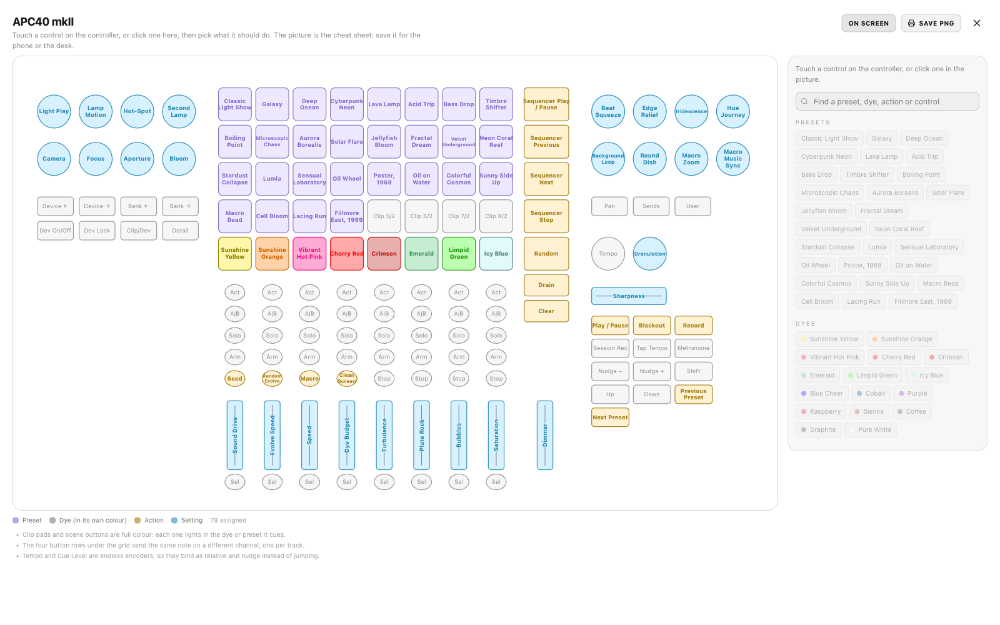
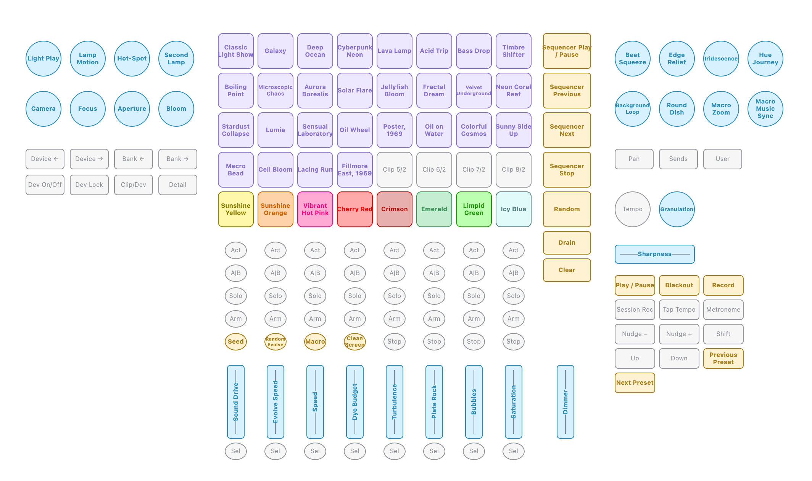
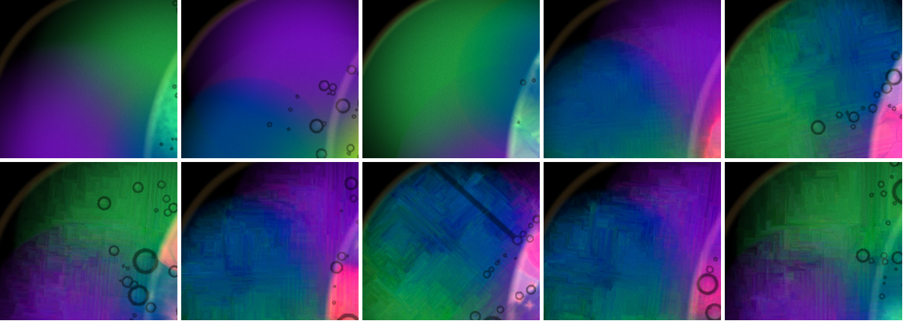
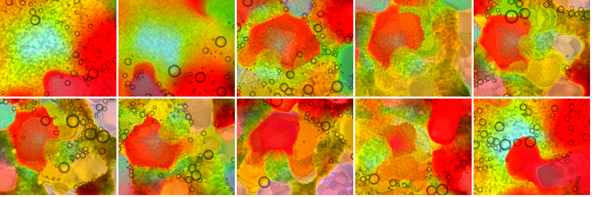

# Mac launch and looks after #35

2026-09-14 night. The Mac is on `main` at 8445d48 "A cheat sheet you can read in the dark (#35)".

## 1. Launch

- `git pull` fast-forwarded 37c5e10 → 8445d48. #35 does not touch `package-lock.json`, so I did not run `npm install`. The local lockfile edit and the nested `chromaglass/` clone are untouched.
- `npm run build`: OK in 1.13 s.
- I killed the old server (pid 18430, key 3523) and started `npm run remote` with nohup. The log is in `~/chromaglass-server.log`.

| | |
|---|---|
| Server pid | **19662** |
| Show key | **9025** |
| Phone | http://192.168.0.234:3000/?remote=1&key=9025 |
| Network display | http://192.168.0.234:3000/?cast=true&key=9025 |
| `curl http://localhost:3000/` | 200, 1320 bytes |

James's Chrome still has a `localhost:3000/?cast=true` tab open. Like last time, it held no connection to the server before or after the restart, so it will need a reload. I left it and the projector alone. All testing below ran in my own Playwright windows, which I closed afterwards.

## 2. The controller picture

Method: `~/cg-scratch/surface35.mjs` and `sizes35.mjs`. I opened the MIDI panel, enabled MIDI (no hardware attached), loaded the APC40 mkII factory map, opened the picture, measured every `<text>`/`<line>`/shape in the DOM, then took screenshots in both modes and saved the PNG in both modes.

Factory map: **79 bindings, 79 controls bound / 68 unbound of 147** (was 77/70).

Screenshots:
- On screen: `s35-surface35-screen.png`
- On paper: `s35-surface35-paper.png`
- Saved PNGs: `s35-cheatsheet-screen.png` and `s35-cheatsheet-paper.png` (2128×1264)
- 3× zooms: `s35-zoom-*.png`

### a) Crossfader strike-through — **fixed**. Tall faders — **no strike-through, but the lines touch the ends of the longer labels**

- The crossfader, now labelled **Sharpness**, has a horizontal track line in two pieces, 812–836 and 880–904, with the word in the gap (`s35-zoom-xfade-screen.png`). Nothing crosses it.
- On all nine tall faders the line is split around the rotated label, and no line passes through a letter.
- On the longer labels, though, the line runs right up to the first and last letters with no visible gap at 3×. These are Sound Drive, Evolve Speed, Dye Budget, Turbulence, Plate Rock and Saturation (`s35-zoom-faders-screen.png`).
- My box-overlap test flags exactly those six faders, at both ends. The gap is the text width + 5 units, i.e. 2.5 units a side, measured along the advance width. That leaves no visible clearance once rendered.
- The short labels (Speed, Bubbles, Dimmer) clear comfortably.
- It reads as `—Label—` rather than a strike-through, so this is cosmetic. A gap of +10 would give clear air.

### b) Truncation — **no "…" anywhere. Three labels still touch their edges.**

- **Ellipses: 0.** The Sel-row dyes are gone from the Sel row, and every label on the sheet is whole.
- **Text box outside its shape: 3.** Figures are the horizontal overhang each side at 1.15 px per unit:
  - `scene-0` "Sequencer Play / Pause": 1.9 px each side. It visibly touches both edges of the pad (`s35-zoom-scene-screen.png`).
  - `pad-3` "Cherry Red": 0.7 px each side. The C and d sit on the pad outline.
  - `pad-23` "Sunny Side": 0.5 px each side.
- **Touching by eye but not flagged:** Microscopic, Velvet Underground, Sensual Laboratory, Lacing Run, Cell Bloom, Cyberpunk, Neon Coral and Solar Flare all run edge to edge of their pads. On the round buttons, Background Loop, Iridescence, Granulation, Random Evolve and Clean Screen fill the circle to the rim. They are legible, but there is no margin. The shape-width limit for rects is `w − 5`, which leaves 2.5 units a side. That is the same size as the stroke plus antialiasing, so it reads as touching.
- **Smallest type in use is 6 units, not 5.** At 1600×1000 the picture draws at 1.15 px/unit, so 6 units is 6.9 px. Everything else is 8 units (175 labels) or:
  - 7 units: Microscopic / Chaos, Clean / Screen, Iridescence, Background / Loop, Granulation
  - 6.5 units: Velvet / Underground
  - 6 units: **Random / Evolve** (Stop row, channel 2)
- **Too small to read on screen from a normal distance:** **Random Evolve** (6) and **Velvet Underground** (6.5). They take a lean-in at 6.9–7.5 px, and on the 2× PNG they are fine. The 7-unit ones are readable. Shortening would be better than smaller type:
  - "Random Evolve" → "Evolve"
  - "Clean Screen" → "Clean"
  - "Sequencer Play / Pause" → "Seq Play" (the other scene buttons could be "Seq Prev" / "Seq Next" / "Seq Stop")
  - "Background Loop" → "Bg Loop"
  - Velvet Underground is a preset name. It could use a short name on the pad only.

### c) Colour legibility — **Crimson on screen and Icy Blue on paper: fixed. Two paper dyes are weak against their own pad.**

The contrast in #35 is measured against the panel, but the label sits on its pad's own tint (dye fill at alpha 0x55 = 33 % over the panel). I measured both.

| Dye | Screen ink | vs panel | vs own pad | Paper ink | vs panel | vs own pad |
|---|---|---|---|---|---|---|
| Sunshine Yellow | #ffea00 | 16.1 | 6.2 | #887c00 | 4.3 | 3.9 |
| Sunshine Orange | #ff7b00 | 7.6 | 4.3 | #cf6400 | 3.8 | 2.8 |
| Vibrant Hot Pink | #ff007f | 5.2 | 3.7 | #ff007f (unchanged) | 3.8 | **2.2** |
| Cherry Red | #ff0000 | 5.0 | 3.5 | #ff0000 (unchanged) | 4.0 | **2.2** |
| Crimson | **#c53d39** (lifted from #b80f0a) | 3.9 | 3.2 | #b80f0a | 6.8 | 3.6 |
| Emerald | #50c878 | 9.3 | 4.8 | #3a9257 | 3.9 | 3.0 |
| Limpid Green | #39ff14 | 14.6 | 6.0 | #22970c | 3.8 | 3.3 |
| Icy Blue | #a5f2f3 | 15.7 | 6.1 | **#588181** (dropped) | 4.3 | 4.0 |

- **Crimson on the dark panel reads now** (`s35-zoom-dyes-screen.png`). It is the dullest label on the row, but you can read it at a glance, and the pad keeps its true dark red.
- **Icy Blue on paper reads now.** It is a grey-teal on a very pale cyan pad (`s35-zoom-dyes-paper.png`).
- **On paper, Vibrant Hot Pink and Cherry Red are the weak ones now.** They pass 3.6 against white, so they are not adjusted. On their own pink and red pads, though, they are 2.2:1. Of the eight, they are the two hardest to read on the sheet.
- Fix: measure against the pad colour (fill blended over the panel) instead of the panel. That would darken these two on paper and lift Crimson a touch more on screen.
- The legend and side-list swatches use the raw dye. On paper, Pure White's swatch is invisible and Icy Blue's nearly so. That's minor, since the names are beside them.

### d) On paper — **the whole screen turns white. The saved PNG is tape-able, with two notes.**

- **Computed backgrounds in paper mode:**
  - Overlay: `rgb(255,255,255)`
  - Side card: `black/3 %`
  - Side text: `oklch(0.205 0 0)`
  - Filter box and chips: black/3–5 % with dark text
  - On screen they were black/95 % with white text.
- The list beside the picture is paper too, so what's on screen matches.
- **The list on paper is faint.** Every assign chip is `disabled:opacity-30` until a control is selected. That is right for making a map, but in paper mode the Presets/Dyes/Actions/Controls lists are 30 % grey on white, so a photo of the screen shows a washed-out list. On a printed sheet the list is reference, not buttons, so paper mode could drop the disabled fade.
- **The saved PNG is only the controller** (`s35-cheatsheet-paper.png`). It is the SVG on white at 2× (2128×1264), without the side list, the legend or the notes. For taping to a desk that's what you want. The picture is clean: white ground, pale tinted pads, dark-toned labels, nothing clipped, 79 labels all whole.
- **I would tape it to a desk.** Two things would make it better:
  - A small title / map name line. The PNG has no "APC40 mkII · ChromaGlass", so nothing on it says which map it is.
  - The unbound controls (Act/A|B/Solo/Arm, Sel row, Device/Bank, Pan/Sends/User) are light grey 400-weight. They are correctly quiet, but at print size the sheet reads as a lot of grey ovals. That's fine as is.
- On-screen mode PNG (`s35-cheatsheet-screen.png`): black ground, same layout. This is the one for the phone.

### e) The factory map layout for a hand in the dark

What reads right:
- **Dyes on the bottom clip row**, full colour and lit in the dye they drop. This is the biggest improvement: the palette is now a strip of eight big coloured pads at the bottom of the grid, nearest the hand. Presets are above it in purple.
- **Drain and Clear under the scene column.** They sit alone, well away from Seed, at the far right of the grid, under Random. Good.
- **Seed and the toggles on the Stop row** (Seed, Random Evolve, Macro, Clean Screen). With the destructive ones gone, a mis-hit here is harmless.
- **Crossfader → Sharpness, Cue Level → Granulation.** The long throw suits a continuous look control. An endless encoder for a nudge-only setting is right, and the picture notes that it binds as relative.
- **Arrows → Previous/Next Preset** is the right hardware choice.

What I would still move or fix:
1. **The picture draws the arrows backwards.**
   - `controllerSurface.ts:149-157` lays the 13 transport buttons out in list order, three to a row.
   - That puts Up, Down and **Left (Previous Preset)** on one row, and **Right (Next Preset)** wraps alone onto the next row, *below and left of* Previous.
   - On the sheet, "Next Preset" sits left of "Previous Preset" and a row lower. The APC40 mkII's four arrow keys are a cluster, so the sheet contradicts the hardware for the one pair a hand reaches for between songs.
   - The arrows need their own positions: Up above Down, with Left and Right either side.
   - The map itself (note 97 = left = prev, 96 = right = next) matches Akai's protocol.
2. **Random sits directly above Drain** in the scene column. A hand going for Random (scene 5) in the dark lands one button short of emptying the plate. I would swap Random up (e.g. to scene 1, with Play/Pause moving down one), or leave a gap.
3. **Preset row 2 abuts the dye row.** Row 2 has four presets (Macro Bead, Cell Bloom, Lacing Run, Fillmore East) over the first four dyes, and four empty pads over the last four. Moving those four presets onto the empty half of row 3's neighbours isn't possible (rows 3–5 are full), but leaving row 2 entirely empty as a buffer would cost 4 of the 28 preset slots. Either is defensible. As it stands, the left half is where a mis-hit changes the preset instead of the dye.
4. **Crossfader to the right end = Sharpness 1.0**, and §3 below shows 1.0 still has both faults. A crossfader flung to one side is a performance gesture, so I would not want its end stop to show grid blocks on the projector.

## 3. Sharpness

**The blocky small dish is not fixed at 1.0. It goes away at slider 0.5 (strength 0.090), is faint at 0.6 (0.103), and is plain from 0.7 (0.113) up. 0.5 is unchanged and still clean. The bright rim along boundaries I can't separate from run-to-run variation in these frames, so it isn't shown to be gone or reduced.**

### Method

- `~/cg-scratch/sharp3.mjs`. Setup: Fillmore 1969, `?debug&sim=512` (GPU, 512², confirmed by `status.label` "GPU · 512² · 1.0x" on every run).
- Each value gets a fresh page. Sharpness is set on the settings slider, the plate settles 25 s, then `#liquid-canvas` is captured with `toDataURL`.
- Values in run order: 1, 0.5, 0, 1, 0.5, 0.75, then 0.6, 0.8, 0.7, 0.9. Each fault value was repeated so I wasn't judging one sample.
- #35's curve is `s·(0.225 − 0.09·s)`: 0.5 → 0.090 (unchanged), 0.6 → 0.103, 0.7 → 0.113, 0.75 → 0.118, 0.8 → 0.122, 0.9 → 0.130, 1.0 → **0.135** (was 0.180).
- **Load:** GPU was 41 % at the start. James's Chrome had a YouTube tab and the `?cast=true` tab open, and rAF ran 21–31 ms a frame across runs. Frame cost is not resolvable today.
- No NaN in any run. Dye density at 25 s was 1.01–1.21 at every value.

### The small left dish (thin dye)

Contact sheet `s35-montage-dish.png` (crop 340,250 280×250, 1:1). Top row: 0, 0.5, 0.5 (repeat), 0.6, 0.7. Bottom row: 0.75, 0.8, 0.9, 1.0, 1.0 (repeat).

| Slider | Strength | Small dish |
|---|---|---|
| 0 | 0 | smooth gradient |
| 0.5 (×2) | 0.090 | smooth gradient, both runs (`s35-sharp3-dish-05.png`) |
| 0.6 | 0.103 | **faint** rectangular texture in the blue, visible at 2× (`s35-sharp3-dish-06.png`) |
| 0.7 | 0.113 | plain axis-aligned rectangles and streaks (`s35-sharp3-dish-07.png`) |
| 0.75, 0.8, 0.9 | 0.118–0.130 | blocky, same as #34's 1.0 |
| 1.0 (×2) | 0.135 | blocky in both runs, same as #34's 1.0 (`s35-sharp3-dish-1.png`; compare `sharp2-zoom-dish-1.png` on this branch) |

Numbers: `~/cg-scratch/dishblock.mjs` over 360,270 260×250, full frames.
- **axisFrac** is the share of gradient pixels with |g| > 12 within ±5° of an axis. Isotropic content is about 0.11.
- **Gradient fraction** is how much of the dish has any gradient at all. It is the clearer signal: sharpening turns the smooth dish into a field of small steps.

| | 0 | 0.5 | 0.5b | 0.6 | 0.7 | 0.75 | 0.8 | 0.9 | 1.0 | 1.0b | #34 0.5 | #34 1.0 |
|---|---|---|---|---|---|---|---|---|---|---|---|---|
| gradient fraction | 0.22 | 0.16 | 0.29 | 0.32 | 0.52 | 0.60 | 0.51 | 0.58 | 0.53 | 0.60 | 0.19 | 0.51 |
| axisFrac | 0.109 | 0.098 | 0.106 | 0.120 | 0.128 | 0.146 | 0.163 | 0.085* | 0.156 | 0.163 | 0.119 | 0.147 |

\* 0.9 has a long dark diagonal streak across the dish, which pulls the axis share down. By eye it is as blocky as 1.0.

So 1.0 now (0.135) measures the same as 1.0 in #34 (0.180), 0.53–0.60 against 0.51. **The blocks switch on between strength 0.090 and 0.113**, and compressing the top to 0.135 did not reach below that.

### The bright rim along boundaries

Contact sheet `s35-montage-core.png` (crop 800,380 360×300), same order as the dish sheet.

- Honestly: this one doesn't come out of these frames cleanly.
- The Fillmore core arrives in two kinds of state at 25 s:
  - a smooth bead-and-cell carpet, which is 0, the first 0.5 and the second 1.0
  - separated blobs outlined by thin light plate-cell edges, which is the second 0.5 and every run from 0.6 to the first 1.0
- The outlined state shows the thin rims **at 0.5 too** (the second 0.5 frame). The second 1.0 frame shows none.
- The ridge counter (thin lines brighter than both sides 2 px away) swings the same way:

| | 0 | 0.5 | 0.5b | 0.6 | 0.7 | 0.75 | 0.8 | 0.9 | 1.0 | 1.0b |
|---|---|---|---|---|---|---|---|---|---|---|
| core ridges per 1000 px | 14.0 | 6.9 | **26.9** | 25.7 | 31.3 | 33.2 | 29.9 | 23.0 | 25.4 | **16.6** |

- The first 1.0 frame (`s35-sharp3-1.png`, `s35-sharp3-green-1.png`) does have the look I reported on #34: light outlines round the amber and green blobs.
- But a 0.5 run in the same state has them too, so I can't attribute the rim to the top of the slider any more. Some of what I called a sharpening rim on #34 is likely the plate `cells` outlines on a blob-state frame.
- To settle it, the next look should fix the composition with `cells` 0 and a seeded start, then compare 0.5 and 1.0 on the same frame state.

### Does 0.5 still look like what I approved?

Yes.
- Both 0.5 dish frames are as smooth as 0.
- The first 0.5 core frame (`s35-sharp3-05.png`) has the crisp colour edges and no grid stair-steps, the same as #34's 0.5.
- #35 did not change 0.5's strength (0.090 before and after).

### Recommendation

- The top of the slider should stop at about **strength 0.095–0.10**, not 0.135. Slider 0.5 = 0.090 is clean and 0.6 = 0.103 is where the blocks first show.
- A quadratic can't hold 0.090 at 0.5 and top out near 0.10 while staying monotonic. Two options:
  - piecewise: linear 0→0.09 over 0–0.5, then 0.09→0.10 over 0.5–1
  - make 0.5 the top of a shorter slider
- The better fix is probably not the cap at all. The blocks appear only where dye is thin, which suggests the sharpen is amplifying low-amplitude values in the thin dye into steps. Scaling the sharpen by local density would leave the main dish's edges alone and stop the thin dish going blocky at any slider value.
- Until then, the crossfader's end stop (§2e) lands on a setting that shows blocks on the projector.

## Files on this branch

- `reports/s35-surface35-screen.png`, `s35-surface35-paper.png`: the picture in both modes, full window
- `reports/s35-cheatsheet-screen.png`, `s35-cheatsheet-paper.png`: the saved PNGs
- `reports/s35-zoom-{faders,xfade,dyes,small,scene}-screen.png`, `s35-zoom-dyes-paper.png`: 3× zooms
- `reports/s35-montage-{dish,core}.png`: sharpness contact sheets; `s35-sharp3-dish-{05,06,07,1}.png` at 2×; `s35-sharp3-1.png`, `s35-sharp3-05.png` full frames; `s35-sharp3-green-1.png`
- `reports/s35-sharp-3a.json`, `s35-sharp-3b.json`: per-run status and metrics
- Scripts on the Mac: `~/cg-scratch/surface35.mjs`, `sizes35.mjs`, `sharp3.mjs`, `dishblock.mjs`, `montage3.mjs`
