# Mac launch and looks after #36

2026-09-14 night. The Mac is on `main` at cf68d2d "Sharpening that knows how much liquid is there, and a second pass on the sheet (#36)".

## 1. Launch

- `git pull` fast-forwarded 8445d48 → cf68d2d. #36 does not touch `package-lock.json`, so I did not run `npm install`. The local lockfile edit and the nested `chromaglass/` clone are untouched.
- `npm run build`: OK in 4.84 s.
- I killed the old server (pid 19662, key 9025) and started `npm run remote` with nohup. The log is in `~/chromaglass-server.log`.

| | |
|---|---|
| Server pid | **20784** |
| Show key | **1265** |
| Phone | http://192.168.0.234:3000/?remote=1&key=1265 |
| Network display | http://192.168.0.234:3000/?cast=true&key=1265 |
| `curl http://localhost:3000/` | 200, 1320 bytes |

- Before the restart, James's Chrome had `localhost:3000/` and two `localhost:3000/?cast=true` tabs open, and one of them held a connection to the old server. The restart dropped it, so those tabs need a reload with the new key.
- I left them and the projector alone. All testing below ran in my own Playwright windows, which I closed afterwards.
- **Load:** GPU utilisation was 92–99 % for the whole session (MOTIV Mix, OBSBOT Center, James's Chrome). My pages ran at **97–125 ms a frame**, against 21–31 ms on #35. That matters for §2 and is dealt with there.

## 2. Sharpness

**The small dish is not fixed.**
- At 25 s under today's load it looks much better than #35: clean at 0.5 and 0.6, faint at 0.7, a smaller blocky patch at 1.0.
- Those pages ran only ~380 solver frames, against ~1000 on #35. I re-ran at #35's frame count (~1150) with the grain off. Small-dish gradient fraction:

  | slider | 0 | 0.5 | 0.6 | 0.7 | 1.0 |
  |---|---|---|---|---|---|
  | #36, grain off, ~1150 frames | 0.21 | 0.21 | 0.28 | 0.46 | 0.45 |
  | #35, same measure | — | — | 0.29 | 0.47 | 0.51 |

  - **0.5: clean,** the same as 0.
  - **0.6: not clean.** Plain crosshatch over a large patch, lower in contrast than 1.0.
  - **0.7 and 1.0: blocky,** over a third to a half of the dish.
  - At 0.6 and 0.7 this is the same as #35; the gate has not moved where the blocks start.
- The blocks sit at layer-1 density **0.3–1.2**, peaking at 0.45–0.9. The 0.15–0.70 window lets the pass through there at half to full weight, and the main dish's own body starts at 0.82. So moving the window can't separate the two dishes cleanly.
- What does separate them: the small dish's dye is still (no new dye, mean 0.41 → 0.39 over two minutes), and the main dish is stirred.

**The rim is settled: there isn't one.** With `cells` at 0 and a seeded start, 0.5 and 1.0 are the same frame, and so is 0. What I called a rim on #34 was the plate-cells outlines.

**Correction to my approval of 0.5.** On that fixed composition, the main dish at 0.5 cannot be told from 0, by eye or by count. The crisp edges I credited to 0.5 came from comparing unseeded frames in different states. 0.5 is harmless, but I can't show it does anything in the main dish at 25 s.

**Also found:** after about two minutes in a page, the pigment grain (`granulation` 0.5) mottles both dishes at every sharpness.

### Method

- `~/cg-scratch/sharp4.mjs`: the same method as `sharp3.mjs` on #35.
  - Fillmore 1969, `?debug&sim=512`, confirmed "GPU · 512² · 1.0x" on every run.
  - A fresh page per value, Sharpness set on the settings slider, plate settled 25 s, `#liquid-canvas` captured with `toDataURL`.
- New in this run: every fluid layer's 192² `readDensity` is saved alongside the frame.
- Runs at 25 s, in order: 0.5, 1, 0.6, 0.7, 0, 1, 0.5, 0.7, 0.6. Every fault value was run twice, alternated.
- No NaN in any run.
- **The small left dish is not `fluids[0]`.** `fluids[0]` is the main dish. The small dish is `fluids[1]`, a whole plate drawn inside its own disc. I read its density over that plate's inscribed circle.
- **A tighter dish metric.** The #35 crop (360,270 260×250) includes the main dish's left edge, and that edge moves between runs. `smalldish.mjs` measures the same gradient fraction and axisFrac over the small dish only: 14 px inside its rim and 14 px clear of the main dish (`s36-smalldish-mask.png`). I re-ran it on the #35 frames so both columns use the same ruler.

### a) The small left dish at 25 s

Contact sheet `s36-montage-dish.png`: the #35 crop at 1:1. Top row: 0, 0.5, 0.5b, 0.6, 0.6b. Bottom row: 0.7, 0.7b, 1.0, 1.0b.

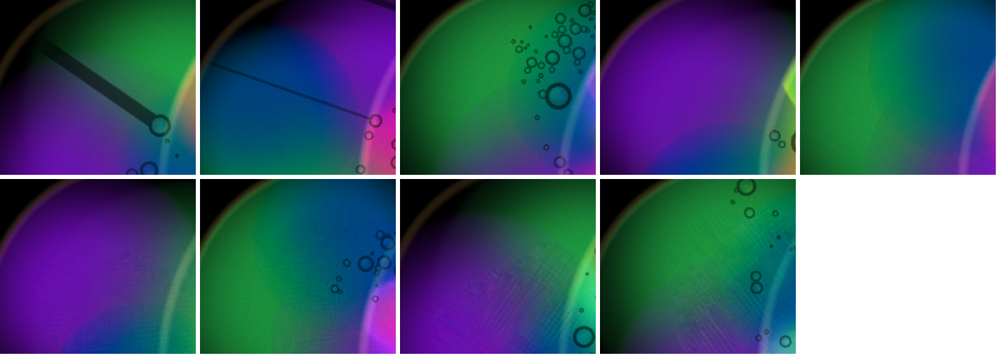

2× zooms `s36-montage-dishzoom.png`: 0.5 and 0.6b on top, 0.7b and 1.0b below.

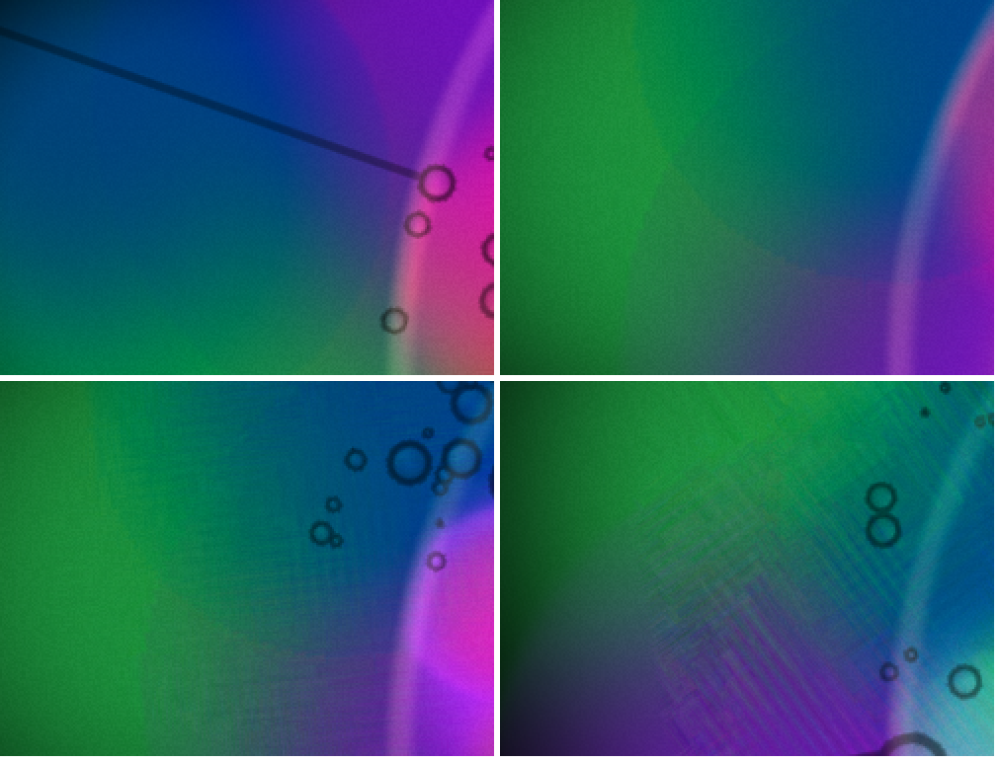

Small dish only (mask), #36 against the #35 frames:

| Slider | #36 gradient fraction | #36 axisFrac | #35 gradient fraction | #35 axisFrac |
|---|---|---|---|---|
| 0 | 0.154 | 0.095 | 0.108 | 0.104 |
| 0.5 | 0.144 / 0.224 | 0.094 / 0.099 | 0.089 / 0.158 | 0.093 / 0.100 |
| 0.6 | 0.041 / 0.170 | 0.109 / 0.110 | 0.289 | 0.123 |
| 0.7 | 0.099 / 0.209 | 0.122 / 0.111 | 0.470 | 0.137 |
| 0.75 / 0.8 / 0.9 | not run | | 0.511 / 0.488 / 0.530 | 0.165 / 0.171 / 0.081 |
| 1.0 | 0.227 / 0.310 | 0.101 / 0.103 | 0.511 / 0.533 | 0.163 / 0.185 |

For direct comparison with the table in my #35 report, the same numbers on the old crop:

| | 0 | 0.5 | 0.5b | 0.6 | 0.6b | 0.7 | 0.7b | 1.0 | 1.0b |
|---|---|---|---|---|---|---|---|---|---|
| gradient fraction #36 | 0.25 | 0.16 | 0.35 | 0.15 | 0.25 | 0.21 | 0.33 | 0.35 | 0.43 |
| gradient fraction #35 | 0.22 | 0.16 | 0.29 | 0.32 | — | 0.52 | — | 0.53 | 0.60 |
| axisFrac #36 | 0.094 | 0.097 | 0.096 | 0.108 | 0.106 | 0.108 | 0.111 | 0.103 | 0.100 |
| axisFrac #35 | 0.109 | 0.098 | 0.106 | 0.120 | — | 0.128 | — | 0.156 | 0.163 |

By eye at 25 s:
- **0.5:** smooth in both runs.
- **0.6:** smooth in one run. In the other there is a faint seam along the green/purple boundary, visible only at 2×.
- **0.7:** a faint fine crosshatch in the lower middle, in both runs. You have to look for it.
- **1.0:** plain crosshatched blocks along the green/purple boundary in both runs (`s36-montage-dishzoom.png`, bottom right). The patch is smaller than on #35, and axisFrac stays at the isotropic 0.10 rather than #35's 0.16–0.19.

**The catch: step count.** Under today's load the 25 s pages drew **369–396 frames**. The #35 pages drew **812–1179 frames** in the same 25 s. The pass runs once per solver step, so part of the fall from #35 to #36 could simply be fewer steps. §2c re-runs at a matched frame count.

### b) Where the dish's density is

`fluids[1].readDensity` over the small dish's plate. The same figures came out in every run, within 1 %: the layer receives no dye in this preset, and its density barely moves in 25 s.

| mean | p10 | p25 | p50 | p75 | p90 | ≤ 0.15 | 0.15–0.70 | ≥ 0.70 | mean gate weight |
|---|---|---|---|---|---|---|---|---|---|
| 0.51 | 0.076 | 0.18 | 0.405 | 0.81 | 1.12 | 20 % | 49 % | 31 % | 0.50 |

For comparison, the main dish under the core crop runs from p10 0.82 to p90 1.61 (max 1.9). The gate is at 1.0 everywhere there.

**Where the remaining blocks sit.** `blockdens.mjs` places each small-dish pixel on the layer-1 plate. The plate's rotation is unknown, so the script scans for the best correlation of density with brightness; r was 0.61–0.74, so treat these bands as approximate. It then counts 1 px steps next to flat runs, per 1000 px, by density band:

| density band | 0–0.15 | 0.15–0.3 | 0.3–0.45 | 0.45–0.6 | 0.6–0.7 | 0.7–0.9 | 0.9–1.2 |
|---|---|---|---|---|---|---|---|
| slider 0 | 0 | 2 | 7 | 11 | 12 | 18 | 24 |
| 1.0 | 0 | 0 | 6 | 13 | 22 | 33 | 48 |
| 1.0b | 0 | 13 | 21 | 30 | 40 | 44 | 42 |
| 0.7b | 0 | 8 | 16 | 20 | 21 | 28 | 32 |

- Below 0.15, where the gate is shut, there are no steps at any value.
- The excess over slider 0 grows with density and is largest at **0.6–1.2**, where the gate is already at 0.8–1.0.
- So the blocks that remain are not in thin dye by this gate's definition. They sit at densities the main dish's own body also covers: its lower tenth is 0.82.

### c) At #35's step count: the dish is speckled at every sharpness, including 0

To take load out of the comparison, I re-ran with the settle measured in frames: 1000 rAF frames after the slider was set (`FRAMES=1000`). The captures landed at **1129–1138 frames**, inside #35's 812–1179. Each page ran about 2.5 minutes at 108–125 ms a frame. Sharpness and Cells were still at their slider values at capture in every run. Order: 1.0, 0.5, 0.7, 1.0, 0.6, 0.

Contact sheet `s36-frames-dish.png`, the same crop as §2a. Top row: 0, 0.5, 0.6. Bottom row: 0.7, 1.0, 1.0b.

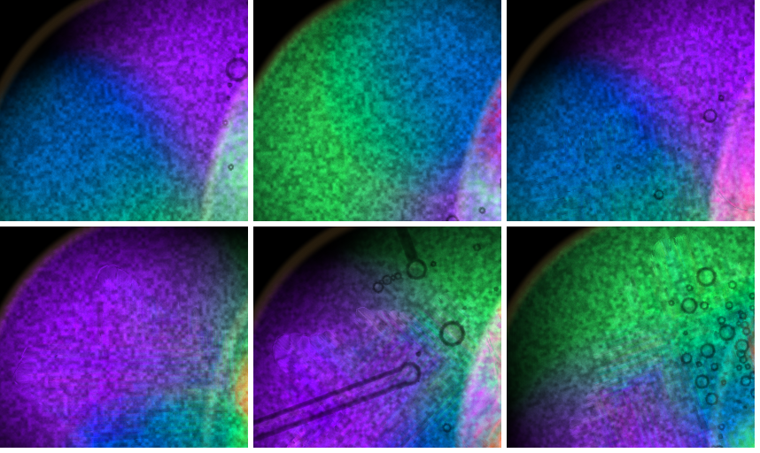

| Slider (frames) | 0 (1134) | 0.5 (1138) | 0.6 (1132) | 0.7 (1136) | 1.0 (1129) | 1.0b (1129) |
|---|---|---|---|---|---|---|
| small-dish gradient fraction | **0.860** | 0.889 | 0.866 | 0.810 | 0.826 | 0.872 |
| axisFrac | 0.129 | 0.132 | 0.126 | 0.128 | 0.098 | 0.114 |
| steps per 1000 px | 31.7 | 32.2 | 31.7 | 31.4 | 26.3 | 30.0 |
| steps/1000 at density < 0.15 (gate shut) | **18** | 16 | 18 | 4 | 9 | 12 |

- By this point the whole plate has changed state, **at sharpness 0 as much as at 1.0**.
  - Both dishes are covered in a pixel-scale mottle (`s36-frames-dish-05.png`, `s36-frames-dish-1.png`).
  - The main dish has glossy, outlined blobs (`s36-frames-wide-05.png`, `s36-frames-wide-1.png`).
- The small dish's gradient fraction is 0.81–0.89 at every value. There are steps below density 0.15, where the gate passes nothing, and slider 0 has as many as 1.0.
- So the mottle is not the sharpening pass. It could be the pigment grain: Fillmore runs the default `granulation` 0.5 at `grainScale` 110, and it multiplies dye by a grain texture in the render. It could also be something else that builds over two minutes.
- It swamps any comparison of sharpening blocks at this step count. By eye, 1.0 and 0.7 show a few faint pale outlines inside the mottle that 0 and 0.5 don't, and nothing more.

So the step-count question splits in two:
- **What I can say:** at 25 s the dish is much less blocky on #36 than on #35 at the same slider values, and 0.5 is clean.
- **What I can't yet say:** whether the #36 improvement survives at #35's step count. At that step count the plate is dominated by a mottle that isn't sharpening.

**With the grain off, at #35's step count: 0.5 is clean; the blocks are back from 0.6 up.**

- Setup: `Granulation` set to 0 on the slider after the preset, `FRAMES=1000`. Captures landed at 1134–1157 frames.
- Two batches: 1.0, 0, 0.7 first, then 0.6 and 0.5 about 10 minutes later, under the same load (GPU 99 %, 93–110 ms a frame).
- Result: the mottle is gone, so it was the pigment grain.

Contact sheet `s36-grain0-dish-all.png`, left to right 0, 0.5, 0.6, 0.7, 1.0:

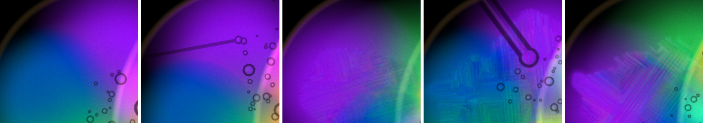

2×: 0 and 0.5 on top, 0.6 and 1.0 below:

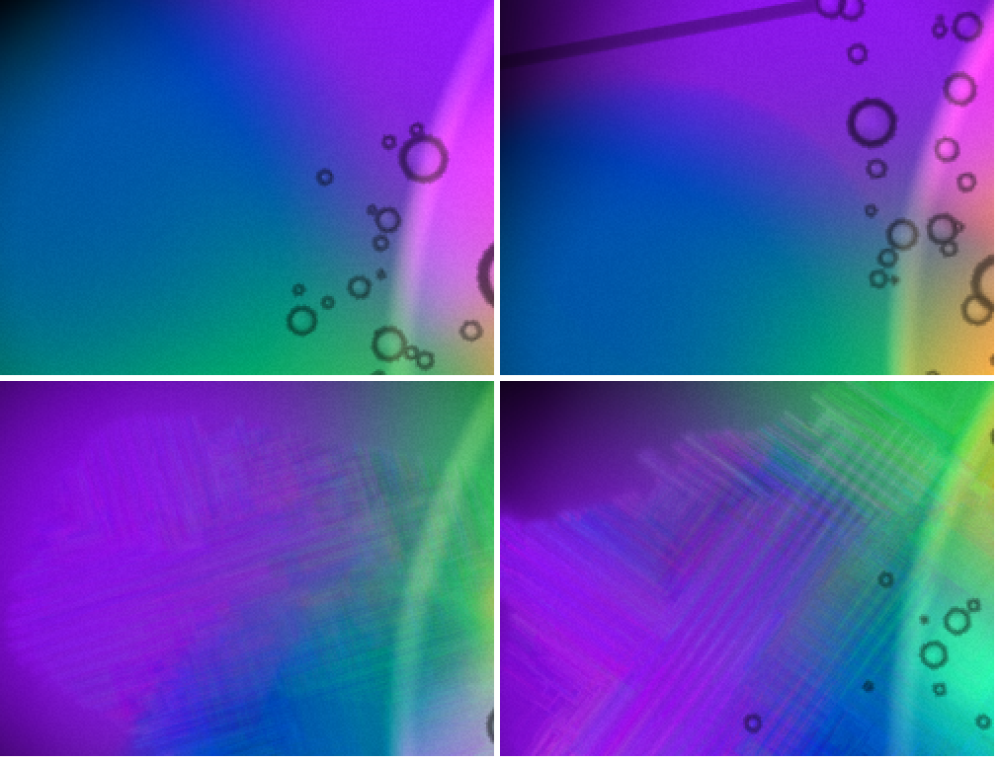

| grain 0 (frames) | 0 (1134) | 0.5 (1157) | 0.6 (1142) | 0.7 (1138) | 1.0 (1151) |
|---|---|---|---|---|---|
| small-dish gradient fraction | **0.214** | **0.207** | **0.280** | **0.457** | **0.449** |
| axisFrac | 0.100 | 0.111 | 0.121 | 0.126 | 0.098 |
| steps per 1000 px | 22.7 | 22.3 | 24.0 | 33.3 | 33.7 |
| by eye | smooth | smooth | plain crosshatch over a large patch, lower contrast | plain blocks | plain blocks, stepped terraces |

- **0.5:** as smooth as 0, by eye and by every count. At the default the shallow dish is clean at #35's step count.
- **0.6:** plainly visible at 1:1 and at 2×. It is a fine crosshatch over roughly the lower half of the dish crop, not the large terraces of 1.0. The gradient fraction measures it more mildly (0.28) than it looks, because the lines are low in contrast. On #35 this mask gave 0.289 at 0.6, so this is no better.

Steps per 1000 px by layer-1 density band (rotation fit r: 0 0.65, 0.5 0.66, 0.6 0.75, 0.7 0.56, 1.0 0.80):

| band | 0–0.15 | 0.15–0.3 | 0.3–0.45 | 0.45–0.6 | 0.6–0.7 | 0.7–0.9 | 0.9–1.2 |
|---|---|---|---|---|---|---|---|
| 0 | 4 | 19 | 21 | 25 | 28 | 31 | 36 |
| 0.5 | 8 | 13 | 18 | 24 | 27 | 24 | 32 |
| 0.6 | 1 | 9 | 18 | 34 | 40 | 46 | 44 |
| 0.7 | 3 | 19 | 28 | 41 | 41 | 46 | 42 |
| 1.0 | 2 | 19 | 38 | **48** | **50** | **54** | 52 |
| excess at 1.0 over 0 | −2 | 0 | +17 | +23 | +22 | +23 | +16 |

- **0:** smooth.
- **0.7 and 1.0:** large, plain, axis-aligned staircase patches covering a third to a half of the small dish. The 1.0 zoom shows stepped rectangular terraces and parallel streaks along both axes. It is the #34/#35 fault, and at least as large as on #35.
- The small dish's gradient fraction at 0.7 and 1.0 (0.46, 0.45) is where #35 measured on the same mask (0.47 at 0.7, 0.51 at 1.0).
- **So the gate has not fixed the dish at a comparable step count.** Most of the improvement in §2a came from the pages running fewer steps under load.
- The excess steps sit at density **0.3–1.2** and peak at 0.45–0.9. Below 0.3 there is none, so the gate does protect the thinnest wash. But the blocks live in the band the gate passes at half to full weight, and that band overlaps the main dish's body (lower tenth 0.82).

**Why a density window can't be the whole answer, from these numbers.**
- To shut the pass off where the blocks are (≤ 0.9), the window would have to start around 0.9–1.0.
- That would halve the pass over the lower part of the main dish.
- §2d/e shows the main dish gains nothing visible from the pass anyway, so that cost may be acceptable. But I would not move the window on a guess from this preset alone.
- Something other than density separates the two dishes. Layer 1 gets no new dye in Fillmore and barely moves: its mean is 0.41 at 25 s and 0.39 at 1100 frames. So the pass steepens the same still field again every step, and the plateaus grow into terraces.
- The main dish is stirred and fed all the time, which keeps smoothing the steps out.
- A gate on local motion (velocity magnitude), or a pass that only acts where the field changed since the last step, would target exactly what goes blocky. That is a hypothesis; I have not tested it.

**Also worth knowing:** the speckle in §2c appeared only in pages that ran ~2.5 minutes. At a similar frame count on #35 (25 s at 21–31 ms) there was none. So the grain builds with wall time rather than solver steps, and at 0.5 it covers both dishes after two minutes. That is a separate thing to look at on the projector.

### d) The rim, with the composition fixed

- Setup: `Plate Cells` 0, and `Math.random` replaced before load with a seeded generator (`addInitScript`, seed 20260914).
- Runs: 0.5, 1.0, 0.5, 1.0, each at 25 s.
- The seed holds. On the core crop, the four seeded frames differ from each other by a mean |Δ| of **4.1–6.7** of 255, whatever the sharpness. Unseeded frames at 25 s differ by 12–32.
- So 0.5 and 1.0 below are the same composition.

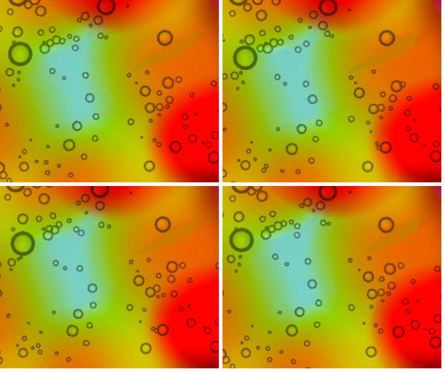

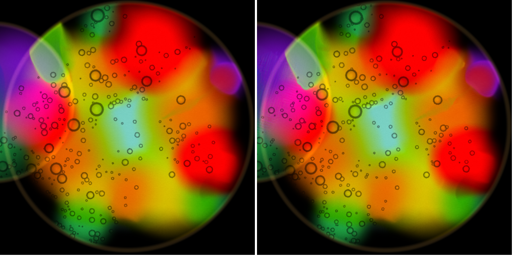

`rimcmp.mjs` counts over the whole main dish (disc r 330) and the core crop:
- **ridge:** thin lines brighter by more than 15 than both sides 2 px away
- **halo:** strong-edge pixels brighter by more than 10 than both sides 3 px across the edge

All counts are per 1000 px:

| seeded, cells 0 | dish ridge | dish halo | dish edge fraction | core ridge | core halo |
|---|---|---|---|---|---|
| 0.5 | 2.5 | 1.40 | 0.094 | 3.7 | 1.63 |
| 0.5b | 2.6 | 1.42 | 0.095 | 3.5 | 1.78 |
| 1.0 | 2.5 | 1.28 | 0.095 | 3.9 | 1.78 |
| 1.0b | 2.4 | 1.24 | 0.095 | 3.5 | 1.50 |

For contrast, unseeded with `cells` 0.2 on #35: core ridge 6.8–26.9 and halo 5.4–24.5 at 0.5 alone, depending on which state the plate landed in.

**Answer: there is no bright rim that comes from sharpness 1.0.** On a fixed composition with the plate cells off, 0.5 and 1.0 cannot be told apart by eye or by count in the main dish. What I reported as a rim on #34 was the `cells` outlines on a blob-state frame. The one visible difference between the two full-dish frames is in the *small* dish at the left edge, which shows its crosshatch at 1.0.

**The same seed at sharpness 0** (372 frames, cells 0):

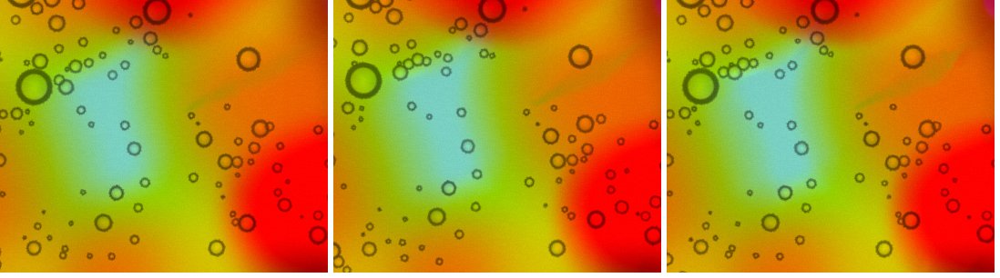

| seeded, cells 0 | dish ridge | dish halo | core ridge | core halo | core mean \|Δ\| vs 0 |
|---|---|---|---|---|---|
| 0 | 2.4 | 1.26 | 3.8 | 1.74 | — |
| 0.5 / 0.5b | 2.5 / 2.6 | 1.40 / 1.42 | 3.7 / 3.5 | 1.63 / 1.78 | 6.9 / 6.6 |
| 1.0 / 1.0b | 2.5 / 2.4 | 1.28 / 1.24 | 3.9 / 3.5 | 1.78 / 1.50 | 4.6 / 7.2 |

- On the fixed composition at 25 s, **sharpness 0, 0.5 and 1.0 cannot be told apart in the main dish, by eye or by count**.
- The frame-to-frame difference between 0 and 1.0 (4.6) is the same size as between two runs at the same value (4.1–6.7).
- In this state of the main dish, the colour boundaries are wide soft gradients at 512², and the pass has almost nothing to steepen.

### e) Does the main dish still look like the 0.5 I approved?

It looks the same as it did. But I have to correct what I said it bought.

- **Nothing lost.** The main dish's density is 0.82–1.9, so the gate is at 1.0 over the whole body and #36 changes nothing there. The core contact sheet `s36-montage-core.png` (same order as the dish sheet) shows the colour edges as before, with no stair-steps at 0.5.
- **The seeded frames in §2d say more than that: on a fixed composition, 0.5 is the same picture as 0.**
  - Core ridge 3.7 against 3.8, halo 1.63 against 1.74, mean |Δ| 6.9, which is run-to-run noise.
  - The crisp edges I credited to 0.5 on #34/#35 were compared across unseeded frames. There the plate's state swings the edge counts far more than the setting does: core edge fraction at 0.5 alone is 0.176 and 0.064 in two runs today, and 0.141 and 0.327 on #35.
- So at 25 s, 512², Fillmore, I can't show that sharpening does anything visible in the main dish at any strength.
- What it visibly does is in the small dish, and there it is the blocks.
- The default 0.5 is harmless: clean in the small dish at 25 s, identical to 0 in the main dish. I can't say it earns its place.

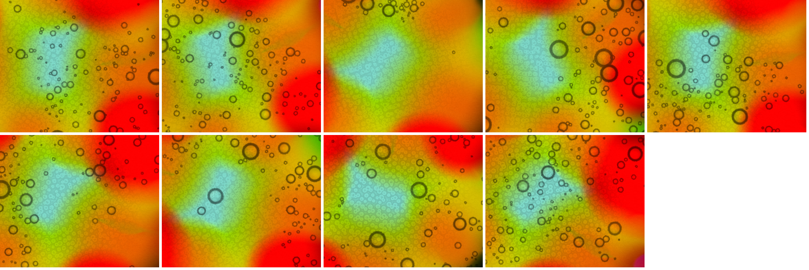

### f) What I could not measure

- **Frame cost of the gate.** Not measured: GPU utilisation was 92–99 % all session, so frame time follows load rather than the setting.
- **Repeats at the matched step count with the grain off.** Each value there is a single run, so I cannot give a run-to-run spread at ~1140 frames. At 25 s the spread at one value was up to 0.08 in gradient fraction.
- **0.75, 0.8 and 0.9 at the matched step count.** Not run; only 0, 0.5, 0.6, 0.7 and 1.0.
- **The main dish at the matched step count on a fixed composition.** The seeded test (§2d) ran at 25 s (~370 frames). I have no seeded frames at ~1150 frames, so "0.5 looks like 0 in the main dish" is shown at 25 s only.
  - The grain-off, frame-matched frames at 0, 0.5 and 1.0 (`s36-grain0-core-0-05-1.png`) are unseeded, so each is a different composition.
  - None has stair-steps or rims. All three show the plate-cell carpet and soft colour boundaries, and nothing in them is lost at 0.5.
  - Their core edge counts (0.198 / 0.298 / 0.157) don't follow the setting, so they measure the plate's state, not sharpening.
- **A moved gate window.** Trying a different window needs a code change, and this session doesn't change code. §2c gives the densities where the blocks sit instead.
- **Exact density under each block.** The small dish's plate rotation isn't exposed, so the density bands come from a best-fit rotation (r 0.56–0.80). Treat the bands as approximate.
- **The projector.** Not looked at, by the house rules. Everything here is my own Playwright windows on the Mac screen.
- **A printed sheet.** Nothing was printed. The printed type sizes in §3a are computed from the PNG at a 10-inch width.

## 3. The cheat sheet, second pass

Method: `~/cg-scratch/surface36.mjs` and `surface36z.mjs`.
- I opened the MIDI panel, enabled MIDI (no hardware attached) and loaded the APC40 mkII factory map.
- I opened the picture and measured every `<text>`, `<line>` and shape in the DOM in both modes.
- I saved the PNG in both modes, took 3× zooms, and measured one label ruler at three type sizes.

Factory map: **79 bindings, 79 bound / 68 unbound of 147** (unchanged).

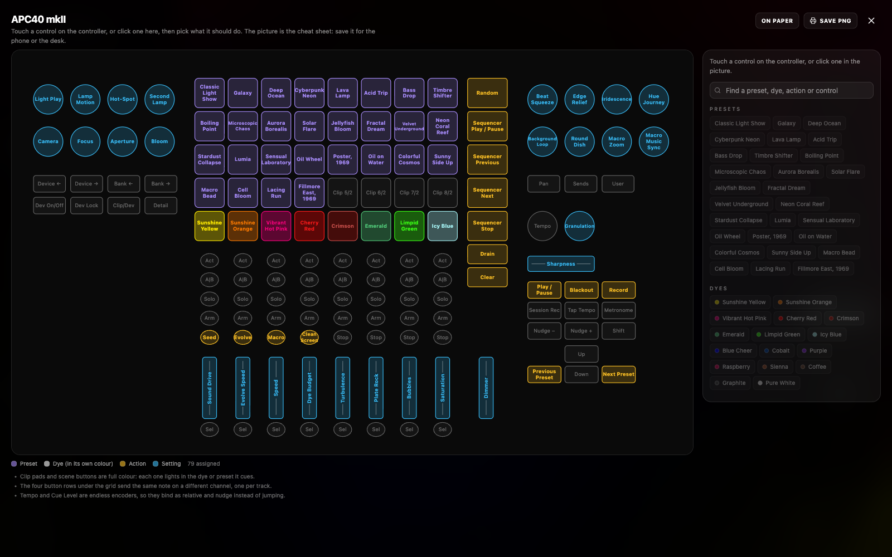
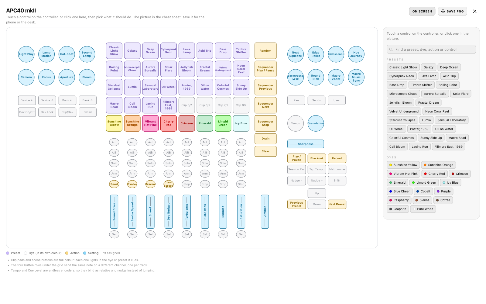

### Summary

| Item | Fixed? |
|---|---|
| Fader tracks break wider | **Fixed** |
| Ink against the control's own fill | **Fixed** |
| Arrows as a cluster | **Fixed** |
| Random at the top of the scene column | **Fixed** |
| Swatch outlines, full-weight list on paper | **Fixed** |
| Title band on the saved PNG | **Fixed** |
| Short forms | **Half.** Evolve is used. Clean Screen and Background Loop are not, and they are two of the labels on their outlines. |
| Type: whole names, nothing on its outline | **Not on the Mac.** Nothing is cut and the smallest type is larger than in the sandbox, but 8 labels still touch or cross their outline, for a reason that is specific to this machine's font (below). |

### a) Type — **no cuts, smallest 6.5, but eight labels still sit on their outline on the Mac**

- **Sizes, counted in text lines:** 186 at 8 units, 4 at 7.5, 4 at 7, 2 at 6.5. That is 196 lines. **Ellipses: 0.** Nothing is cut.
- **Smallest on the Mac:**
  - **Velvet / Underground at 6.5** (7.5 px on screen)
  - Microscopic / Chaos and Background / Loop at 7
  - Clean / Screen, Iridescence and Granulation at 7.5
- There is nothing at 5.5 or 6 here; the sandbox figures differ, and the ruler below is why.
- **On the outline, measured** (text box to shape box, units a side; circles are measured on their bounding box, which flatters them):
  - **Over the edge:** Sensual Laboratory −0.2, Iridescence −0.2, Granulation −0.2, Cyberpunk Neon −0.1
  - **Within half a unit:** Velvet Underground +0.1, Clean Screen +0.2, Microscopic Chaos +0.3, Evolve +0.3
- **By eye at 3×** (`s36-zoom-presets-paper.png`, `s36-zoom-knobs-paper.png`, `s36-zoom-stoprow-screen.png`):
  - "Cyberpunk", "Microscopic", "Underground" and "Laboratory" run from one pad edge to the other.
  - "Iridescence" and "Granulation" cross the ring of their circle.
  - "Background" touches its ring.
  - "Clean Screen" crosses its oval on both lines.
  - "Evolve" touches its oval.
- **Why the Mac differs from the sandbox.** `em()` measures a label on the ruler at 100 units and divides by 100. This Mac draws `ui-sans-serif, system-ui` as SF. At small sizes SF switches to its Text optical size, which is wider and more loosely spaced. The same word measured on the same ruler (`s36-ruler.json`, `getComputedTextLength` ÷ size):

| word, bold | per unit at 100 | at 8 | at 6.5 | 8 vs 100 |
|---|---|---|---|---|
| Sensual | 3.643 | 4.161 | 4.238 | +14 % |
| Laboratory | 4.999 | 5.797 | 5.907 | +16 % |
| Iridescence | 5.311 | 6.145 | 6.266 | +16 % |
| Granulation | 5.313 | 6.143 | 6.263 | +16 % |
| Cyberpunk | 5.058 | 5.764 | 5.863 | +14 % |
| Underground | 6.042 | 6.938 | 7.059 | +15 % |
| Clip 5/2 (regular) | 3.281 | 3.839 | 3.926 | +17 % |

- So every label is set 14–17 % wider than the fit believes. The "comfortable" 4.5-unit margin is eaten, and the tight one goes negative.
- **Fix:** measure at the size being tried: set the ruler's `font-size` to `size` and divide by `size`. Measuring once at 8 would also do, since 8 and 6.5 differ by only 2 %.
- Expect this to push several of the 186 down a step, or onto their short forms, on a Mac. Chrome on Linux (the sandbox) has no optical sizes, which is why it shows no problem.
- **Short forms:**
  - "Random Evolve" → **Evolve** is in use (8 units).
  - "Clean Screen" (7.5) and "Background Loop" (7) keep their full names, because the rule only swaps when the full name would go **below** 7. These two are among the labels on their outlines. A rule of "below 8, or tight margin" would have caught them.
  - The sequencer four fit at 8 as full names on the tall scene pads, so the Seq forms aren't needed, and they read well (`s36-zoom-scene-screen.png`).

**Do the smallest read?**
- **On the Mac's screen** (1.15 px/unit at 1600×1000):
  - Velvet Underground at 6.5 is 7.5 px. It reads if you lean in; at a glance it is a grey smudge next to its 8-unit neighbours.
  - The 7 and 7.5 ones read.
- **On the saved PNG** (2 px/unit), everything reads, Velvet Underground included.
- **Printed.** The PNG is 1064 units wide. Printed to fill a landscape Letter page (10 in across), one unit is 0.68 pt:
  - full-size type is **5.4 pt**
  - Velvet Underground is **4.4 pt**
  - 5.4 pt bold reads at desk distance in normal light; 4.4 pt is fine print.
  - In a dark room I would not rely on anything on the sheet smaller than the 8-unit type. Velvet Underground is the one that fails that test.

### b) Fader tracks — **fixed**

- The line now stops short of the label on every fader.
- Clearance from line end to label, in units, at both ends:
  - Sound Drive 1.6, Evolve Speed 1.4, Dye Budget 1.9, Turbulence 1.8, Plate Rock 1.9, Saturation 2.0
  - The short labels: Speed 3.5, Bubbles 2.8, Dimmer 3.0
  - The crossfader's Sharpness: 2.3
- On #35 the six long ones were touching (0).
- At 3× (`s36-zoom-faders-screen.png`) there is clear air at both ends of all six. It reads as a label with a line either side, not a line running into the word.
- These clearances are also measured with the too-narrow ruler (§3a), so the drawn gap is about 1 unit smaller than intended. It still shows.

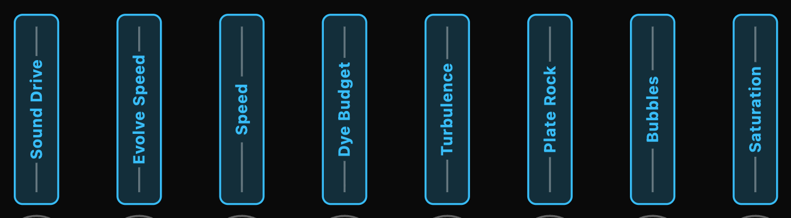

### c) Ink against the control's own fill — **fixed**

Measured two ways: against the panel, and against the control's fill composited over the panel (fill hex alpha: `55` on dye pads, `33` elsewhere).

| Dye | Screen ink | vs panel | vs own pad | Paper ink | vs panel | vs own pad (#35) |
|---|---|---|---|---|---|---|
| Sunshine Yellow | #ffea00 | 16.1 | 6.2 | #887c00 | 4.3 | **3.9** (3.9) |
| Sunshine Orange | #ff7b00 | 7.6 | 4.3 | #a75100 | 5.5 | **4.0** (2.8) |
| Vibrant Hot Pink | #ff007f | 5.2 | 3.7 | #ba005d | 6.5 | **3.7** (2.2) |
| Cherry Red | #ff1a1a | 5.1 | 3.7 | #ba0000 | 6.8 | **3.8** (2.2) |
| Crimson | #cb504c | 4.5 | 3.7 | #a60e09 | 7.8 | **4.2** (3.6) |
| Emerald | #50c878 | 9.3 | 4.8 | #34834f | 4.7 | **3.6** (3.0) |
| Limpid Green | #39ff14 | 14.6 | 6.0 | #1e880b | 4.6 | **4.0** (3.3) |
| Icy Blue | #a5f2f3 | 15.7 | 6.1 | #588181 | 4.3 | **4.0** (4.0) |

- Every bound control in both modes is **≥ 3.6 against its own fill**. The count below 3.6 is 0, down from two dyes at 2.2 on #35.
- By eye on paper (`s36-zoom-dyes-paper.png`), Hot Pink and Cherry Red now read as dark ink on their pads. Emerald and Icy Blue are the palest of the eight, but you can read them at a glance.
- On screen (`s36-zoom-dyes-screen.png`), Crimson is lifted a little further (#cb504c) and reads.

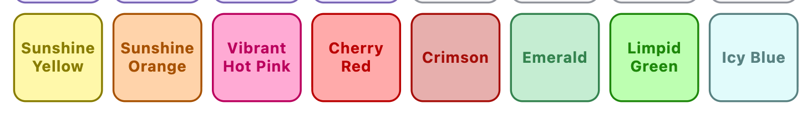

### d) Short forms — see §3a. Evolve is used; Clean Screen and Background Loop should be.

### e) Arrows — **fixed**

- Positions in picture units:
  - Up at (863, 462)
  - Down at (863, 494), directly below it
  - **Previous Preset** (Left) at (806, 494)
  - **Next Preset** (Right) at (921, 494)
- Previous is to the left of Next, on the same row, either side of Down (`s36-zoom-arrows-paper.png`).

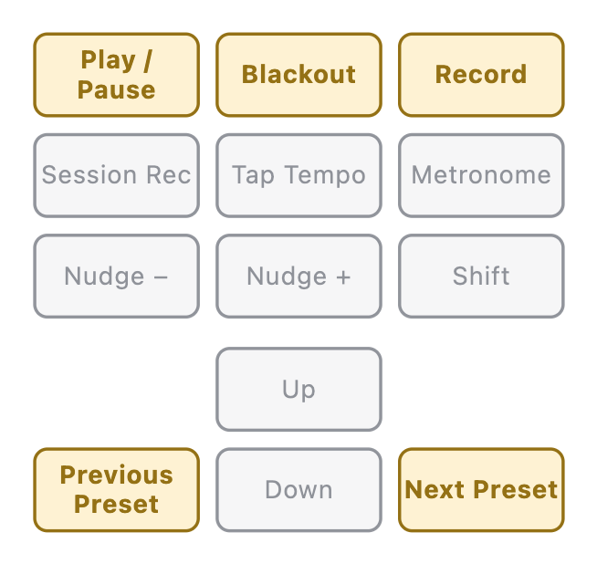

### f) Random at the top — **fixed**

- The scene column top to bottom: **Random**, Sequencer Play / Pause, Sequencer Previous, Sequencer Next, Sequencer Stop, then **Drain**, then Clear.
- The button above Drain is Sequencer Stop: harmless (`s36-zoom-scene-screen.png`).

### g) Swatches, list, saved PNG — **all three fixed**

- **Swatches:** every swatch has a 1 px inset outline, `rgba(17,24,39,0.35)` on paper and `rgba(255,255,255,0.35)` on screen. Pure White is a visible ring on paper, and the legend's white Dye square is outlined too.
- **Assign list:** chip opacity on paper is **1** (0.3 on #35). On screen it is still 0.3 while nothing is selected, as intended. The paper screenshot shows a full-weight list.
- **Saved PNG:** 2128×1324, 60 px taller than #35 for the band.
  - Top left, bold: **"ChromaGlass · APC40 mkII"**
  - Top right, grey: **"79 assigned · Sep 14, 2026"**
  - Nothing overlaps.

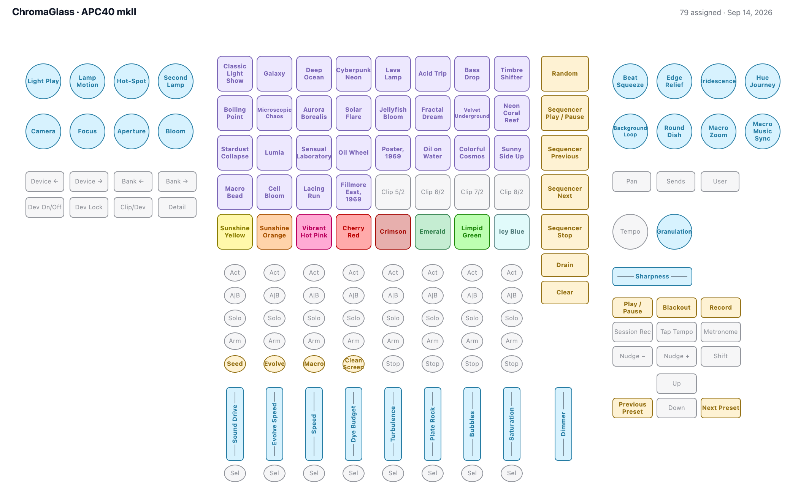

**Would I tape it to a desk?** Yes.
- It says which controller and map it is, and when it was made.
- The dyes are a readable strip of colour, the arrows sit where the hand goes, and Random is away from Drain.
- The two things I would still fix, both from §3a:
  - measure labels at the size they are drawn, so the eight names come off their outlines on a Mac
  - use Clean and Bg Loop
- If it is going to be read in the dark, print it as large as the page allows. At Letter size the main type is 5.4 pt.

On-screen PNG (`s36-cheatsheet-screen.png`): black ground, same band in white. This is the one for the phone.

## Files on this branch

- `reports/s36-surface-{screen,paper}.png`: the picture in both modes, full window
- `reports/s36-cheatsheet-{paper,screen}.png`: the saved PNGs (2128×1324)
- `reports/s36-zoom-*.png`: 3× zooms
- `reports/s36-surface-{screen,paper}.json`: measurements
- `reports/s36-ruler.json`: label width at 100 / 8 / 6.5 units
- `reports/s36-montage-{dish,core,dishzoom}.png`, `s36-smalldish-mask.png`: sharpness at 25 s
- `reports/s36-frames-dish.png`, `s36-frames-dish-{05,1}.png`, `s36-frames-wide-{05,1}.png`, `s36-frames.json`: frame-matched (~1130 frames)
- `reports/s36-rim-core-0-05-1.png`: seeded core at 0, 0.5 and 1.0
- `reports/s36-grain0-dish-all.png`, `s36-grain0-zoom-0-05-06-1.png`, `s36-grain0-core-0-05-1.png`: grain off, frame-matched, 0 / 0.5 / 0.6 / 0.7 / 1.0
- `reports/s36-grain0-dish.png`, `s36-grain0-zoom-0-vs-1.png`, `s36-grain0-wide-{0,1}.png`, `s36-grain0.json`: grain off, frame-matched, first batch (0 / 0.7 / 1.0)
- `reports/s36-rim-core.png`, `s36-rim-dish-05-vs-1.png`: seeded, cells 0
- `reports/s36-sharp-4.json`, `s36-rim.json`: per-run status
- Scripts on the Mac, in `~/cg-scratch/`: `sharp4.mjs` (env `SEED`, `SLIDERS`, `FRAMES`), `smalldish.mjs`, `blockdens.mjs`, `dishdens.mjs`, `rimcmp.mjs`, `montage4.mjs`, `surface36.mjs`, `surface36z.mjs`
