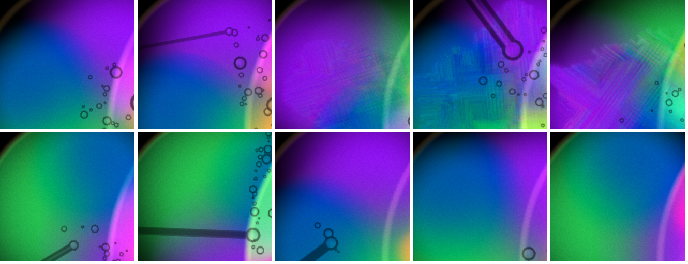
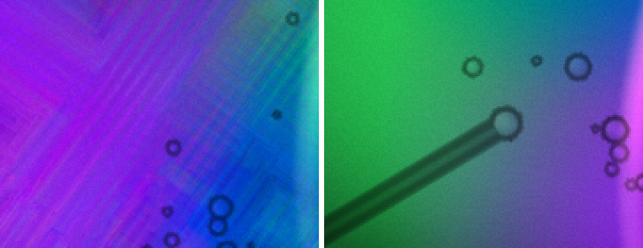
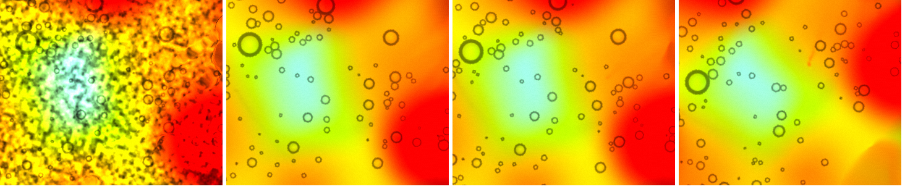
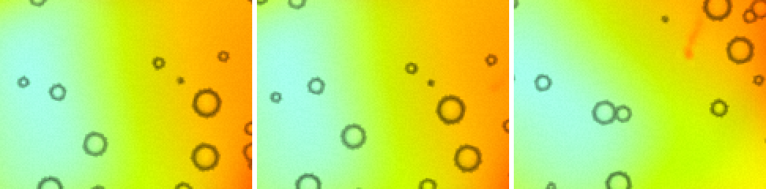
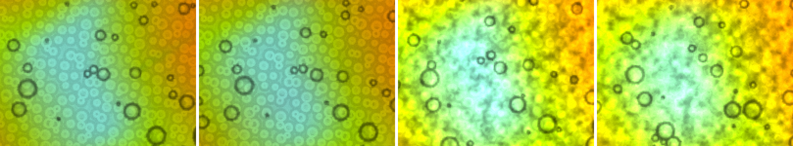
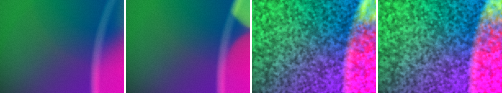
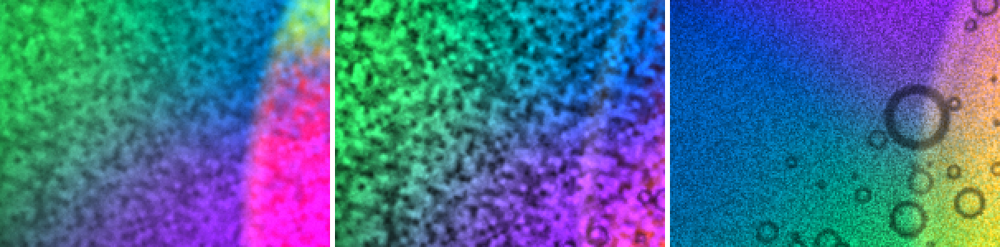
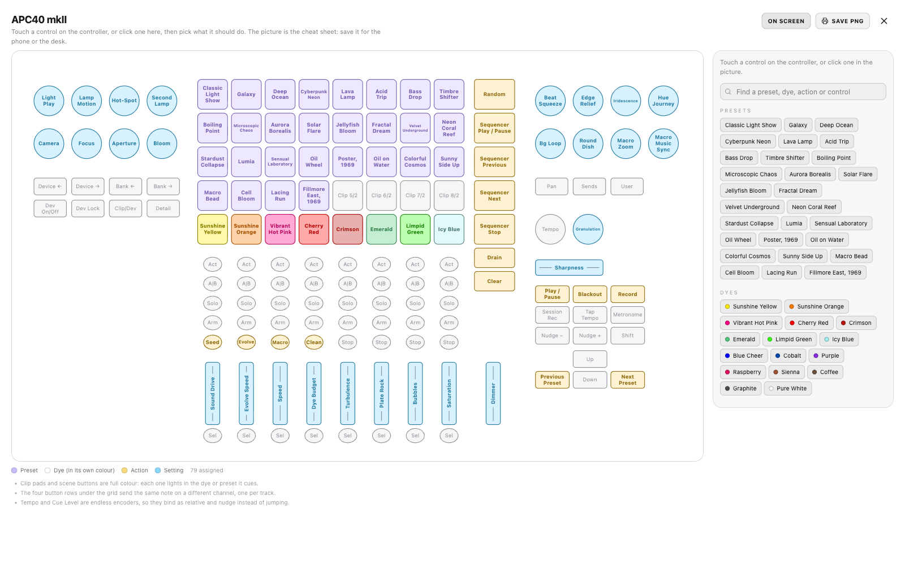
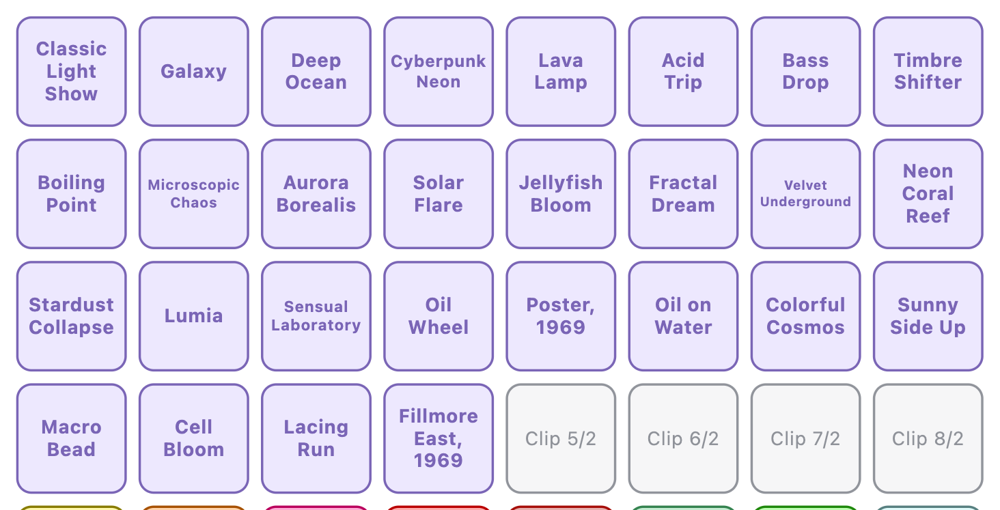
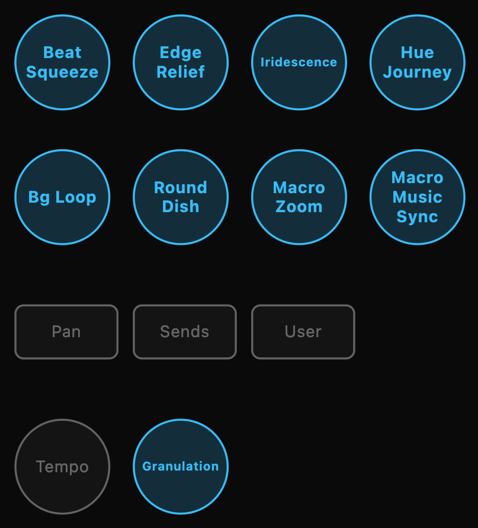

# Mac launch and looks after #37

2026-09-14 night. The Mac is on `main` at f960f9b "Sharpening that stops before it builds a staircase (#37)".

**In short**
- **Shallow dish:** clean at 0, 0.5, 0.6, 0.7 and 1.0 at the frame-matched settle (~1100–1150 frames, grain off). #37 fixed it.
- **Main dish:** on a seeded composition at that settle, 0.5 is the same picture as 0, and 1.0 moves the composition without making it sharper. Sharpening is harmless now, but I can't show it earns its place on this GPU.
- **Grain mottle:** a real bug, and it is not drift. The reset seeds the pigment coordinates by drawing a texture into itself, and WebGL refuses that draw. So the coordinates stay 0 and no grain is drawn at all for the first ~900 frames. What I called a mottle on #36 is the grain arriving late. Granulation sets its strength and grain scale its size; neither moves the timing.
- **Sheet:** nothing sits on its outline and nothing is cut, and Clean and Bg Loop are in use. But four labels now draw at 5.5–6 units, which is too small to read at a glance.

## 1. Launch

- `git pull --ff-only` fast-forwarded cf68d2d → f960f9b. #37 touches `CHANGELOG.md`, `ControllerSurface.tsx`, `LiquidVisualizer.tsx` and `gpuFluid.ts`, not `package-lock.json`, so I did not run `npm install`. The local lockfile edit and the nested `chromaglass/` clone are untouched.
- `npm run build`: OK in 3.66 s.
- I killed the old server (pid 20784, key 1265) and started `npm run remote` with nohup. The log is in `~/chromaglass-server.log`.

| | |
|---|---|
| Server pid | **23447** |
| Show key | **7594** |
| Phone | http://192.168.0.234:3000/?remote=1&key=7594 |
| Network display | http://192.168.0.234:3000/?cast=true&key=7594 |
| `curl http://localhost:3000/` | 200, 1320 bytes |

- Before the restart, James's Chrome had `localhost:3000/` and two `localhost:3000/?cast=true` tabs open, and one held a connection to the old server. The restart dropped it, so those tabs need a reload with the new key.
- I left them and the projector alone. All testing below ran in my own Playwright windows, which I closed afterwards.
- **Load:** GPU utilisation was 99 % at the start (OBSBOT Center, MOTIV Mix, James's Chrome), load average 5.3–5.8. My 512² pages ran at **108–121 ms a frame**, the same as #36. So the sharpness comparison below is frame-matched again.

## 2. Sharpening

### a) The shallow dish — **clean at every value, 1.0 included**

Method: `~/cg-scratch/sharp4.mjs`, unchanged from #36.
- Fillmore 1969, `?debug&sim=512`, "GPU · 512² · 1.0x" on every run.
- A fresh page per value, with Sharpness and `Granulation` 0 set on the sliders after the preset.
- The capture comes 1000 rAF frames after the sliders were set.
- Order: 0.6, 0, 1.0, 0.5, 0.7.
- Captures landed at **1099–1153 frames** (102–138 ms a frame), inside #36's 1134–1157.
- Measured with `smalldish.mjs` on the same small-dish mask as #36.

| slider | 0 | 0.5 | 0.6 | 0.7 | 1.0 |
|---|---|---|---|---|---|
| frames | 1153 | 1147 | 1139 | 1099 | 1126 |
| **#37 gradient fraction** | 0.306 | 0.312 | 0.212 | 0.238 | 0.265 |
| #36 gradient fraction (grain off, ~1150 frames) | 0.214 | 0.207 | 0.280 | 0.457 | 0.449 |
| **#37 axisFrac** | 0.096 | 0.143 | 0.095 | 0.110 | 0.110 |
| #36 axisFrac | 0.100 | 0.111 | 0.121 | 0.126 | 0.098 |
| **#37 steps per 1000 px** | 30.3 | 32.7 | 22.1 | 26.8 | 32.2 |
| #36 steps per 1000 px | 22.7 | 22.3 | 24.0 | 33.3 | 33.7 |
| by eye, #37 | smooth | smooth | smooth | smooth | **smooth** |
| by eye, #36 | smooth | smooth | crosshatch | blocks | blocks, terraces |

- **The numbers no longer follow the slider.** On #36 the gradient fraction doubled from 0.5 to 0.7. On #37 all five values sit in 0.21–0.31, and sharpness 0 is among the highest.
  - The spread is the composition: these runs are unseeded, as on #36, so each value is a different arrangement of green, blue and purple.
  - It is the same size as #36's run-to-run spread at one value (up to 0.08).
- **By eye there is nothing to find.** At 1:1 and at 2× the #37 dish is a soft wash at every value. There is no crosshatch, no terrace and no parallel streak, including at 1.0.
- The 0.143 axisFrac at 0.5 is the dropper's straight horizontal shaft crossing the mask in that frame (bottom row, second from left), not a staircase.

Contact sheet, the #36 crop at 1:1. **Top row: #36** grain off at 0 / 0.5 / 0.6 / 0.7 / 1.0. **Bottom row: #37**, same values.



2×, #37 at 0 / 0.5 / 0.6 / 0.7 / 1.0:


For scale, 2×: #36 at 1.0 (left) against #37 at 0 (right):



**Is 0.6 clean now? Yes. Is 1.0? Yes**, at #35/#36's step count on this GPU.

### b) The main dish on a fixed composition, at the frame-matched settle — **0.5 is the same picture as 0; 1.0 is no sharper**

Method: the same script, with a seeded `Math.random` (seed 20260914), `Plate Cells` 0 and `Granulation` 0, and `FRAMES=1000`.
- Order: 0, 1.0, 0.5, 0 again.
- Captures landed at **1121–1134 frames** (133–141 ms a frame).
- So this closes the gap I named in #36 §2f: these are seeded frames at ~1130 frames, not 25 s.

**One run is spoiled, and it was my doing.** The first run at 0 (`m0`) is covered in a dark grain speckle.
- My grain probe (§3) was running at the same time, and its granulation-1.0 variant sent `/chromaglass/setting/granulation 1` over OSC at about 22:36, in the middle of that run.
- OSC reaches every display connected to the server, my sharpness page included.
- I have left `m0` out of the comparison. The repeat at 0 (`m0b`) ran after that variant had finished setting its value, and it is clean.

| seeded, cells 0, grain 0 | frames | dish ridge /1000 | dish halo /1000 | dish edge fraction | core ridge /1000 | core halo /1000 | core mean \|Δ\| vs 0b |
|---|---|---|---|---|---|---|---|
| 0 (`m0b`) | 1131 | 3.2 | 1.32 | 0.096 | 4.3 | 1.36 | — |
| 0.5 | 1121 | 3.3 | 1.50 | 0.097 | 4.6 | 1.47 | **6.8** |
| 1.0 | 1125 | 2.9 | 1.31 | 0.094 | 3.6 | 0.83 | 27.2 |
| (`m0`, grain 1 by accident) | 1134 | 22.1 | 19.3 | 0.472 | 25.1 | 19.7 | 23.2 |

- **0.5 against 0:** mean |Δ| 6.8, inside the 4–7 that two runs at the *same* value differed by on #36. Every count agrees to within a tenth. By eye they are the same frame (sheet below, second and third).
- **1.0 against 0:** mean |Δ| 27. The composition has moved: the red patch on the right has shifted and the yellow is spread wider. So at 1.0 the pass does change how the liquid evolves over 1100 frames.
  - But it is not sharper. Edge fraction, ridge and halo are the same as 0 or slightly lower.
  - At 2× the boundaries at 1.0 are as soft as at 0.
- Nothing at any value has a rim, a staircase or a hard edge that 0 lacks.

Core, 1:1: `m0` (spoiled by grain), 0 (`m0b`), 0.5, 1.0:



2×: 0, 0.5, 1.0:



### c) Does sharpening earn its place? — **No, not that I can see on this GPU**

Put plainly:
- **In the main dish at 512², I cannot tell 0.5 from 0.** That was true on #36 at 25 s, and it is still true at the frame-matched settle. At 1.0 the picture changes but does not get sharper. On Fillmore at 512² the colour boundaries are wide soft gradients, and after #37's floor the pass finds almost nothing it is allowed to steepen.
- **In the shallow dish it now costs nothing visible** at any value (§2a). That is the change from #36: the pass is no longer harmful.
- **Frame cost:** not re-measured. GPU utilisation was at 99 % all session, so frame times follow load. #34 measured about 1 ms a frame (2–3 %) in paired pages.

So it is harmless now, but I have no frame on this machine in which it does anything a viewer would notice, at the default or at the top of the slider. If the choice is between keeping a slider and pass that don't show and dropping them, I would drop them.

What I have not tested, and could change that answer:
- a preset with hard-edged dye (drops or lacing) rather than Fillmore's washes
- 768², if the governor ever climbs there
- the CPU solver, where your 192² numbers show a real change

## 3. The grain mottle — **it is the grain switching on late, because the first seed of the pigment coordinates is a feedback loop**

### a) The bug

In `GpuFluid`'s reset (`src/lib/gpuFluid.ts:687–694`), both grain targets are seeded like this:

```ts
for (const t of [this.grain.read, this.grain.write]) {
  this.runInto('seedGrain', t.fbo, (u) => {
    this.bind(u, 'u_src', this.grain!.read.tex, 0);   // ← the texture being drawn into, when t is read
    ...
```

- When `t` is `grain.read`, the shader samples `grain.read.tex` while drawing into `grain.read`'s framebuffer.
- WebGL refuses that draw: `GL_INVALID_OPERATION: glDrawArrays: Feedback loop formed between Framebuffer and active Texture`. `u_keep` being 0 does not help, because the texture is still bound.
- So `grain.read` stays all zero. `grain.write` does get the identity coordinates.
- But the first solver step advects `write ← read`, which overwrites `write` with zeros, and then swaps. From there both targets hold **0 in both phases**.
- With the coordinates at 0, `pigmentGrain` is `grainAt(0)` everywhere: a constant. **No grain is drawn at all.**
- Nothing repairs it until the phase clock reseeds a phase from `v_uv`:
  - phase B at `grainAge` = 3
  - phase A when the age wraps at 6
- Phase B fades in from its reseed (weight `grainMix` = cos²(π·age/6), 0 at age 3 and 1 at age 6), so the grain arrives over the second half of the first period.

How I pinned it (`~/cg-scratch/grainprobe2–4.mjs`, `grain37.mjs`):
- **The error:** a `drawArrays` hook installed before the app loads caught exactly **4** `INVALID_OPERATION`s in a page's first 15 s (1075 draws). All 4 were on the `seedGrain` program, 7.6–9.4 s after load, and none came after.
- **The targets:** both grain targets read back as exactly 0 (`nonzeroFrac` 0) from load until phase B's reseed. Meanwhile the dye target read back normally.
- **The shader is fine:** `seedGrain` run by hand into `grain.write`, with `grain.read` bound as the source, wrote the expected uv (0.5010, 0.2510) with no GL error.
- **The wrapper counts agree:** `seedGrain` was called 2 times at load with 1 error, then once per half-period with no errors.

### b) When it starts — **solver steps, not wall time**

Fillmore, granulation 0.5, grain scale 110, one page, captured 30 / 60 / 120 / 240 s after the preset pick (`grain37.mjs`):

| capture | frames since set | `grainAge` | `grainMix` (B's weight) | seed calls | coordinates | phase B stretch p50 / p90 / p99 | phase A stretch p50 / p90 / p99 |
|---|---|---|---|---|---|---|---|
| 30 s | 195 | 1.42 | 0.54 | 2 (1 failed) | **all zero** | — | — |
| 60 s | 424 | 2.94 | 0.00 | 2 (1 failed) | **all zero** | — | — |
| 120 s | 855 | 5.74 | 0.98 | 3 | B seeded, A zero | 1.00 / 1.05 / 1.93 | — |
| 240 s | 1742 | 5.49 (second period) | 0.93 | 5 | both seeded | 1.00 / 1.09 / 1.85 | 1.00 / 1.13 / 2.86 |

- `grainAge` advances by the solver's `dt`. Between the 30 s and 60 s captures it moved **0.0066 per rAF frame** on Fillmore. I counted frames, not solver steps, so I cannot say how many steps that is.
  - Phase B's first reseed comes at about **450 frames** after load.
  - The first period ends, and phase B reaches full weight, at about **900 frames**. After that both phases are live and the grain behaves as designed.
- Under today's load (~110 ms a frame) that is about **1 min** before anything shows and **2 min** before it is at full strength. That is exactly the "after about two minutes" I reported on #36.
- The clock runs on the solver's `dt`, not the wall clock. On a quiet machine at 60 Hz, if the steps per frame are the same, 900 frames is about **15 s**, so on the projector the grain would arrive a few seconds after each load.
- "It builds with wall time" in my #36 report was wrong. It builds with the simulation clock; under load, wall time was only a proxy for it.

2×, the same page at **30 s, 60 s, 120 s, 240 s**. Main dish core:



Small dish:



- At 30 s and 60 s the plate is smooth: the plate-cell carpet shows in the main dish, and the small dish is a soft wash.
- At 120 s the pigment grain is fully there, a mottle a few pixels across over both dishes. At 240 s it is the same.

### c) Crossfade or drifting coordinates? — **neither; it is the designed grain, arriving late**

- **Not drifting coordinates.**
  - Once seeded, a phase's coordinates move a median **0.9–1.5 texels** from identity.
  - Their stretch (|∂a/∂x|·N, 1 = fresh) is **1.00 at the median, 1.05–1.13 at p90 and under 3 at p99**, at both 120 s and 240 s.
  - The speckle is therefore drawn at close to its intended size, not compressed into pixel noise by the flow.
- **Not the crossfade.** At 120 s and 240 s `grainMix` is 0.93–0.98, so almost all of the picture is one phase, and the mottle is already at full strength.
- **What the "mottle" is:** the grain as the shader draws it at `granulation` 0.5 and `grainScale` 110. Before this bug is fixed, nobody on a GPU sees that grain for the first ~900 steps of a page. So anything tuned by looking at the first minute under load, or the first few seconds on a quiet machine, was tuned without it.

### d) Does `granulation` or `grainScale` change it? — **the strength and the size, not the timing**

The same script, a fresh page per variant, and the value set over OSC right after the preset.

The mottle metric is mean |L − its 5×5 box mean| (`grainhp.mjs`). It is read on the small-dish mask, where the dye is a smooth wash, so the metric sees the grain alone. On the core crop the plate cells and beads add to it.

| variant | seeded by | small dish 30 s | 60 s | 120 s | 240 s | core 30 / 60 / 120 / 240 s |
|---|---|---|---|---|---|---|
| granulation 0.5, scale 110 (Fillmore default) | ~450 frames | 1.27 | 1.23 | **4.09** | 4.14 | 5.4 / 5.8 / 6.5 / 6.2 |
| granulation 1.0, scale 110 | ~450 frames | 0.79 | 0.78 | **7.70** | 7.82 | 2.8 / 2.5 / 7.1 / 6.8 |
| granulation 0.5, scale 440 | ~450 frames | 1.30 | 1.29 | **8.12** | 7.95 | 4.3 / 4.9 / 12.4 / 11.6 |
| granulation 0 (control) | ~450 frames (seeded, not drawn) | 1.56 | 1.53 | 1.53 | 1.48 | 5.9 / 5.9 / 5.7 / 5.4 |

- **The control stays flat.** With granulation at 0, the coordinates are reseeded on the same clock, but nothing is drawn with them. The small dish holds at 1.5 throughout, so the jump in the other rows is the grain and nothing else.

- **Timing doesn't change.** Every variant shows no grain at 30 s and 60 s, and full grain by 120 s. The seed calls and `grainAge` line up to within a few frames. The delay belongs to the phase clock, not to either setting.
- **Granulation scales the contrast.** At 1.0 the speckle has about twice the energy of 0.5, at the same size.
- **Grain scale sets the size.** At 440 the speckle is about one pixel: it looks like video noise on the projector rather than pigment. At 110 it is a few pixels across.
- The coordinates stay tame in every variant: phase stretch p99 1.35–2.92 at 240 s, median 1.00.

2× at 240 s, small dish: granulation 0.5 / scale 110, granulation 1.0 / scale 110, granulation 0.5 / scale 440:



### e) Suggested fix (not tried; this session does not change code)

Seed without sampling the target being drawn. For example, seed `write`, swap, seed `write` again with `u_keep` 0 (sampling the other texture), swap. Or give `seedGrain` a no-source variant for the reset.

After that, the grain is there from the first frame. Whether 0.5 at scale 110 is then the texture James wants on the projector is a separate question, and it should be judged with the grain present from the start.

## 4. The sheet, third pass — **the labels are off their outlines and nothing is cut, but the smallest type is now smaller**

Method: `~/cg-scratch/surface37.mjs` (the #36 script, pointed at a new folder) and `surface37z.mjs` (3× zooms).
- I opened the MIDI panel, enabled MIDI (no hardware attached) and loaded the APC40 mkII factory map.
- I opened the picture and measured every `<text>` and shape in the DOM in both modes, then saved the PNG in both modes.

Factory map: **79 bound / 68 unbound** (unchanged). Ink against its own fill: **0 controls below 3.6** in either mode (unchanged).



### a) On the outline — **fixed**

The margin is measured from the text box to the shape box, in units per side. Circles are measured on their bounding box, which flatters them.

| | #36 | #37 |
|---|---|---|
| Labels over their edge | 4 (−0.1 to −0.2) | **0** |
| Labels within half a unit | 4 | **0** |
| Tightest margin | −0.2 (Sensual Laboratory, Iridescence, Granulation) | **+1.7** (Macro, stop row) |
| Next tightest | | Evolve +1.9, Clean +2.1, Cyberpunk Neon +2.6, Microscopic Chaos +3.3, Velvet Underground +3.5 |

By eye at 3× (`s37-zoom-presets-paper.png`, `s37-zoom-knobs-screen.png`, `s37-zoom-stoprow-paper.png`):
- Every preset pad has clear air on both sides, including Cyberpunk Neon, Microscopic Chaos, Velvet Underground and Sensual Laboratory, which ran edge to edge on #36.
- Iridescence and Granulation sit inside their rings; on #36 they crossed them.
- In the stop row, Seed, Evolve, Macro and Clean are inside their ovals. Macro and Clean come closest, but neither touches.





### b) Short forms — **Clean and Bg Loop are in use**

- Stop row: **Clean** (Clean Screen) at 8 units, **Evolve** (Random Evolve) at 7, and **Macro** at 7.5.
- Track 5 knob: **Bg Loop** (Background Loop) at 8, one line, well inside the ring.

### c) Nothing is cut — **confirmed**

- **Ellipses: 0.** **Text outside its shape: 0**, in both modes.
- Fader tracks: every fader now has **5.0 units** of clearance at both ends of its label (#36: 1.4–3.5). The lines stop well short of the words (`s37-zoom-faders-screen.png`).
- Saved PNGs: 2128×1324 in both modes, same as #36, with the title band.

### d) The smallest type — **smaller than on #36**

Measuring at the drawn size did what I expected in §3a of the #36 report: the labels now measure 14–17 % wider, so the ones that were tight stepped down a size instead of crossing their outline.

| units | #36 lines | #37 lines |
|---|---|---|
| 8 | 186 | 189 |
| 7.5 | 4 | 1 |
| 7 | 4 | 3 |
| 6.5 | 2 | 2 |
| 6 | 0 | **4** |
| 5.5 | 0 | **2** |

- **Smallest now: Velvet / Underground at 5.5 units.** On #36 it was 6.5.
- **At 6:** Microscopic / Chaos, Iridescence, Granulation.
- **At 6.5:** Sensual / Laboratory. **At 7:** Cyberpunk / Neon, Evolve.
- On the Mac screen (1.15 px per unit) 5.5 is **6.3 px** and 6 is **6.9 px**. At 1× in the picture above, Velvet Underground and Microscopic Chaos read as grey smudges next to their neighbours, and so do Iridescence and Granulation on their knobs. At 3× they read.
- Printed to fill a landscape Letter page (0.68 pt per unit), 5.5 is **3.7 pt** and 6 is **4.1 pt**, against 5.4 pt for the body.

### Is the sheet right now?

**The layout is.** Nothing touches, nothing is cut, and the short forms work.

**But it reads worse in the dark than #36 in four places.** The fix moved the failure from "on the outline" to "too small":
- Velvet Underground, Microscopic Chaos, Iridescence and Granulation are the four I would not trust at a glance on a dark stage.
- The first two are presets with no short form; the last two are single long words in a small circle, so they cannot wrap.
- The short-form rule would already catch all four if they had short forms: they are below 8. **Velvet**, **Micro Chaos**, **Iridesce** / **Irid.** and **Grain** would each fit at 8 or close to it. Whether Iridescence and Granulation read well abbreviated is James's call.

## What I did not measure

- **Frame cost of the #37 pass:** GPU utilisation was 99 % all session, so frame time follows load (#34: about 1 ms a frame).
- **Repeats of the shallow dish at the matched settle:** one run per value. Five clean frames with no trend is what I'm relying on.
- **A clean second seeded run at 0.5 and 1.0:** there is one each. The first run at 0 was spoiled by my own OSC (§2b).
- **Sharpening on a hard-edged preset or at 768²:** not run.
- **The grain once fixed:** I did not change code, so I cannot show the plate with the grain present from frame one. I also did not test whether the crossover between phases is visible once both phases are live; at 240 s I saw none in single frames.
- **The projector and a printed sheet:** not looked at, per the house rules.

## Files on this branch

- `reports/s37-shallow-36-vs-37.png`, `s37-shallow-zoom-0-05-06-07-1.png`, `s37-shallow-zoom-36at1-vs-37at0.png`, `s37-shallow.json`: §2a
- `reports/s37-main-seeded-0-0b-05-1.png`, `s37-main-seeded-zoom-0b-05-1.png`, `s37-main.json`: §2b
- `reports/s37-grain-main-30-60-120-240.png`, `s37-grain-small-30-60-120-240.png`, `s37-grain-small-a05-b1-c440-at240.png`, `s37-grain.json`: §3
- `reports/s37-surface-{screen,paper}.{png,json}`, `s37-cheatsheet-{screen,paper}.png`, `s37-zoom-*.png`: §4
- Scripts on the Mac, in `~/cg-scratch/`:
  - `sharp4.mjs` (unchanged), `smalldish.mjs`, `rimcmp.mjs`, `montage4.mjs`, `zoomrow.mjs`
  - `grain37.mjs`, `grainhp.mjs`, `grainprobe2.mjs`, `grainprobe3.mjs`, `grainprobe4.mjs`
  - `surface37.mjs`, `surface37z.mjs`
