# Mac launch and looks after #39

2026-09-14, late night. The Mac is on `main` at ba3733f "The pigment grain was never drawn for the first nine hundred steps (#39)".

**In short**
- **The grain is live from the first frame.** At 10 s there are no GL errors and no NaN, and both phases carry coordinates. The texture is the same at 10 s, 30 s and 2 min. #37's four `INVALID_OPERATION`s on `seedGrain` are gone.
- **The default to set: granulation 0.5 at grain scale 110**, which is what Fillmore already has.
  - At 0.25 the grain is lost under the plate cells, and 0.75–1.0 muddies thin dye.
  - Scale 55 reads as blur, 220 as sand and 440 as video static.
- **The crossover doesn't show.** The designed contrast dip is measurable but small: 0.965× in the small dish at the default and 1.00× at granulation 1.0, against 0.71× for independent noise. I found no pulse and no jump at a reseed, by numbers or by eye. The reason: a reseeded phase is nearly the same texture as the one it replaces.
- **Sheet:** 208 of 210 lines at full size on this Mac, nothing cut or over an outline. Three breaks read badly: **Backg-round** (I'd rather have Back-ground), **Micros-copic** (Micro-scopic) and **Labo-ratory** (Labora-tory).
- **Sharpening:** I agree with PLAN.md.
- **GL errors after 25 s and frame cost:** the probe is running; see "Errors and cost" in §2.

## 1. Launch

- **Pull.** `git pull --ff-only` refused at first: #38 adds `playwright` to `package-lock.json`, and the local lockfile edit is in the way.
  - The two edits touch different parts of the file. The local edit drops 531 lines of optional `@esbuild/*` platform packages; #38 adds the `playwright` and `playwright-core` entries.
  - So I stashed only the lockfile, fast-forwarded f960f9b → ba3733f (#38 and #39), and popped the stash. It merged cleanly.
  - The lockfile is still modified locally: the 531 deleted lines are still gone, and #38's playwright entries are in it. A backup of the local file from before the pull is at `/tmp/package-lock.local-backup-39.json`.
  - The nested `chromaglass/` clone is untouched.
- **No `npm install`.** #38's only new dependency is `playwright`, a dev dependency the build does not use, and an install would rewrite the local lockfile.
- **Build.** `npm run build`: OK in 3.27 s.
- **Restart.** I killed the old server (pid 23447, key 7594) and started `npm run remote` with nohup. The log is in `~/chromaglass-server.log`.

| | |
|---|---|
| Server pid | **25271** |
| Show key | **9281** |
| Phone | http://192.168.0.234:3000/?remote=1&key=9281 |
| Network display | http://192.168.0.234:3000/?cast=true&key=9281 |
| `curl http://localhost:3000/` | 200, 1320 bytes |

- The key changed, so any of James's tabs or displays still holding key 7594 need a reload with 9281. I left James's Chrome and the projector alone.
- **Load:** GPU utilisation 99 % and load average 5.3–5.5 at the start (MOTIV Mix, James's Chrome, WindowServer). That is the same as #37, so timings below are compared by frames, not seconds.

## 2. The grain — **keep granulation 0.5 at grain scale 110; no visible crossover**

### Which pair for a projected plate — **granulation 0.5, grain scale 110 (the current Fillmore default)**

Method: `grain39.mjs` on Fillmore at `?debug&sim=512`, on "GPU · 512² · 1.0x" in every run. The settings were sent over OSC after the preset, with a fresh page per variant and one page at a time. Captures at 10 s, 30 s and 2 min after the pick landed at 128–136, 353–391 and 1378–1421 frames, so the variants are frame-matched to within 3 %. The runs are unseeded, so each is a different arrangement of colour. High-pass is `grainhp.mjs`, as on #37.

| variant | small dish 10 / 30 / 120 s | core 10 / 30 / 120 s | by eye at 2× |
|---|---|---|---|
| granulation 0 (control) | 1.60 / 1.56 / 1.54 | 5.61 / 5.99 / 5.67 | clean wash |
| granulation 0.25, scale 110 | 2.49 / 2.49 / 2.45 | 5.51 / 5.65 / 5.66 | faint; lost under the plate cells and bubbles in the core |
| **granulation 0.5, scale 110** | **4.21 / 4.24 / 4.16** | **5.05 / 5.30 / 5.08** | **a pigment mottle a few px across; the colour still leads** |
| granulation 0.75, scale 110 | 4.40 / 4.40 / 4.38 | 7.11 / 7.40 / 7.17 | dark cells start to muddy thin dye |
| granulation 1.0, scale 110 | 7.96 / 7.92 / 7.78 | 8.34 / 8.71 / 8.42 | heavy blotches; the texture leads the colour |
| granulation 0.5, scale 55 | 2.13 / 2.12 / 2.16 | 4.91 / 5.19 / 4.80 | soft clouds 10–15 px across; reads as blur, not pigment |
| granulation 0.5, scale 220 | 6.16 / 6.09 / 6.11 | 10.44 / 10.60 / 10.26 | fine sand |
| granulation 0.5, scale 440 | 9.62 / 9.59 / 9.20 | 12.50 / 12.65 / 12.12 | single-pixel static; on a projector this is video noise |

- **Every variant is at full strength at 10 s and holds to 2 min.** The rows are flat across time, so nothing builds any more. That settles the question from #37.
- **Granulation scales contrast, and grain scale sets size.** The high-pass doubles from 0.5 to 1.0.
  - The 0.75 row reads low only because that run's small dish happened to be a darker purple. By eye, 0.75 is clearly stronger than 0.5.
  - A 5×5 high-pass rewards fine texture, so the scale rows compare size, not strength.
- **Why 0.5 / 110:**
  - It is the only pair here that reads as pigment in the liquid rather than as blur (55), sand or static (220, 440) or dirt (0.75 and 1.0).
  - A projector loses contrast, which argues against going lower. At 0.25 the grain is already hard to see on the Mac screen, under the plate cells.
  - If James finds it busy on the wall, the next step I'd try is 0.35 at 110, not a different scale.
- **Caveat:** I judged this on the Mac screen and in crops, not on the projector.

2× small dish at 10 s. **Granulation** 0.25 / 0.5 / 0.75 / 1.0 at scale 110:

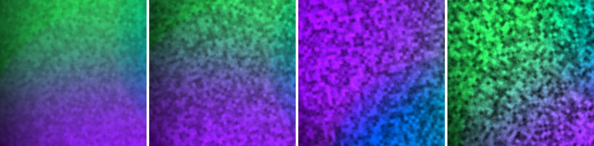

**Grain scale** 55 / 110 / 220 / 440 at granulation 0.5:

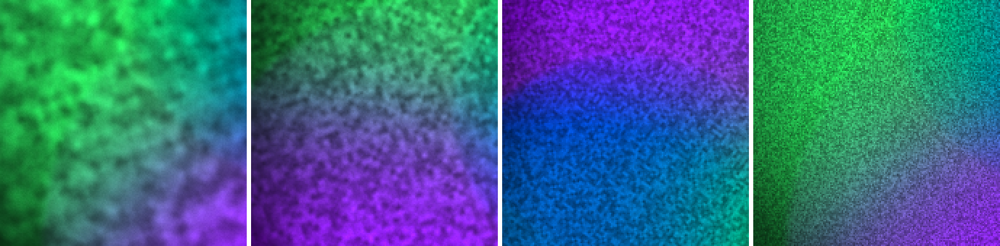

2× core at 10 s. Granulation 0.25 / 0.5 / 0.75 / 1.0:

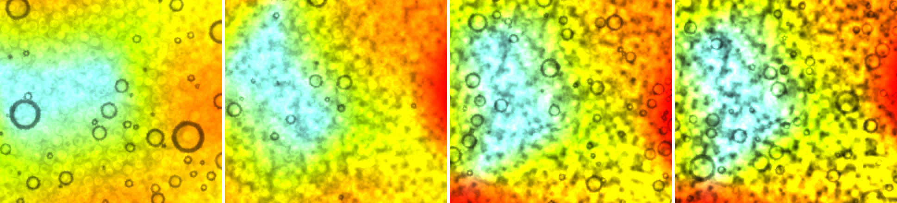

Scale 55 / 110 / 220 / 440:

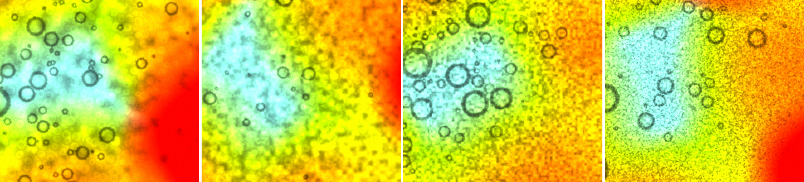

Control, small dish: granulation 0 at 10 s, 0.5 at 10 s, 0 at 2 min, 0.5 at 2 min:

The same rows at 2 min are `s39-sweep-gran-small-120.png` and `s39-sweep-scale-small-120.png`.

### Crossover — **no pulse and no jump that I can see; the designed dip is there but small**

Method: `grain39.mjs` samples in-page every 3 frames for 1000 frames after the 2-min capture. Each sample logs `grainAge`, `grainMix` and the high-pass energy in the small dish and the core. There were 333 samples over frames 1635–2631, covering 4.9 s of simulation clock including one reseed of each phase.

- **Where the dip should be:** a linear mix of two independent speckle fields would lose contrast to √(w² + (1−w)²), which is 0.71 at `grainAge` 1.5 and 4.5.
- **What I measured (small dish):**

| `grainAge` bin | 0.0 | 0.5 | 1.0 | 1.5 | 2.5 | 3.0 | 3.5 | 4.0 | 4.5 | 5.0 | 5.5 |
|---|---|---|---|---|---|---|---|---|---|---|---|
| designed contrast | 0.98 | 0.86 | 0.74 | 0.71 | 0.99 | 0.98 | 0.87 | 0.74 | 0.74 | 0.87 | 0.98 |
| small-dish high-pass | 4.04 | 3.98 | 3.92 | 3.90 | 4.14 | 4.14 | 4.13 | 4.01 | 3.97 | 4.02 | 4.06 |

- **It follows the design (correlation 0.72), but shallowly.** At equal weights the energy is **0.965×** its value at one phase in the small dish and **0.92×** in the core, not 0.71×.
  - Two phases don't make independent noise: a phase is reseeded to the grid when the other has drifted only ~1 texel (median), and a speckle at scale 110 is ~4.7 texels. So the two phases are mostly the same texture.
  - Where the liquid is still, a reseeded phase lands on the same noise it left. In the 2× crops below, the speckles in the small dish are in the same places at mix 0, ½, 1 and ½.
- **No jump at a reseed.** The median step between samples is 0.007 and the p99 is 0.044.
  - The one large step (−0.148, at `grainAge` 4.36) holds its new level and does not show in the core. It lands where nothing reseeds and the weights change smoothly, so it is not the crossover. Most likely something in the composition moved in the small dish.
- **At granulation 1.0 as well:** 333 samples over 5.3 s of clock. The small dish reads **1.00×** at equal weights (correlation −0.07) and the core 0.94×. The largest step was 0.084 against a median of 0.013.
- **Control, granulation 0:** 1.00× in the small dish and 0.99× in the core, with a largest step of 0.029. So the dips above are the grain and not the composition.
- **By eye:** the 2× frames at mix 0 / ½ / 1 / ½ show no change in speckle size or strength in the small dish. In the core the picture changes only because a new orange flood spreads across it.

2× small dish at mix 0, ½ rising, 1, ½ falling (`grainAge` 2.73, 4.44, 5.73, 1.45):

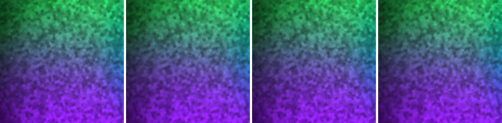

The same frames in the core:

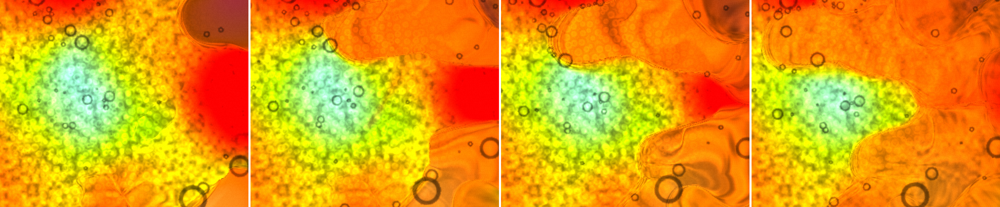

### The default over time

At 10 s, 30 s and 2 min the default is the same texture, and it is there from the first capture:

| granulation 0.5, scale 110 | 10 s | 30 s | 2 min |
|---|---|---|---|
| frames since load | 372 | 597 | 1631 |
| small-dish high-pass | 4.21 | 4.24 | 4.16 |
| core high-pass | 5.05 | 5.30 | 5.08 |
| GL errors, NaN in grain or dye | 0, 0 | 0, 0 | 0, 0 |
| phase stretch p50 / p99 | 1.00 / 1.37 | 1.00 / 2.35 | 1.00 / 4.8–5.2 |

2× core at 10 s, 30 s, 2 min:

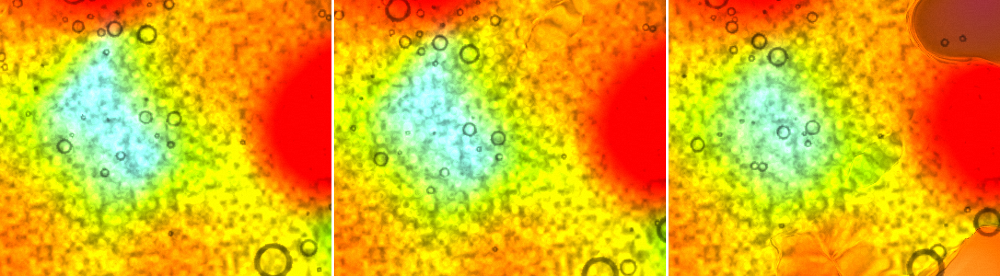

2× small dish at 10 s, 30 s, 2 min:

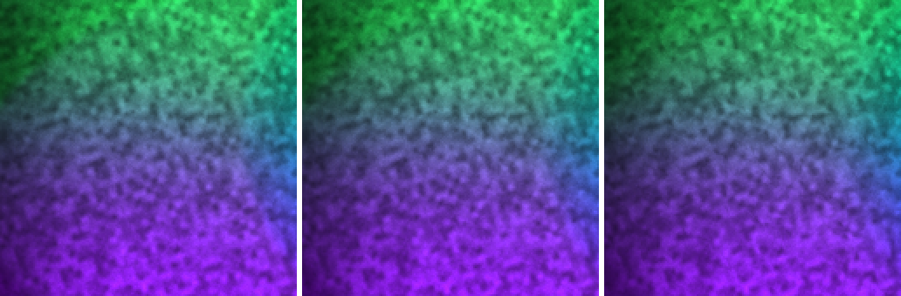

### First look

Fillmore, `?debug&sim=512`, granulation 0.5, grain scale 110. 10 s after the preset pick, which is 372 frames after load:
- **GL errors: none.** A `getError` after every draw for the first 25 s after load caught nothing (#37: 4 `INVALID_OPERATION`s on `seedGrain`).
- **Both phases seeded everywhere:** non-zero fraction 1.00 (#37: 0 until ~450 frames).
- **NaN: 0** in the grain coordinates and 0 in the dye.
- **High-pass in the small dish: 4.21**, against 1.27 at 30 s on #37 and 1.5 for #37's granulation-0 control. On #37 it took ~900 frames to reach this level (4.09–4.14).

2× at 10 s, main dish core and small dish:

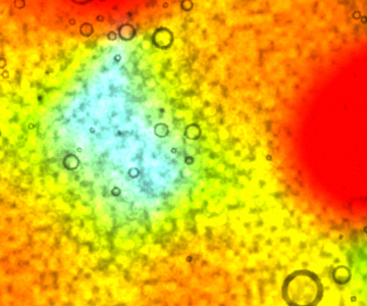 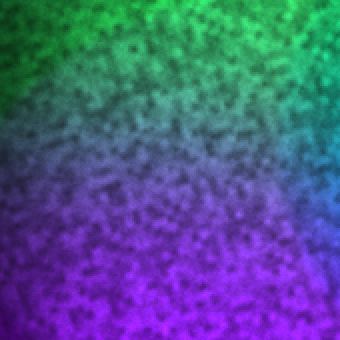

### Errors and cost

*Probe running (`errcost39.mjs`); results will be added here.*
- Every page in the sweep, the granulation-0 control included, logged one console line: "WebGL: too many errors, no more errors will be reported to the console for this context". Chrome prints that once a context has sent 32 messages to the console, and my filter hid the "READ-usage buffer" warnings my own float `readPixels` raise. So it may be mine, not the app's. The probe runs with no readbacks first, then with a burst of them, to tell which.
- Granulation 0 only stops the display binding the grain texture; the solver still advects and reseeds the coordinates. So the probe measures cost by detaching the grain from the solver in alternate windows, not by moving the slider.

## 3. The sheet — **everything at 8 but two stop-row words; three breaks read badly**

Method: `~/cg-scratch/surface39.mjs` (surface37 pointed at a new folder) and `surface39z.mjs` (3× zooms).
- MIDI panel open, MIDI enabled with no hardware attached, APC40 mkII factory map loaded.
- Every `<text>` and shape measured in the DOM in both modes, then the PNG saved in both modes.
- The old script's extra zoom block stopped on a control id this picture doesn't have (`fader-8`), after all measurements and both PNGs were saved. The zooms come from `surface39z.mjs`.

**Factory map: 80 bound / 67 unbound** (#37: 79 / 68). Ink against its own fill: 0 controls below 3.6 in either mode.

### a) Sizes — **208 of 210 lines at full size on this Mac**

| units | #37 lines | #39 lines |
|---|---|---|
| 8 | 189 | **208** |
| 7.5 | 1 | 1 (Macro) |
| 7 | 3 | 1 (Evolve) |
| 6.5 | 2 | 0 |
| 6 | 4 | 0 |
| 5.5 | 2 | 0 |

- **This is better than your 203.** Nothing is below 7 here, and Evolve is at 7, not 6.5. My guess is Chrome on macOS measures the font slightly narrower than your machine does; the numbers are the same in both modes.
- **Smallest:** Evolve at 7 units, which is 8.1 px on the Mac screen. Macro is at 7.5.

### b) Margins and cuts — **unchanged and clean**

- **Tightest margins:** Macro +1.7, Evolve +1.9, Clean +2.1 (all in the stop row, same as #37), then Seed and Metronome at +3.5.
- **The hyphenated labels** all sit further in than that: none is in the ten tightest, so each has at least 3.6 units of air.
- **Ellipses: 0. Text outside its shape: 0.** Both modes.
- **Fader label clearance:** 5.0 units at both ends, as on #37.
- **Saved PNGs:** 2128×1324 in both modes, with the title band.

### c) The hyphenated names — **four read well, three don't**

On the Mac at 1× (screenshot below), every hyphenated name is readable, in both modes. That is a clear improvement on #37's grey smudges at 5.5–6 units. The same holds on the saved PNG. What's left is the choice of break:

| label | reads | say instead |
|---|---|---|
| Cyber- / punk / Neon | **well**: breaks between the two words it's made of | — |
| Velvet / Under- / ground | **well** | — |
| Irides- / cence | **well** | — |
| Granu- / lation | **well** | — |
| Backg- / round / Loop | **badly**: "Backg" isn't a syllable | **Back- / ground**. Or "Bg Loop", which on #37 fit on one line at 8. |
| Micros- / copic / Chaos | **badly**: "Micros" reads as a word of its own | **Micro- / scopic** |
| Sensual / Labo- / ratory | **awkward**: readable, but the eye stalls on "Labo" | **Lab- / oratory** or **Labora- / tory** |

- Yes, I would rather have **"Back-ground"**. The same rule (break between the parts of a compound, or after a prefix) fixes Microscopic too.
- Background Loop is also the one knob that now needs three lines. On #37 its short form "Bg Loop" fit on one.

On screen at 1×:

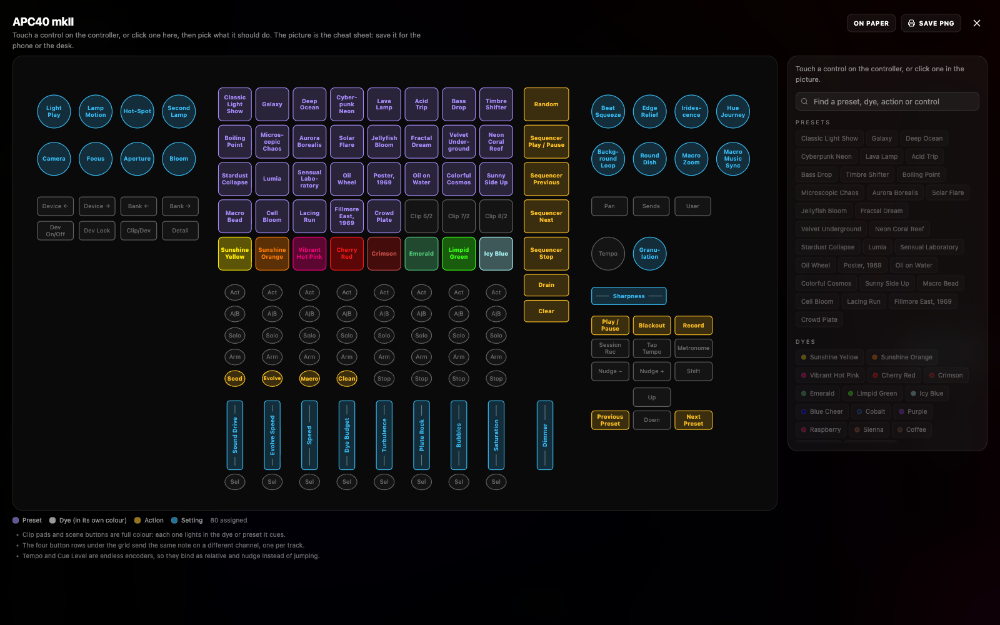

Saved PNG, on paper:

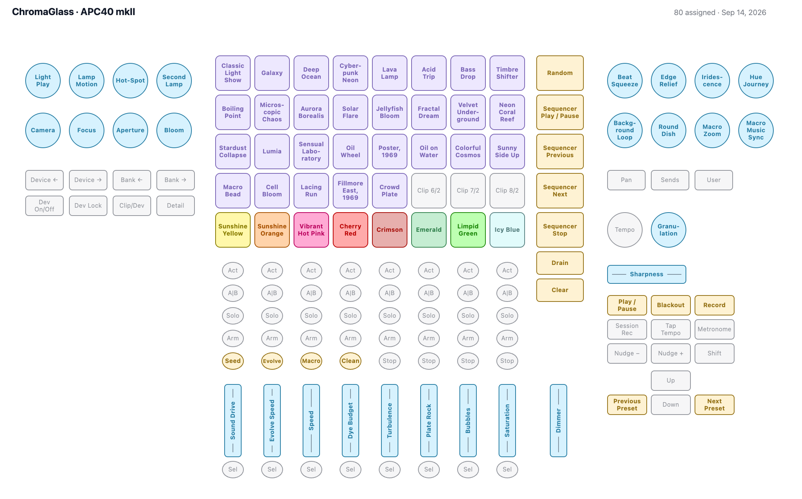

3×: presets on paper, knobs on screen, stop row on paper:

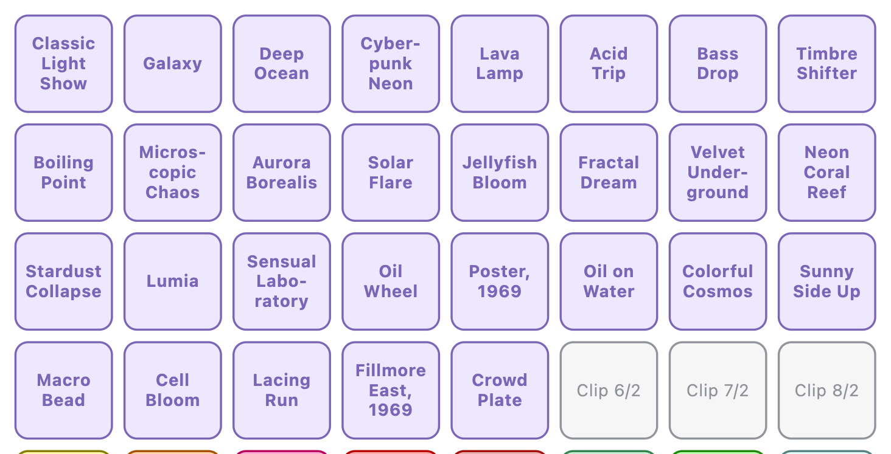
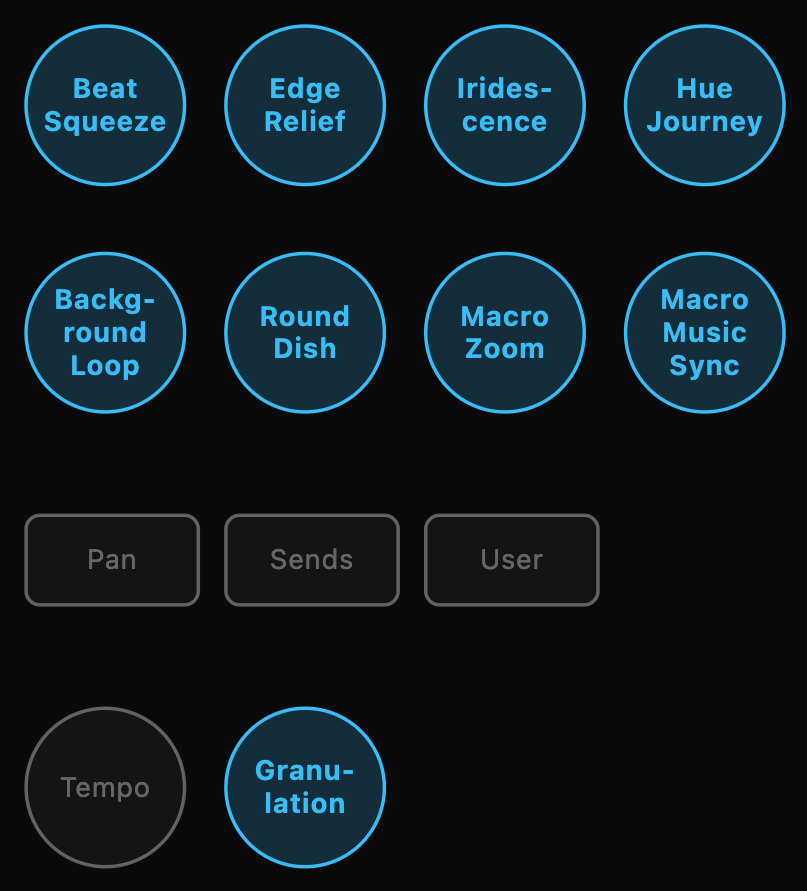
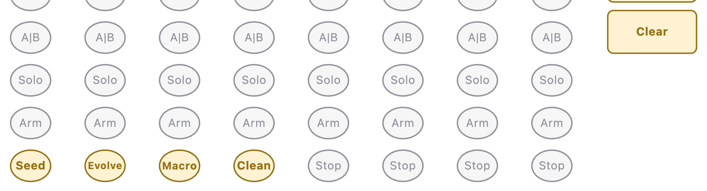

## 4. Sharpening — **I agree with PLAN.md**

No new runs. The entry in PLAN.md matches what I measured on #36 and #37:
- harmless at every value in the shallow dish
- indistinguishable from 0 at 0.5 in the main dish on a fixed composition
- at 1.0 the picture moves without getting sharper

Deciding after lacing and drops exist is the right call, because Fillmore at 512² gives the pass nothing to steepen. The test I'd want then is the same seeded, frame-matched comparison, run on a preset with hard edges.

One thing to carry into that decision: with the grain now live from frame one, the high-pass in the main dish is about 5 at the default. Any edge metric used for sharpening should be run with `Granulation` 0, or the grain will swamp it. On #37 one run was spoiled that way.

## What I did not measure

- **The projector:** not looked at, per the house rules. I judged the grain on the Mac screen and in 2× crops.
- **Repeats:** one unseeded run per sweep variant, so each has a different composition. The 0.75 run is the one where that visibly skews the metric.
- **The crossover at scale 440,** where a speckle is ~1 texel and a 1-texel drift would decorrelate the phases: not watched. If a pulse shows anywhere it would be there, but I don't recommend that scale.
- **The CPU solver:** not run.

## Files on this branch

- `reports/s39-grain-first-*.png`, `s39-d05-*.png`, `s39-sweep-*.png`, `s39-grain.json`: §2
- `reports/s39-surface-{screen,paper}.{png,json}`, `s39-cheatsheet-{screen,paper}.png`, `s39-zoom-*.png`: §3
- Scripts on the Mac, in `~/cg-scratch/`: `grain39.mjs`, `grainwatch.mjs`, `sweep39.sh`, `errcost39.mjs`, `grainhp.mjs`, `zoomrow.mjs`, `surface39.mjs`, `surface39z.mjs`
