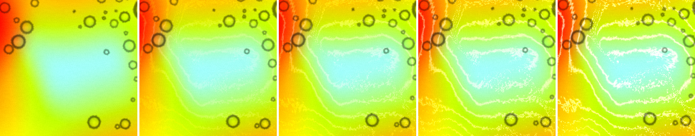
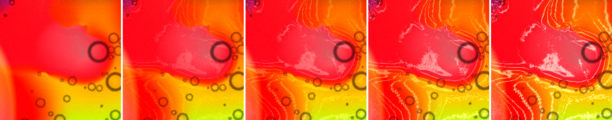
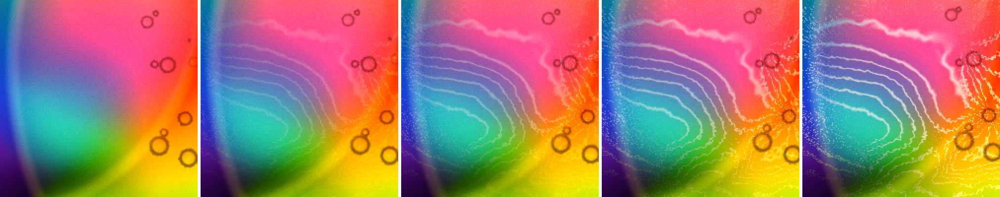
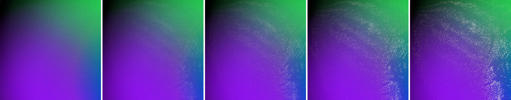
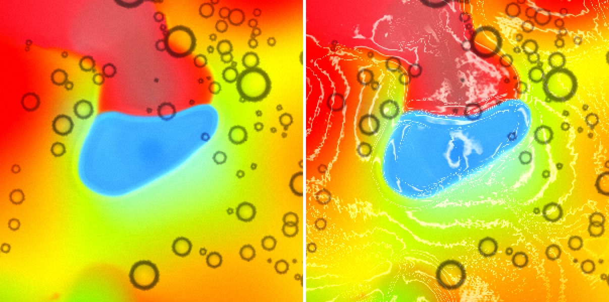
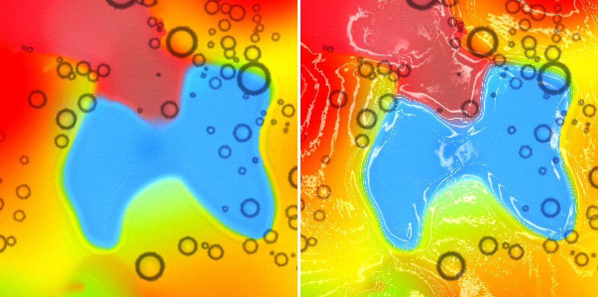

# Mac launch and looks after #42

2026-09-15, morning. The Mac is on `main` at b687f94 "Lacing: the threads that outline a boundary, drawn by the strain across it (#42)".

*This report is pushed in stages. The launch section is final. The lacing looks follow.*

## 1. Launch

- **Pull.** I stashed only `package-lock.json`, fast-forwarded 129ad9b → b687f94 (#42), and popped the stash. #42 doesn't touch the lockfile, so the pop was clean and the local edit is kept. A backup is at `/tmp/package-lock.local-backup-42.json`. The nested `chromaglass/` clone is untouched. No `npm install`.
- **Build.** `npm run build`: OK in 1.18 s.
- **Restart.** I killed the old server (pid 25271, key 9281) and started `npm run remote` with nohup. The log is in `~/chromaglass-server.log`.

| | |
|---|---|
| Server pid | **30897** |
| Show key | **1678** |
| Phone | http://192.168.0.234:3000/?remote=1&key=1678 |
| Network display | http://192.168.0.234:3000/?cast=true&key=1678 |
| `curl http://localhost:3000/` | 200, 1320 bytes |

- The key changed, so any tab or display still holding key 9281 needs a reload with 1678. I left James's Chrome and the projector alone. James's Chrome has one tab open, and it isn't the show.
- **Load at the start:** GPU utilisation 94 %, load average 4.3. Timings below are compared by frames, not seconds.

## 2. Lacing (first pass; more to follow)

**Method.** `~/cg-scratch/lace42.mjs` runs Fillmore at `?debug&sim=512` on "GPU · 512² · 1.0x" throughout. `Math.random` is seeded (mulberry32, seed 7), and Granulation 0 and Plate Cells 0 are set over OSC. It runs one page at a time.

Lacing only affects the display, so I swept it inside one page. At frame 400 and again at frame 1100, I set lacing to 0, 0.25, 0.45, 0.7 and 1.0 over OSC in turn. Each capture waits until `settings.lacing` reads the value, then does a `readPixels` of the next frame. A sweep takes about 20 frames per value. Between captures the dye moves only slightly, so the main difference is the threads.

- **Errors:** 0 GL errors from `getError` after every draw in the first 25 s, no shader or GL console lines, and 0 NaN in the dye at the end (after the press).

### Filaments or texture? **In the main dish, filaments that follow the boundary, but they read as a contour map. In the small dish, a stipple.**

2× crops at frame 1100. Each row is lacing 0 / 0.25 / 0.45 / 0.7 / 1.0.

The cyan core in its yellow-green ramp:

A red tongue against orange:

The left of the main dish: cyan → pink → orange:

The small dish (`fluids[1]`), purple into green:

- **The threads follow the boundary's shape.** They are not noise sprayed near it. Every line runs parallel to its edge, and they bend with it (top right in the red row, the core outline).
- **But a wide colour ramp gets 4–6 evenly spaced parallel lines, not one braid.** Examples are the stack in the cyan → pink ramp on the left, and the rings around the cyan core. That is exactly the "contour map" the shader comment says the noise should prevent. A soft 100 px ramp and a hard edge both get lines; the hard edge only packs them tighter. At 0.25 it is a faint, fairly pleasant topographic hatch. At 0.45 it is plainly isolines.
- **The lines get jagged where the ramp is shallow and the level barely changes.** They zigzag in a sawtooth with a period of ~6–8 px (the orange below the red tongue, and the lower left of the core row). Inside the red tongue, where two reds of similar hue meet, the pass paints a pale speckled patch. That one does read as texture over the colour.
- **At 0.7 and 1.0 the lines go white and break into sparkle.** At 1.0 the core shows single-pixel glitter along the inner ring.
- **The small dish is a stipple, not threads:** fine pale dashes and dots over the whole purple → green ramp, like video noise. Its threads are aliased, not filaments. My guess is that the magnified layer (`u_layerZoom1`) is sampled with the same one-cell `e` as layer 0, so its line spacing falls below a screen pixel. Even at 0.25 it adds grit.

Numbers (`lacediff42.mjs`). "Lifted" means a pixel more than 8 luminance units brighter than lacing 0 at nearly the same frame; "braid" means |Δ| > 40; "hp" is the 5×5 high-pass. The frames are ~20 frames apart, so a little of the "lifted" count is motion.

| crop | lacing | lifted % | mean lift | braid % | hp |
|---|---|---|---|---|---|
| main dish 380 px, f1100 | 0 | – | – | – | 3.87 |
| | 0.25 | 13.6 | 21 | 3.0 | 4.53 |
| | **0.45** | **20.8** | **26** | **6.3** | **5.48** |
| | 0.7 | 25.9 | 33 | 10.8 | 7.02 |
| | 1.0 | 28.8 | 40 | 15.1 | 8.83 |
| small dish 180×260, f1100 | 0 | – | – | – | 1.49 |
| | 0.45 | 9.4 | 19 | 0.4 | 3.37 |
| | 1.0 | 14.0 | 32 | 3.9 | 6.52 |

Frame 400 matches within 2 points (main dish hp 3.92 → 5.32 at 0.45 → 8.44 at 1.0). A fifth of the main dish is touched at the default.

### Frame cost at 1600×1000: **not resolvable here**

`lacecost42.mjs` runs one page on Fillmore at its own defaults (grain 0.5, cells 0.2, seeded). Lacing alternates 0.45 / 0 over OSC in 20 s windows, A B B A × 2, with the median rAF interval taken per window.

| window | lacing | median ms | p90 ms | frames |
|---|---|---|---|---|
| 1 | 0.45 | 16.7 | 18.1 | 1200 |
| 2 | 0 | 16.7 | 18.1 | 1201 |
| 3 | 0 | 16.7 | 18.0 | 1200 |
| 4 | 0.45 | 16.7 | 33.4 | 991 |
| 5 | 0.45 | 16.7 | 34.7 | 873 |
| 6 | 0 | 16.8 | 48.8 | 837 |
| 7 | 0 | 17.1 | 48.9 | 825 |
| 8 | 0.45 | 16.8 | 49.4 | 808 |

- The first three windows sat on the 60 Hz vsync floor with either value. Then OBSBOT Center (89 % CPU) and MOTIV Mix loaded the machine, and every later window slowed, whatever the setting.
- Means: 16.72 ms on against 16.83 off, and 968 against 1016 frames per window. The 5 % frame gap is in the load drift's direction (on/off/off/on straddles it) and is not a cost I can stand behind.
- **At this canvas size the pass does not push the Mac off vsync.**
- **A 1920×1080 run doesn't settle it either.** I asked for DPR 2 to get the projector's 4K, but the app draws 1920×1080 whatever the DPR.
  - Medians: 16.82 ms on, 16.92 off.
  - Frames per window: 804/835, 791/727, 727/725, 724/694 (on/off in turn). Adjacent pairs give about 4 % fewer frames with lacing on. The load was falling through the whole run, so that is within the noise.
  - A per-draw GPU timer (`lacegpu42.mjs`) follows.

### Does the strain coupling show? **No, I can't see it.**

`~/cg-scratch/lacefold42.mjs` keeps the same seeded Fillmore with grain 0 and cells 0. It switches lacing by writing `chromaglassDebug().settings.lacing` inside a rAF, which the render loop picks up on the next frame. So each capture is three consecutive frames: lacing 0, lacing 1.0, lacing 0 again. The second lacing-0 frame is the motion baseline. Captures are at frame 1121 (still), then after a 1 s press at the dish centre: at release (1235), +30 frames (1329) and +90 (1491).

2× crops of the pressed region, lacing 0 | 1.0 on the next frame. At release:

30 frames later, the push still spreading:

- **Along the pushed blob's edge the threads are the same everywhere.** At 1.0 the whole cyan-into-yellow outline gets a crisp double white line. The blob is pushing outward on some sides and being squeezed on others, but no side reads thicker, brighter or finer than another. The width varies 1–3 px with how steep the ramp is, not with which way the edge moves.
- **The brightest thing in the press is inside the blue, not on its edge:** pale curling streaks where two blues meet, and pale speckle in the dusky red above it. Those are same-hue boundaries, and the level lines land on shade steps.
- **Stripes around the blob spread outward with the push,** but they look the same as the still frame's. Nothing there piles up.
- **The fold map from the solver doesn't help.** I read `gpu.dye.read` and `gpu.vel.read` (512²) and applied the shader's formula: fold = −(v(+n) − v(−n))·n across the colour gradient. Fold and stretch come out as patches 20–40 px across all over the plate, in near-equal counts (fold 76k / stretch 68k at release, 83k / 71k at +30, 71k / 78k at +90). There is no coherent ring at the press. Its band mask also covers 88 % of the plate on raw dye, so it can't pick out the pixels the threads are on. I can't tie a visible thread to a fold or stretch sign from it.
- **Why it's probably inaudible:** in the shader, fold only changes the line's smoothstep width from 0.10 to 0.22 of a level (a factor of 2.2 on a 1–2 px line), and brightness by 0.55 → 1.0. The `* 7.0` gain clamps most of the plate to one end or the other. Fold or stretch flips sign every 20–40 px, so along any one thread the width changes too often to read as braid against hair.
- **Motion baseline:** on consecutive frames, lacing 0 → 0 lifts 2.7–3.4 % of main-dish pixels, and 0 → 1.0 lifts 22–24 % (braid 7.5–8.5 %, hp 3.8 → 8.9–9.5). The sweep table above has ~20 frames between captures, so its 1.0 row (28.8 % / 15.1 %) includes ~5 points of motion. The lower values are affected less.
