# Mac launch and looks after #43

2026-09-15, late morning. The Mac is on `main` at aab272f "Lacing: threads at a boundary, not a contour map (#43)".

## 1. Launch

- **Pull.** I stashed only `package-lock.json`, fast-forwarded b687f94 → aab272f (#43: `CHANGELOG.md` and `LiquidVisualizer.tsx`), and popped the stash cleanly, so the local lockfile edit is kept. The nested `chromaglass/` clone is untouched. No `npm install`.
- **Build.** `npm run build`: OK in 1.16 s.
- **Restart.** I killed the old server (pid 30897, key 1678) and started `npm run remote` with nohup. The log is in `~/chromaglass-server.log`.

| | |
|---|---|
| Server pid | **32470** |
| Show key | **7699** |
| Phone | http://192.168.0.234:3000/?remote=1&key=7699 |
| Network display | http://192.168.0.234:3000/?cast=true&key=7699 |
| `curl http://localhost:3000/` | 200, 1320 bytes |

- The key changed, so any tab or display still holding key 1678 needs a reload with 7699. I left James's Chrome and the projector alone. James's Chrome has one tab open (a news site), and it isn't the show.
- **Load at the start:** GPU utilisation 41 %, load average 3.7 (OBSBOT Center 84 % CPU, MOTIV Mix 58 %). That is quieter than #42's 94 %.

## 2. Lacing, second pass

**Method.** Fillmore at `?debug&sim=512` on "GPU · 512² · 1.0x", `Math.random` seeded (mulberry32, seed 7), Granulation 0 and Plate Cells 0 over OSC unless stated. One page at a time. Same seed and frame counts as #42, so the plate is the same plate.

- `~/cg-scratch/lace43.mjs`: #42's OSC sweep (0 / 0.25 / 0.45 / 0.7 / 1.0 at frames 400 and 1100, then a 1 s press at the dish centre). Captures are ~20 frames apart.
- `~/cg-scratch/lacecurv43.mjs`: writes `chromaglassDebug().settings.lacing` in consecutive rAFs, so every value is **one frame** from the next. For the curvature question it patches the lacing shader **in the test page only** (the app is untouched): the thousandths digit of the amount picks a mode. x.xx0 is the real shader, x.xx1 forces `fold` to 0 (hair everywhere), x.xx2 forces `fold` to 1 (braid everywhere), and x.xx3 paints `fold` itself (red = curled, blue = straight, brightness = band). So real, hair-only and braid-only are compared on the same plate, one frame apart.
- **Errors:** 0 GL errors from `getError` after every draw in the first 25 s, no shader or GL console lines (only Chrome's usual "too many errors" cap from the app's READ-usage warnings), and 0 NaN in the dye after the press.

### Does it read as filaments now? **Better in the main dish, not fixed. The small dish stipple is hidden, not gone.**

2× crops at frame ~1100, lacing 0 / 0.25 / 0.45 / 0.7 / 1.0 (the OSC sweep, ~20 frames apart).

The cyan core in its yellow-green ramp:

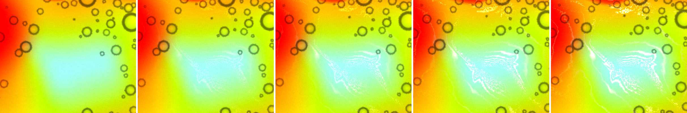

A red tongue against orange:

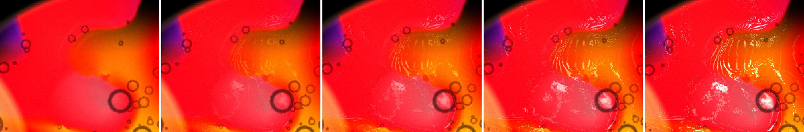

The left of the main dish (pink → cyan → yellow, seen through the small dish's glass):

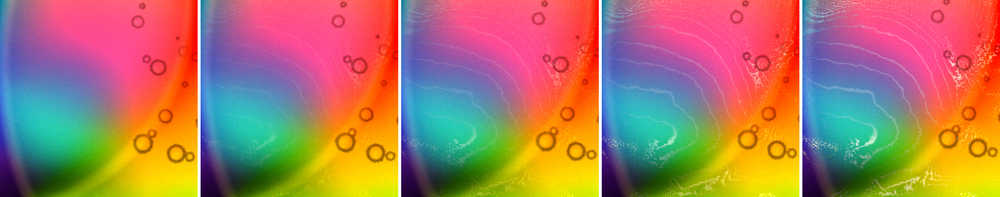

The green tongue against red, bottom of the main dish:

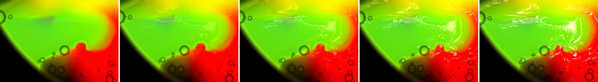

The small dish (`fluids[1]`), purple into green:

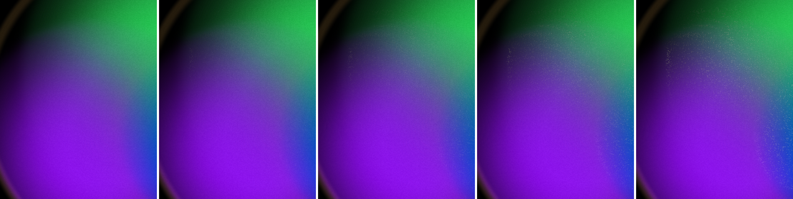

- **Much less is laced.** Coverage in the 380 px main-dish crop (lifted > 8 over lacing 0) at the Fillmore default 0.45 falls from 20.8 % to **13.5 %** on the OSC sweep. On consecutive frames, where motion doesn't inflate it, it is **8.7 %**. The frame-apart numbers are 5.0 / 7.0 / 8.7 / 11.2 / 13.3 % at 0.25 / 0.35 / 0.45 / 0.7 / 1.0. The 0 → 0 baseline over 11 frames is 4.3 %. The 5×5 high-pass goes 3.9 → 4.75 at 0.45 (#42: 3.87 → 5.48). So **0.45 now lays down less thread than 0.25 did in #42.**
- **The threads that remain sit on boundaries and follow them.** On the cyan core, the red tongue's lip and the green tongue's outline, there is one or two bright lines along the edge rather than rings across the ramp. That is the look you asked for.
- **Isoline stacks on soft ramps: mostly gone, not everywhere.** The core's concentric rings are gone. But the **left crop still has a stack of 6–7 thin parallel lines** across the wide pink → cyan ramp (fainter and thinner than #42's), and the **red tongue's top edge has a comb of ~8 short parallel stripes** running across the red → orange ramp. See the curvature section for why: the stacks are still in the level function and the fold gate is what hides most of them. The ±4-cell span is 8 cells, so a ramp wider than that still gets 1.5 × (ramp width / 8 cells) lines, and on a 50-cell ramp that is about nine.
- **Speckle and glitter are still there.** The pale speckled patch where two reds meet (red crop, lower middle) and a pale crumbly fringe along the green/yellow boundary (bottom crop) are present from 0.25. From 0.7 the core's braid breaks into single-pixel white glitter, as in #42.
- **The small dish draws almost nothing now, rather than threads.** Coverage at 0.45 is **0.9 %** (#42: 9.4 %), and 3.1 % at 1.0: sparse single-pixel dots along the blue edge and the green band. There are no filaments at any value.
- **The stipple is only hidden.** With `fold` forced to 1 (braid everywhere, below: lacing 0 | real 1.0 | braid-forced 0.992), the small dish is the same aliased stipple as #42: single-pixel dots in wavy bands, 24 % coverage. The 4-px `fwidth` clamp doesn't stop it.
- **It is not the colour source.** My first guess was that the level's `color` (the displayed colour) carries per-pixel noise. A page-only patch that takes `fC` from a bilinear `decodeFluid` sample instead changes nothing, one frame apart: small-dish coverage 24.1 against 24.2 % braid-forced (3.1 against 3.1 % real at 1.0), and the share of lifted pixels with no lifted neighbour is 10.5 against 10.4 % braid-forced (69.6 against 69.7 % real). The main dish is also unchanged (42.9 / 43.3 %). The remaining suspects are tested below.

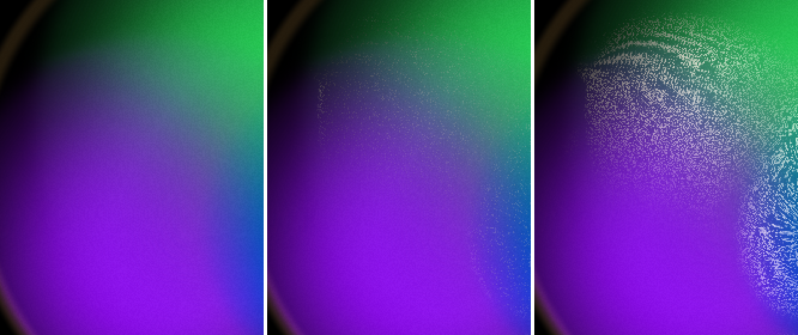

### Is the curvature coupling visible? **Yes, but as a gate, not as braid against hair.**

Same frame ± 1, lacing 1.0: real | `fold` forced 0 | `fold` forced 1, on the cyan core:

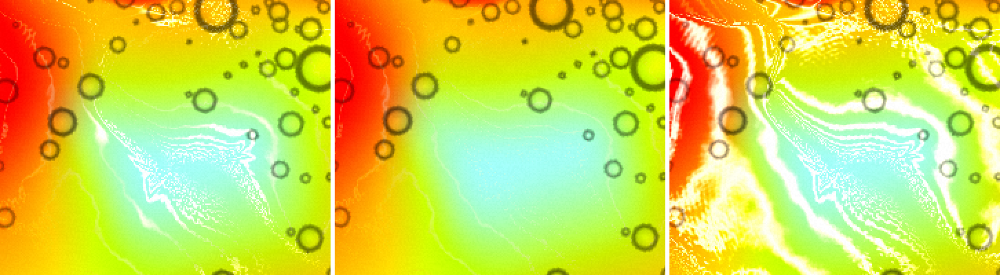

The green tongue, same order plus the fold map:

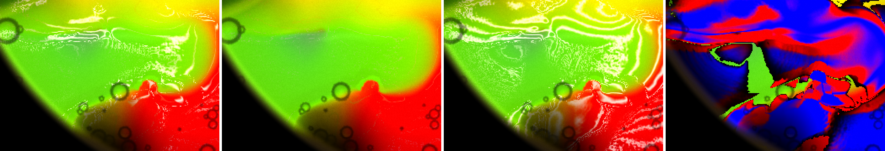

At release after a 1 s press, real | hair | braid:

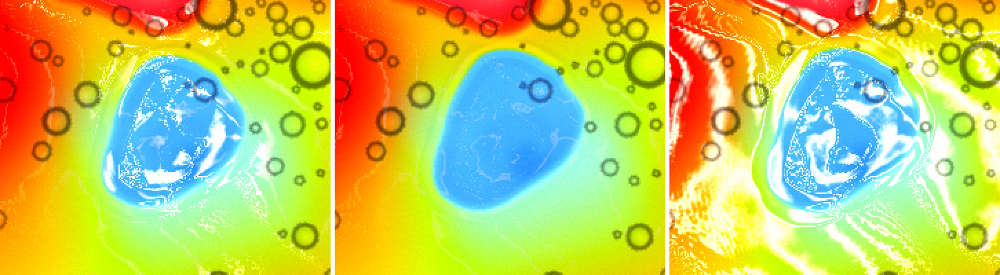

The fold map of the whole main dish (left: lacing 0; right: `fold`, red curled, blue straight):

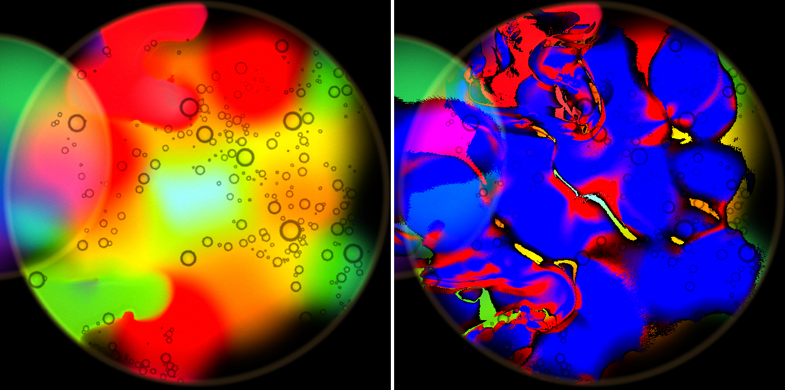

- **Forcing `fold` to 0 removes almost every thread.** The "hair" column is nearly identical to lacing 0. Mean lift over lacing 0 is 0.1–0.7 luminance units in every bucket, still or pressed. So on a straight run the thread is `mix(0.07, 0.30, 0)` = 0.07 of a level wide, at `mix(0.4, 1.0, 0)` = 0.4 brightness. That is under a pixel, at under half weight: **there is no hair.**
- **Forcing `fold` to 1 brings back the contour map.** It gives wide bright white stripes stacked across every ramp: 5–6 on the green tongue, and parallel bands through the red and orange around the core. So the level function still stacks lines. It is the fold term that hides them.
- **The real shader draws threads only where the map is red.** In the 380 px crop, split by the painted fold (still frame; release and +30 are the same within 2 points):

| fold bucket | share of crop | lift at 0.45: real / hair / braid | lift at 1.0: real / hair / braid | real differs from hair by > 8, at 1.0 |
|---|---|---|---|---|
| straight (< 0.25) | 64 % | 0.4 / 0.3 / 10.4 | 1.1 / 0.7 / 22.4 | 9.5 % |
| mid | 10 % | 1.9 / 0.1 / 8.4 | 4.4 / 0.5 / 18.2 | 19.7 % |
| curled (> 0.6) | 17 % | 5.8 / 0.2 / 7.2 | 13.0 / 0.6 / 15.4 | 37.7 % |

  The frame-to-frame motion baseline (lacing 0 vs 0, 11 frames apart) is 7–14 %. So straight runs are at the noise floor, and the curled parts carry almost the whole braid.
- **So the coupling is visible, but what it does is choose where threads exist.** It doesn't make curls thicker than straight runs, because straight runs draw nothing. On screen that reads as short bright scribbles on the curls of the core and the tongues, with blank edges between them. At a press, the pushed blob's outline is laced on its bent flanks and bare along its straighter sides.
- **Not a strain-style "nobody can see it".** Unlike #42's strain, this one decides what the pass looks like. Keep it, but it can't get a hair floor until the spacing is fixed (next section).

### A floor under `fold`: **the hairs appear, and so does the contour map**

Under Fillmore's own grain (0.5) and cells (0.2), same seed, one frame apart. Lacing 0.45 real | 0.45 with `fold` ≥ 0.3 | 0.45 with `fold` ≥ 0.5 | 1.0 with `fold` ≥ 0.3 | 1.0 with `fold` ≥ 0.5:

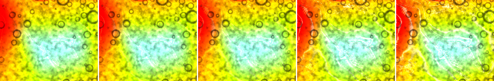

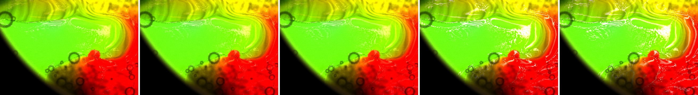

The wide pink → cyan ramp: 0.45 real | ≥ 0.3 | ≥ 0.5 | 1.0 with ≥ 0.5:

- **On straight edges a floor does what you want.** At 0.45 with a 0.5 floor, the green tongue's straight outline and the core's red/yellow edge get a fine continuous pale hair, while the curls keep the brighter braid. That is braid against hair, finally. Coverage in the 380 px crop goes 9.2 % (real) → 13.4 % (≥ 0.3) → 18.2 % (≥ 0.5).
- **On a wide soft ramp it brings the stack straight back.** The left ramp at 0.45 with a 0.5 floor shows 6–7 thin parallel isolines, and at 1.0 it is #42's contour map again. The small dish goes from 0.9 % to 8.1 % coverage, as the same stipple.
- **So the order is: fix the spacing, then floor the fold.** Laying 1.5 threads across a ±4-cell window only gives one line per boundary when the boundary is under ~8 cells wide. My suggestion, untested: gate `band` on the per-cell steepness (`al`) as well as the span, so a ramp that changes slowly per cell gets no thread at all. Or measure the span out to where the gradient falls off, not at a fixed ±4 cells. Then a `fold` floor of about 0.4 would give the straight runs their hair without re-stacking the ramps.

### Under the grain, and the value for Fillmore: **0.55**

Fillmore's own grain and cells, one frame apart, 2×: lacing 0.35 / 0.45 / 0.55 / 0.6 / 0.7.

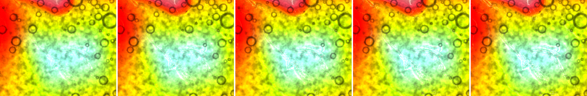

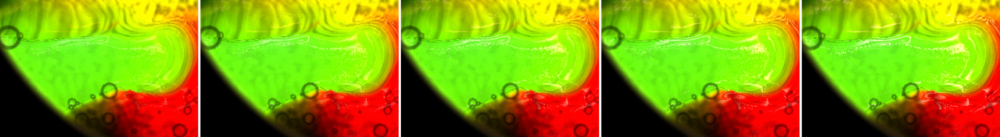

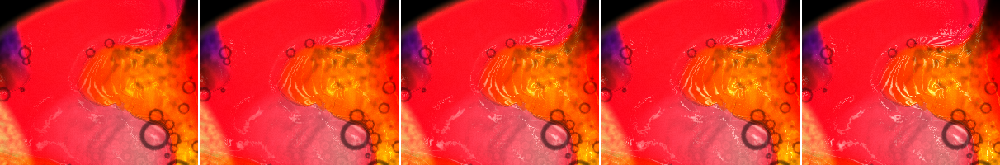

The small dish under the grain, lacing 0 | 0.45 | 0.45 with `fold` ≥ 0.5 | 1.0 with `fold` ≥ 0.5:

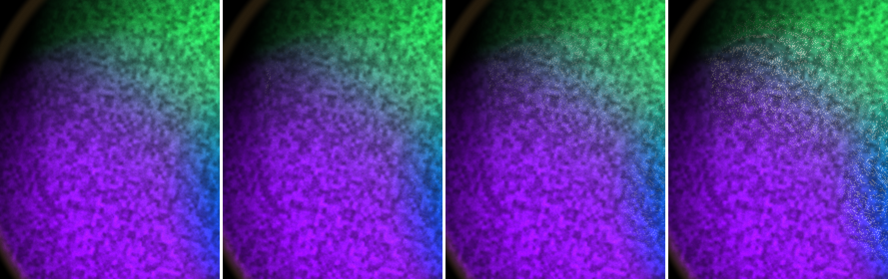

| main dish 380 px, grain 0.5 / cells 0.2 | 0.35 | 0.45 | 0.55 | 0.6 | 0.7 | 1.0 |
|---|---|---|---|---|---|---|
| lifted > 8 over lacing 0 | 6.8 % | 8.9 % | 10.7 % | 11.5 % | 12.6 % | 13.7 % |
| braid (\|Δ\| > 40) | 0.26 % | 0.65 % | 1.23 % | 1.65 % | 2.32 % | 3.25 % |
| 5×5 high-pass (lacing 0: 5.9) | 6.40 | 6.62 | 6.85 | 6.96 | 7.20 | 8.05 |

Lacing 0 against 0 six frames later lifts 4.7 %, so 0.35 is barely above motion.

- **They still layer and don't fight.** The grain is the 5–10 px mottle and the threads sit on top as 1–2 px lines. The grain breaks the thinner threads into dashes at 0.35–0.45, and they read as part of the mottle.
- **0.45 is too quiet now.** Under the grain it's a few short scribbles on the core's curl and the tongue's lip; from across a room on a projector I expect it to vanish.
- **0.55** is the value I'd set. The core curl, the green tongue's lip and the red tongue's edge carry a clear pale braid, and nothing glitters. Its 10.7 % coverage (one frame apart) is a little under #42's 0.25 (13.6 %, which had ~20 frames of motion in it), and far less of it lands on ramps. 0.6 is the same look a touch brighter; either is fine.
- **0.7 starts to go wrong** on the red tongue. Its comb of short parallel stripes across the red → orange ramp turns bright, and the core's braid picks up single-pixel glitter.
- **The small dish under the grain** shows nothing at 0.45. With a floor, the stipple is back as bright dots, mostly lost in the grain.
- **Errors:** 0 GL errors, 0 NaN in both dishes, grain on and off.

## 3. Sharpening: **I haven't changed my mind; on Fillmore at 512² it doesn't earn its place**

Nothing in #43 touches the solver, so #42's result stands: seeded, frame-matched, Sharpness 0.5 against 0 differs by exactly the seed drift in both dishes, with lacing on.

One test could still show the pass working. I'd run it before putting the drop to James, because it matches how the show actually runs:

- **Run it at the grid the show falls to, not at 512².** Sharpening acts on the solver's own boundaries, which are a few cells wide. At 512² in a 700 px dish, a cell is ~1.4 px, so a 3-cell ramp is ~4 px and nothing is left to sharpen on screen. On the projector's 4K canvas under load, the governor steps down (ladder 768 / 512 / 384 / 256). At 256² a cell is ~2.7 px, and at 384² it is ~1.8 px. The small dish (a 192² plate drawn ~450 px across, ~2.3 px a cell) is the same case, and it is where #35–#37 saw the pass do something (blocks, then nothing after the curvature floor).
- **The test:** `?debug&sim=256` (then `sim=384`), Fillmore, seeded, Granulation 0, Plate Cells 0, Lacing 0. Sharpness 0 / 0.5 / 0 / 0.5 pages, a throwaway page first, captured at matched frame counts. **Measure the 10–90 % edge width in pixels across ~20 hard edges** (the tongues' lips, the core outline, the small dish's blue edge), not by eye. Also do a 2× eye comparison of the same edges.
- **The bar:** if 0.5 doesn't narrow those edges by at least ~1 px at 256² (outside the 0-vs-0 spread), it isn't doing anything a performer can see on the worst rung either, and dropping it is safe. If it does, the case for keeping it is "it holds the look when the governor drops". The default could then be tied to the rung rather than dropped.
- I can run this on the next pass if you want it measured here.
