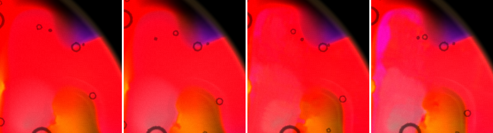
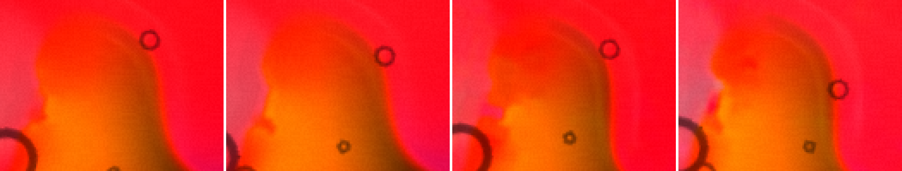
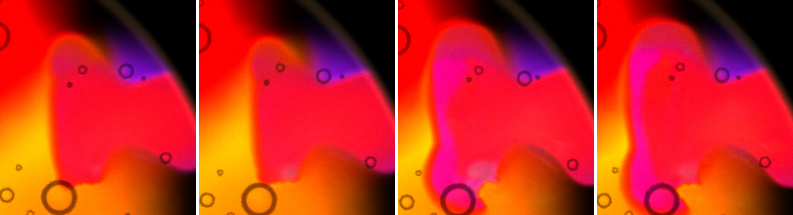
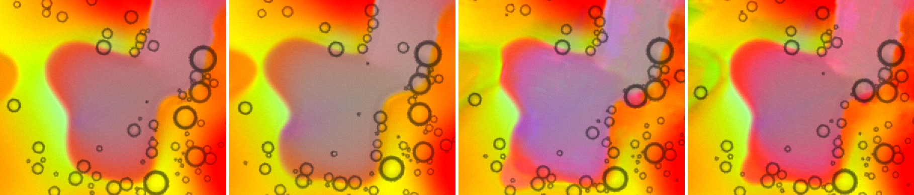
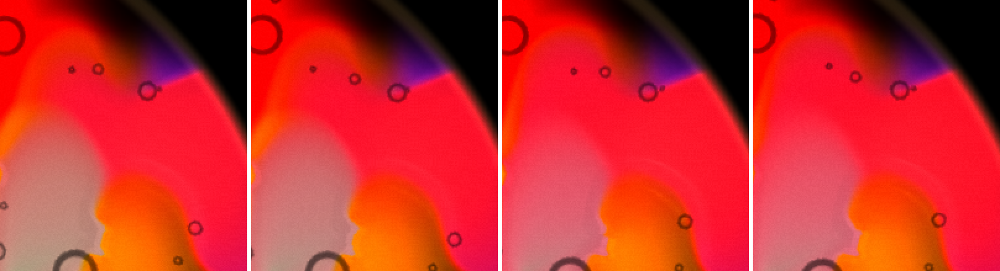
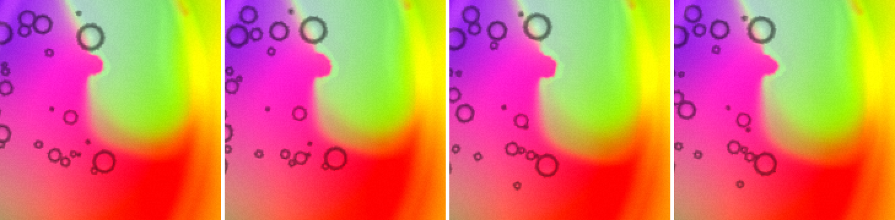
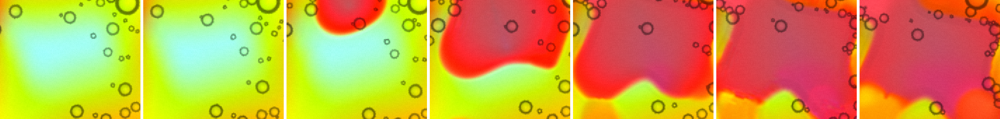
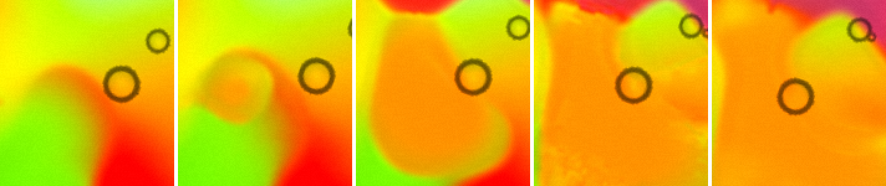

# Mac launch and looks after #44

2026-09-15, midday. The Mac is on `main` at fb2db6d "Lacing: a thread on a boundary, a hair on a straight run (#44)".

**In short**
- **Launch:** server pid **34070**, show key **1703**, curl 200. Details in §1.
- **Sharpening: drop it.** I ran your test at 256² and 384² and measured the 10–90 % width of every clean edge in each page (300–950 of them). Page against page at 256², 0.5 is 0.2–2.6 px narrower in some captures and not in others; at 384² the sign flips. **On one plate with the value switched every 300 frames, 0.5 moves the width by −1.25 to +1.33 px, inside the plate's own drift, and 1.0 by −0.3 px.** What 0.5 does add over hundreds of frames at 256² is pale magenta terraces and torn lips, not crisper edges. Details in §3.
- §2 (lacing) follows.

## 1. Launch

- **Pull.** I stashed only `package-lock.json`, fast-forwarded aab272f → fb2db6d (#44: `CHANGELOG.md`, `LiquidVisualizer.tsx`, `presets.ts`), and popped the stash cleanly, so the local lockfile edit is kept. The nested `chromaglass/` clone is untouched. No `npm install`.
- **What landed** (checked in the diff): `band` gains `* smoothstep(0.03, 0.10, al)`, `fold = max(smoothstep(0.15, 1.6, bend), 0.4)`, `wide = max(mix(0.07, 0.30, fold), fwidth(f) * 0.75)`, and Fillmore's `lacing` 0.45 → 0.5.
- **Build.** `npm run build`: OK in 1.12 s.
- **Restart.** I killed the old server (pid 32470, key 7699) and started `npm run remote` with nohup. The log is in `~/chromaglass-server.log`.

| | |
|---|---|
| Server pid | **34070** |
| Show key | **1703** |
| Phone | http://192.168.0.234:3000/?remote=1&key=1703 |
| Network display | http://192.168.0.234:3000/?cast=true&key=1703 |
| `curl http://localhost:3000/` | 200, 1320 bytes |

- The key changed, so any tab or display still holding key 7699 needs a reload with 1703. I left James's Chrome and the projector alone. James's Chrome has one tab open (a news site), and it isn't the show.
- **Load at the start:** GPU utilisation 36 %, load average 3.2 (MOTIV Mix 55 % CPU, OBSBOT Center 15 %).

## 3. Sharpening at the governor's low rungs: **it fails the bar. Drop it.**

**Method.** `~/cg-scratch/sharp44.mjs`: `?debug&sim=256` and `sim=384`, Fillmore, `Math.random` seeded (mulberry32, seed 7), Granulation 0, Plate Cells 0, Lacing 0, and Sharpness per page, all over OSC right after the preset pick. One fresh context per page, one page at a time. Each set is a throwaway page, then 0 / 0.5 / 0 / 0.5. Captures are `readPixels` at 600 and 1100 rAF frames after the settings; every capture landed within 17 frames of its target. The status label read "GPU · 256² · 1.0x" / "GPU · 384² · 1.0x" throughout, and **both** dishes ran at that N (so the small dish is a 256² plate here too, not 192²). I ran a second 256² set (c/d) out to 2000 frames. 0 GL errors and 0 NaN in every page.

**Edge width.** `~/cg-scratch/edge44.mjs` finds edges with a Sobel on each colour channel and non-max suppression. It takes a ±14 px profile along the normal in the strongest channel and keeps a clean step: a step ≥ 50 (or ≥ 100) between flat end plateaus, with no overshoot. It reports the 10–90 % width in screen px. Two things changed the plan:
- **Matching the same ~20 edges across pages doesn't work.** Seeded pages still drift apart (mean |Δ| 10 between the two 256² pages at Sharpness 0), so a0's edges were re-found in only 4–8 of 20 on the other pages. I measured **every clean step in each page** instead: 300–950 edges per page.
- **Regions:** main dish inside its vignette (r 290), and the main dish seen through the small dish's glass. The small dish's own plate has **no hard edges at all** at either grid (0–26 candidates), so it can't be measured and isn't in the tables.
- The throwaway page drifted far from the rest again (mean |Δ| 45–80 against a0/b0), so the throwaway earns its place.

### Page against page

Median 10–90 % width in px, main dish, all clean steps ≥ 50. "Δ" is the mean of the two 0.5 pages minus the mean of the two 0 pages; "0-vs-0" is the gap between the two 0 pages.

| grid, set | frames | 0 / 0 | 0.5 / 0.5 | Δ | 0-vs-0 |
|---|---|---|---|---|---|
| 256², a/b | 600 | 8.81 / 8.28 | 8.93 / 7.82 | −0.2 | 0.5 |
| 256², a/b | 1100 | 9.05 / 8.85 | 6.20 / 6.57 | **−2.6** | 0.2 |
| 256², c/d | 600 | 9.07 / 9.02 | 7.11 / 6.68 | **−2.2** | 0.05 |
| 256², c/d | 1100 | 8.35 / 7.69 | 7.68 / 8.06 | −0.2 | 0.7 |
| 256², c/d | 2000 | 6.68 / 6.83 | 6.03 / 6.18 | −0.7 | 0.15 |
| 384², a/b | 600 | 10.14 / 9.03 | 8.37 / 8.55 | −1.1 | 1.1 |
| 384², a/b | 1100 | 6.73 / 6.95 | 8.07 / 8.09 | **+1.2** | 0.2 |

With steps ≥ 100 the same pattern holds (256²: +0.3, −1.6, −2.6, +0.1, −0.4; 384²: −1.3, +1.6).

- **At 256² it never makes edges wider, but it only narrows them by a pixel or more in two of five captures**, and not at the same frame count in the two sets. The 0.5 pages also always yield 30–60 % more clean steps (e.g. 339 / 365 against 531 / 507).
- **At 384² the sign flips** between 600 and 1100 frames, so there is nothing there.

### The same plate, switching the value (the decider)

Page against page can't tell "the pass narrows edges" from "the pass sends the plate somewhere else". So `~/cg-scratch/sharp44t.mjs` runs **one** seeded 256² page at Sharpness 0 to frame 1100, then switches over OSC every 300 frames: 0.5, 0, 0.5, 0, **1.0**, 0. It captures at the end of each window (~280 frames at the value).

| window | 0 | 0.5 | 0 | 0.5 | 0 | 1.0 | 0 |
|---|---|---|---|---|---|---|---|
| median px (steps ≥ 50) | 9.07 | 8.50 | 8.00 | 6.75 | 8.00 | 7.17 | 6.95 |
| median px (steps ≥ 100) | 9.78 | 10.71 | 8.97 | 7.47 | 8.19 | 7.61 | 7.25 |
| clean steps (≥ 50) | 699 | 658 | 806 | 797 | 900 | 1017 | 839 |

Against the mean of its two neighbours, each 0.5 window is **−0.04 and −1.25 px** (steps ≥ 50) or **+1.33 and −1.11 px** (≥ 100). The **1.0** window is **−0.3 / −0.1 px**. The plate itself drifts a mean |Δ| 10–19 per window, and the widths trend down from 9 to 7 px at every value. So **the pass doesn't move the edge width on the same plate by anything outside that drift, even at full strength.** A shorter 65-frame toggle on another page (0 / 0.5 / 0 / 0.5 / 0 / 0.5 / 0 / 1 / 0) said the same: 9.33 / 9.55 / 9.56 / 9.51 / 9.23 / 7.37 / 7.11 / 6.60 / 6.85.

### By eye, 2×

256², 1100 frames, the red tongues: 0 | 0 | 0.5 | 0.5.

The orange tongue's lip, 4×, same order:

Second set at 600 frames: 0 | 0 | 0.5 | 0.5.

Second set at 2000 frames, the core, 1.5×:

384², 1100 frames, red tongues and the pink/green lobe: 0 | 0 | 0.5 | 0.5.

The same plate, 256², windows 0 | 0.5 | 0 | 0.5 | 0 | 1.0 | 0 (1.5×), and the orange lip over the last five windows (2×):

- **At 256², the four 0.5 pages don't look crisper. They look different.** All four grow **pale magenta flat patches inside the red**, and the tongues' lips go **ragged and torn** instead of round. At 2000 frames the core blob's outline is crinkled and streaky where the 0 pages are smooth. That is #34–#35's "pale flat patches" and "blocky" look, arriving slowly on a coarse grid. It is also why the edge finder counts 30–60 % more clean steps.
- **On the same plate, 0.5 for 280 frames is invisible.** The blob's edge in the 0.5 windows is as soft as in its neighbours. **1.0 for 280 frames is visible:** the orange lip goes crinkled and mottled, and it relaxes again in the next 0 window. That is texture, not a narrower edge.
- **At 384² I can't tell 0 from 0.5** in the lobe; the red crop differs only by drift.

### Answer for James

**Drop it.** On the rung where it should matter most (256²), 0.5 doesn't narrow edges by a pixel on the same plate, and it's inside the drift even at 1.0. Across pages, what it adds over hundreds of frames is pale terraces and torn lips, not sharper boundaries. At 384² it does nothing measurable. Tying it to the governor's rung would switch on exactly that look when the show is already struggling.
