# Mac launch and looks after #47

2026-09-15, afternoon. The Mac is on `main` at 6a55c11 "The steepness gate, where the plate says it belongs (#47)".

**In short**
- **Launch:** server pid **36169**, show key **5950**, curl 200. Details in §1.
- **The gate: not confirmed, and not a number.** With `fold` forced to 1 at 0.08–0.20 the full-dish contour map is gone (lift 23 % against 37 % on the old gate), but stacks come back on some steep ramps: a green → red ramp and your pale-red blob. The blob stacks 4–5 lines **at the real 0.55**. Gates of 0.10–0.25, 0.12–0.30 and 0.15–0.35 all keep 3–5 of those lines while thinning the real boundaries, so **I wouldn't change the number**. Details in §2.
- **Fillmore: keep 0.55.** Under the grain the core's thread only starts to read at 0.65–0.75, but by then the stacks are the brightest lacing on the plate. The exception decides the look, not the value. Details in §3.
- **The exception:** its pixels are as steep (`al` ≈ 0.2), as opaque, as straight and as hue-only as a real boundary, so nothing sampled at the pixel separates it. Three tests failed: a second-difference skirt test (it kills the core first) and two `span12`/`span` width gates (they do nothing). What's different is that one change gets several level crossings. My suggestion for the test, untested: measure the change by walking along the normal while `al` holds, or draw only the level nearest the span's midpoint.
- **Small dish:** effectively unlaced now (0.3 % lifted).
- **Beads:** still thin dark rings with no interior cue, 10–43 px (p10–p90). Within a neighbourhood they vary 3.6× in size, but the clusters are sparse. They rarely meet the threads, and where they do both stay distinct. Beads under ~12 px dissolve into the grain. Details in §4.
- 0 GL errors, 0 NaN on all five pages.

## 1. Launch

- **Pull.** I stashed only `package-lock.json`, fast-forwarded 838c571 → 6a55c11 (#46 presets on the title, #47 the steepness gate), and the stash popped cleanly, so the local lockfile edit is kept. The nested `chromaglass/` clone is untouched. No `npm install`.
- **What landed** (checked in the diff): `band = smoothstep(0.05, 0.3, span) * smoothstep(0.08, 0.20, al)`, and Fillmore's `lacing` 0.5 → 0.55. #46 removes the settings panel's copy of the presets and adds two `qa.mjs` checks.
- **Build.** `npm run build`: OK in 1.15 s.
- **Restart.** I killed the old server (pid 34070, key 1703) and started `npm run remote` with nohup. The log is in `~/chromaglass-server.log`.

| | |
|---|---|
| Server pid | **36169** |
| Show key | **5950** |
| Phone | http://192.168.0.234:3000/?remote=1&key=5950 |
| Network display | http://192.168.0.234:3000/?cast=true&key=5950 |
| `curl http://localhost:3000/` | 200, 1320 bytes |

- The key changed, so any tab or display still holding key 1703 needs a reload with 5950. I left James's Chrome and the projector alone. James's Chrome has one tab open (a news site), and it isn't the show.
- **Load at the start:** GPU utilisation 57 %, load average 4.0.

## 2. The gate on the shipped build: **not confirmed. With `fold` forced to 1 the stacks come back on two kinds of place, and no higher threshold removes them.**

**Method.** As in #44. Fillmore at `?debug&sim=512` on "GPU · 512² · 1.0x", `Math.random` seeded (mulberry32, 7), Granulation 0 and Plate Cells 0, captures at ~1125 frames, `settings.lacing` written in consecutive rAFs, lacing-0 frames between the variants because the plate drifts (0 against 0 lifts 2.6 % after 4 frames). `~/cg-scratch/lace47.mjs` patches the shader **in the test page only** (`__patched` 1; every replaced line found once in `castProtocol-Shl8Yar_.js`). The mode is the amount's last two decimal places **below 1.0**. The app clamps `u_lacing` to 1 (`LiquidVisualizer.tsx:4893`), so my first page, which encoded modes above 1.0, drew the real shader for all of them. I threw it away and use 0.99 as "full" throughout. 0 GL errors and 0 NaN on all four pages.

Main dish, one frame apart: lacing 0 | real 0.99 | braid forced (shipped gate 0.08–0.20) | braid forced, old gate 0.03–0.10 | braid forced, gate 0.10–0.25 | 0.12–0.30 | 0.15–0.35.

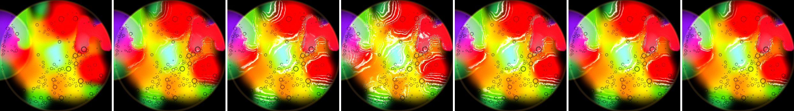

| lifted > 8, main dish 380 px | |
|---|---|
| lacing 0 (neighbouring frames) | 2.6–3.3 % |
| real 0.55 / 0.99 | 8.0 / 11.7 % |
| braid forced, **shipped gate 0.08–0.20** | **22.6 %** (braid 8.8 %) |
| braid forced, old gate 0.03–0.10 | 36.9 % (braid 15.7 %), #44's contour map |
| braid forced, 0.10–0.25 / 0.12–0.30 / 0.15–0.35 | 19.6 / 17.1 / 14.3 % |

- **The gate did what #44 predicted on the soft ramps**: the old gate's full-dish contour map (37 %) drops to 23 %, and most of the wide ramps are clean.
- **Two places still stack, at every threshold I tried.** Rows at 1.5×, in the order 0 | real 0.55 | real 0.99 | braid forced | braid at 0.12–0.30 | braid at 0.15–0.35 | two span tests (below):

  The green → red ramp at the top-left:

  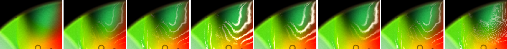

  The pale-red blob in the red, which is your exception, back on this seed:

  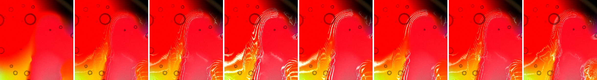

  - **Green → red:** 3 lines at real 0.55 and 4 wide stripes with the braid forced. With the gate at 0.15–0.35 there are still 3.
  - **Pale-red blob:** 4–5 concentric lines along its left outline **at the real 0.55**, not only at 1.0, and 6–7 with the braid forced. At 0.12–0.30 and 0.15–0.35 there are still 4–5.
  - **So I would not raise the number.** The `al` map (approximate, below) puts both stacks at `al` ≈ 0.2 or more, the same as the core's real boundary. A gate strict enough to close them takes the core's thread with them, and 0.15–0.35 already thins the boundaries (14 % against 23 %).

## 3. Fillmore's value under the grain: **keep 0.55**

Fillmore's own grain 0.5 and cells 0.2, one frame apart, with lacing-0 frames between. Rows at 1.5×: 0 | 0.35 | 0.45 | 0.55 | 0.65 | 0.75.

The cyan core:

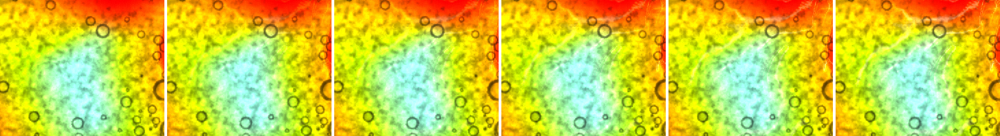

The pale-red blob:

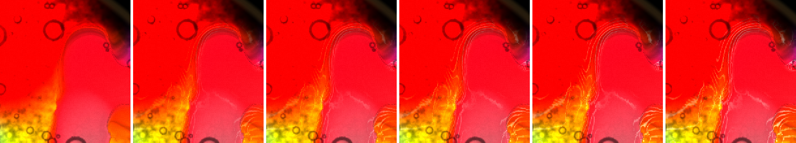

The green curl at the top-left:

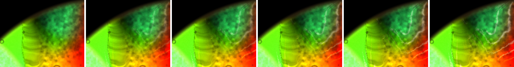

| main dish 380 px, grain + cells | 0 (neighbours) | 0.35 | 0.45 | 0.55 | 0.65 | 0.75 |
|---|---|---|---|---|---|---|
| lifted | 2.5–4.7 % | 8.2 % | 7.1 % | 9.5 % | 10.9 % | 12.0 % |
| braid (\|Δ\| > 40) | 0.3–1.6 % | 1.29 % | 0.26 % | 0.86 % | 1.68 % | 2.73 % |

The grain makes the zero frames drift (animated speckle), so read each value against its neighbouring 0 (2.5 % before 0.45, 3.5 % before 0.55, 3.8 % before 0.65). The 0.35 frame sits after the 0.65 one and carries more drift.

- **The core's thread barely reads under the grain at 0.35–0.55.** At 0.65 it is a faint line, and only at 0.75 is it a clear thin thread around the cyan.
- **The green curl** gets its braid from 0.55, and it is a little brighter at 0.65.
- **The pale-red blob's stack** is 3–4 lines at 0.45, 4–5 at 0.55 and brighter from 0.65. **It is the most visible lacing on the plate at every value.**
- **So 0.55.** 0.65 would buy a faint core thread by making the stack the one thing you see. What makes the plate look wrong is the exception, not the value, so I'd hold the number and fix the exception.

## The exception: what distinguishes it

Maps from page-only modes, read back over the pixels the real 0.99 lifts. They are **approximate**. The display pass reworks the output after `lacing()` returns (a `fuv.x` ramp of 0.50 reads back 0.58, and 0.76 reads back 0.72), so treat them as ±0.1.

Run b (the §2 page):

| laced pixels, p50 | `al` | `span` | `span12` (±12 cells) | alpha | bend | hue distance of the axis |
|---|---|---|---|---|---|---|
| pale-red blob stack | ≈ 0.24 | ≈ 0.26 | ≈ 0.16 | 1.0 | ≈ 0.15 (straight) | ≈ 0.98 |
| green → red stack | ≈ 0.21 | ≈ 0.62 | ≈ 0 | 1.0 | ≈ 0.02 | ≈ 0.84 |
| main dish around the cyan core | ≈ 0.24 | ≈ 0.56 | ≈ 0.39 | 1.0 | ≈ 0.1 | ≈ 0.98 |

- **`al`: no.** The stacks are as steep per cell as the core's real boundary, which is why no gate closes them (§2).
- **Alpha: no.** It is 1 in all three.
- **Hue distance: no.** The change is almost all hue, not lightness, in both the blob stack and the core.
- **Curvature: only weakly.** The stacks are straight and sit on the hair floor. But so do most real outlines.
- **Span: no single value.** `span12` against `span` isn't consistent, because on a multi-hue change the ±12-cell samples land on other hues and project short onto the local axis. #44's two span tests (freq from `span12`; kill the gate when `span12`/`span` > 1.8–2.6) don't fix it. The first turns the green → red ramp into a dense fine hatch, and the second takes a line or two off the stack but leaves the rest.
- **The shape across the change: also not cleanly.** I measured s2 = |f(+4 cells) + f(−4 cells) − 2 f(0)| / span, the second difference along the normal. It is about 0 where the change is locally linear and near 1 on the skirt of a sigmoid. Run d drifted to a different composition in the same crops, so these are other stacks, not the pale-red blob:
  - a red blob's soft edge against green/yellow with 3–4 threads: **0.12**
  - an orange blob against red with a ribbed stack of 6+ lines: **0.31**
  - the main dish around the cyan core: **0.33**

  The first is a wide, straight, steep band, which fits the idea that `freq` (1.5/span, measured inside the ±4-cell window) keeps laying threads because the band carries on past the window. But the orange-on-red stack is as curved across as a real boundary, so s2 alone doesn't pick out the exception either.
- **Using it the obvious way is wrong.** Suppressing threads where s2 is high (the skirt of a boundary, 0.35–0.70 and 0.50–0.90) faded the core's threads before it touched the stacks:

  Run d, 1.5×: 0 | real 0.55 | skirt 0.35–0.70 | skirt 0.50–0.90 | real 0.99 | skirt 0.35–0.70 at 0.99 | skirt 0.50–0.90 at 0.99.

  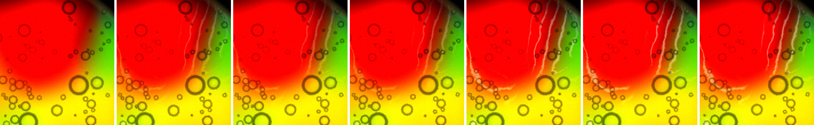
  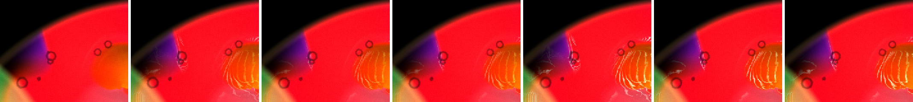
  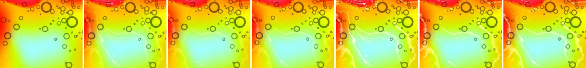

  - The red blob's soft right edge keeps 2–3 of its 3–4 threads.
  - The orange blob's ribbed stack on the right of the second row is untouched.
  - The core's threads fade.
- **A tighter width test doesn't work either.** Run e kills the gate where `span12`/`span` > 1.25–1.6. Whole dish, 0.5×: 0 | real 0.55 | ratio 1.25–1.6 at 0.55 | ratio 1.8–2.6 at 0.55 | real 0.99 | ratio 1.25–1.6 at 0.99 | ratio 1.8–2.6 at 0.99.

  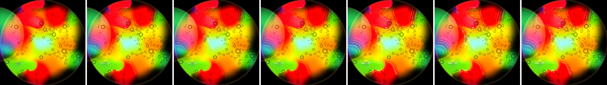

  Coverage doesn't move (main dish 5.1 / 5.4 / 5.8 % at 0.55, 7.8 / 7.7 / 8.1 % at 0.99), and the pink → teal stack at the left is untouched. The ratio over laced pixels is p50 ≈ 0.7–1.1 and p90 ≈ 1.6–2.1: on a multi-hue change the ±12-cell samples usually project *shorter* than the ±4-cell ones, so the ratio can't say "this band is wide".

**What I'd give you to write the test against:** the stacks are steep (`al` ≈ 0.2, like a real boundary), straight (on the hair floor), at full alpha, and almost all hue change. So nothing sampled at the pixel separates them. What they have that a real boundary doesn't is **more than one or two level crossings across one change**. The measure that separates them has to follow the change along the normal until `al` drops, not a fixed ±4 or ±12 cells projected on one axis. For example, march along `n` in steps of 2 cells while `al` stays above half its value here, and set `freq` so the whole walked change carries 1.5 threads. I haven't tested that; it is 6–10 more samples. If that is too dear, the cheaper cap is on the count rather than the gate: draw only the level nearest the middle of the `fAhead`/`fBack` span. That would leave the stack's one central thread.

**Small dish:** with the gate at 0.08–0.20 it is effectively unlaced: 0.3 % of its region lifted at 0.55 and 0.6–0.7 % at 0.99 (run d), down from 4.6 % on #44. That fits #44's `al` p90 of 0.056 there.

**Errors and cost:** 0 GL errors (`getError` after every draw for 25 s) and 0 NaN in both dishes, on all five pages. The only console line is the usual "too many errors" cap from the app's READ-usage warnings. #47 changed two constants, so I didn't re-time it.

## 4. Batch 3: the bead field now, with lacing and the grain

**What this is and isn't.** I did not look at the projector, which I left alone. These are `readPixels` frames of the 1600×1000 canvas from run c: Fillmore as shipped (beads 0.8, grain 0.5, cells 0.2, lacing 0.55), seeded, ~1130 frames, GPU 512². The projector draws the same canvas scaled to its own size, so crops at 2× are roughly what a 3200-wide throw puts on the wall.

The whole dish at 0.55:

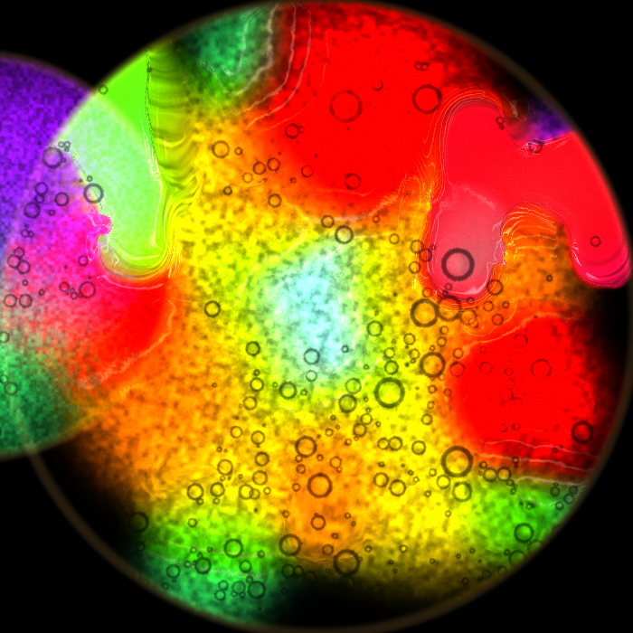

Core, 2×, lacing 0 | 0.55:

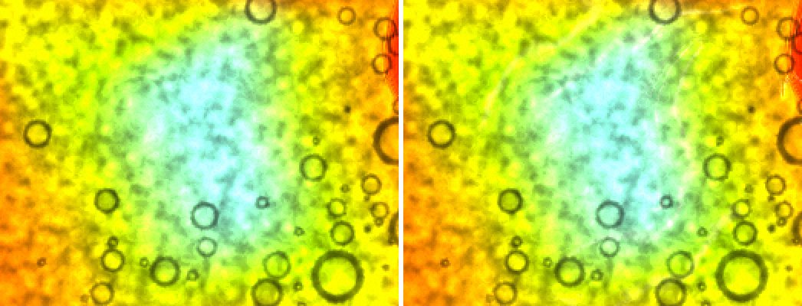

Lower dish by the red corner, 2×, lacing 0 | 0.55:

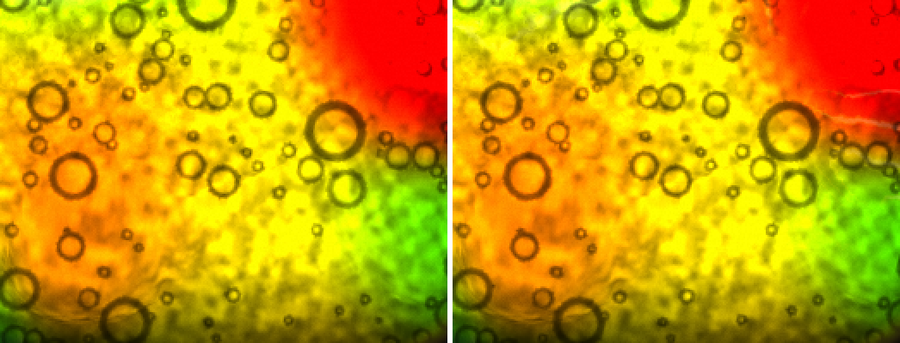

| bead field (`chromaglassDebug().beadList`, 192 grid, 8.3 px a cell) | |
|---|---|
| count | 348 |
| diameter on screen, p10 / p50 / p90 / max | 10 / 19 / 43 / 84 px |
| within a 12-cell neighbourhood with ≥ 6 beads, max/min radius | p10 3.1, **p50 3.6**, p90 5.6 |
| nearest-neighbour distance, p10 / p50 / p90 | 17 / 29 / 59 px |
| 16×16 occupancy | 131 of 256 blocks, 1–7 beads each, none with 8+ |

- **Still dark-rimmed rings.** Every bead is a thin dark outline, 2–3 px, with its interior the same dye and grain as outside it. The big ones (40–84 px) read as lenses because the rim is thicker. The small ones (8–15 px) are only a dark circle.
- **They don't collide with the lacing much.** The threads run along colour boundaries, and the beads sit mostly in the flat yellow/orange body. Where a thread does cross a ring (by the red corner in the lower crop, and the green curl), the pale thread and the dark rim stay distinct. They don't merge into a blob, and the thread doesn't bend round the bead. Across the dish, lacing 0 and 0.55 look the same wherever there are beads.
- **There is a size range within a cluster.** A neighbourhood's biggest bead is typically 3.6× its smallest. The lower crop has 60–80 px rings next to 8–12 px ones. But the clusters are sparse: no block holds 8 or more, and half the dish's blocks are empty (the red and the top of the dish carry almost none).
- **What competes with them is the grain.** The pigment speckle is 5–10 px dark mottle, the same size as the smallest beads, so the bottom third of the size range dissolves into it at 1×. Beads under ~12 px read as grain, not as drops.
- **For drops, then:** the dark ring is the only cue that says "drop", and there is no highlight or refraction offset inside, so a drop reads as an outline. Structure at 4 px will be carried by the grain whatever the beads do. The 8 px structure the gate asks for would have to come from beads that differ from the dye inside (a lens shift or a lamp point) and from denser clusters, not from more small rings.

