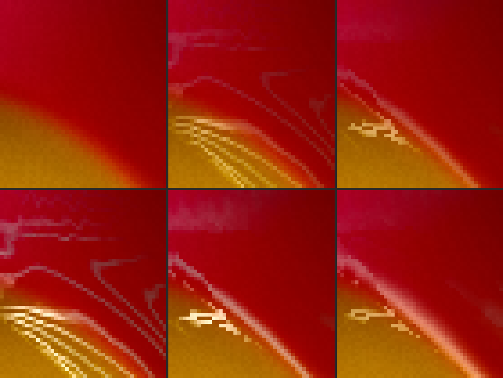
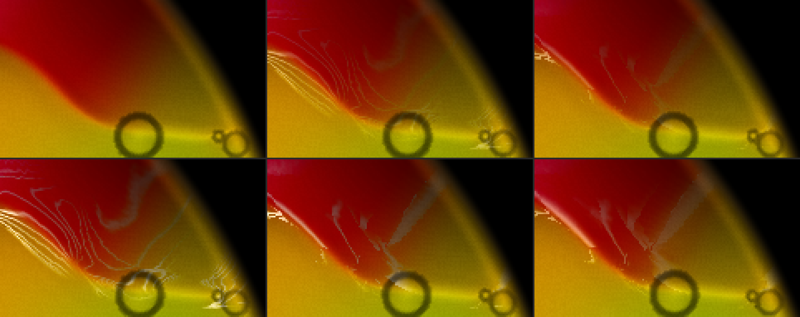
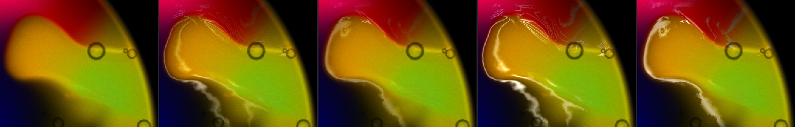
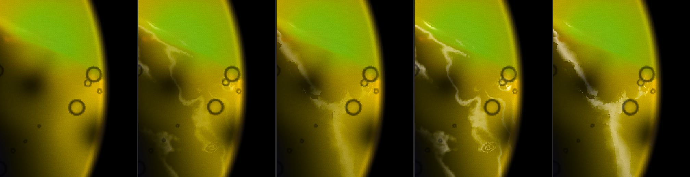
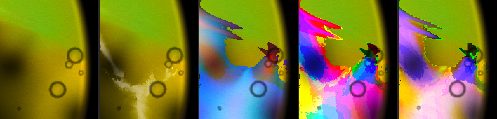
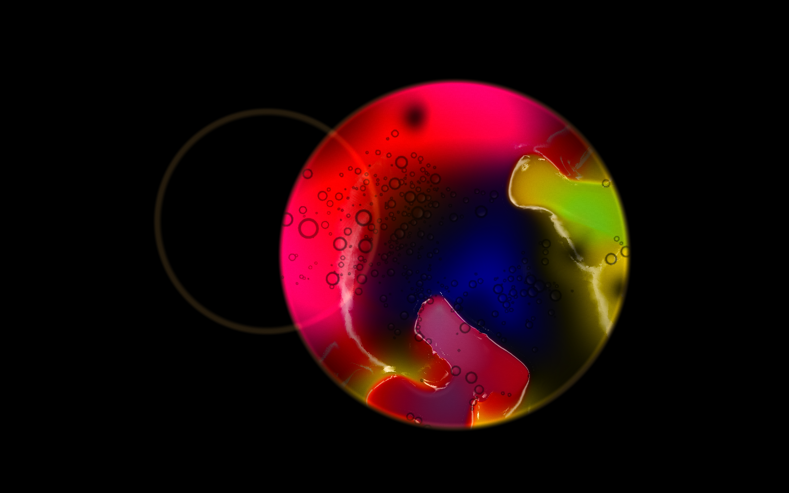
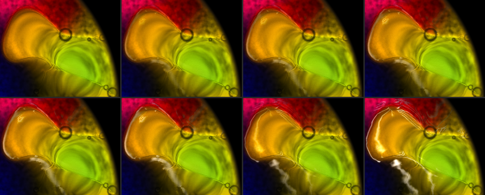
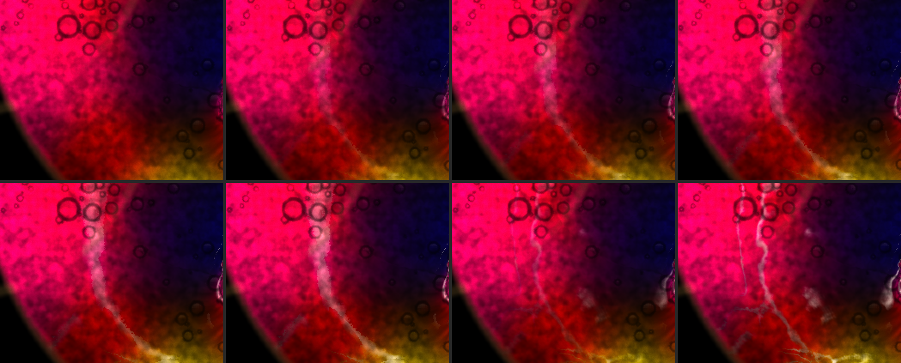
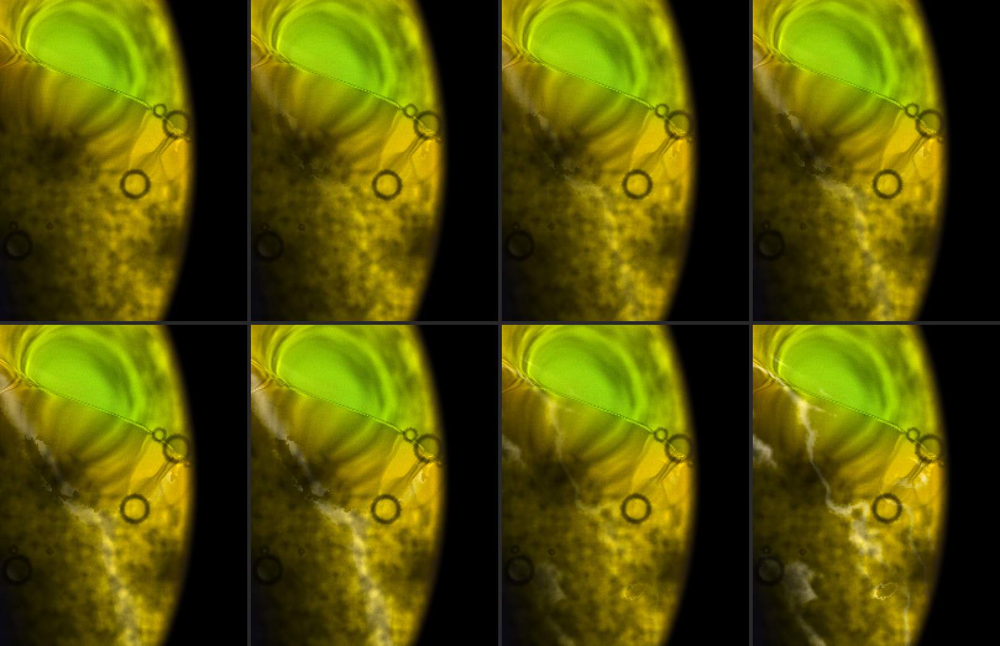

# Mac launch and looks after #49

2026-09-15, night. The Mac is on `main`.

**In short**
- **Launch:** server pid **43741**, show key **7113**, curl 200. Details in §1.
- **`main` is not where the brief expected it.** Head is **69e59ca**, four merges past `e42bd48`: #50 the manual and the bottles, #51 a duplicate Band button, #52 the desk (a look change that does not cut to black), #53 the settings panel as a control surface. `lacing()` itself is byte-identical to #49, so what I measure is #49's shader — but the plate around it is not the one #47 ran on.
- **The stacks are gone, and I can show it directly.** I put #47's construction back into the same shader as a page-only mode, so the old stack and the new thread can be read a frame apart on one plate. Where the old one lays **5–8 parallel lines** across a wide steep band, #49 lays **one**. Details in §2.
- **The forced-braid test passes.** Forcing the curvature term to 1 leaves the thread count where it was (19 runs against 18 across the same eight cuts) and takes the median thread from 3 px to 7 px. Bolder, not more numerous — which is what "by construction" should look like.
- **What replaced the stack on the widest bands is one fat thread, not one thin one.** `wide` is a fraction of `reach`, so a thread's screen width is about a fifth of the band's: a rim gets a 3 px thread and a fifty-cell ramp gets a 15–20 px pale bar. And because the walk stops on an integer step, `reach` and `mid` are piecewise constant over patches, so those wide threads have cell-sized stair-steps on their edges and break into dashes where the patches are small. Both are new. Details in §2.
- **Fillmore: I'd come down to 0.45.** Details in §3.
- **The harness broke again, in the same place and for a new reason.** #49 taught it to pick Fillmore from the title menu. #52's desk made picking from that menu only *cue* a preset: it sits in a cue bar as CUED against ON STAGE, and lands on the glass on **Go**, over a crossfade. So the click loaded nothing and the first page ran Classic Light Show with `lacing` 0. The harness now sets the fade to `cut` and presses Go, and checks `settings.lacing` is 0.55 before it measures. **Anything else driving this app from a script needs the same fix.**

## 1. Launch

- **Pull.** `main` was already at 69e59ca when I arrived and matched `origin/main`, so nothing to fast-forward. I stashed `package-lock.json` first, ran `npm run show`, and popped it after; the popped file is byte-identical to the stashed one and parses, and the redundant stash entry is dropped. The pre-existing `auto-stash before local deploy` entry is left alone. The nested `chromaglass/` clone is untouched.
- **What I am measuring.** `git diff e42bd48 main -- LiquidVisualizer.tsx` touches 287 lines, but none of them are inside `lacing()` — the change is the liquid-phase work (soap that keeps pulling, glycerine that crawls). The walk, `reach`, `mid`, `wide` and the `mix(0.55, 1.0, fold)` weight are exactly as #49 landed them.
- **Build.** `npm run show` = `update && remote`, so it pulled, installed and built: OK in 11.96 s. It does not publish. I did not run `deploy` or `ship`.
- **Restart.** The server I found was **not** pid 36169 — that one had died and a `npm run remote` was running from a terminal as pid 42401 (up 1 h 20 m, build from 20:47, still printing key 5950). I killed it and its npm parent and started `npm run show` under nohup. The log is `~/chromaglass-server.log`. **The key changed, so any tab or display still holding 5950 needs a reload with 7113** — the projector's display reconnected to the new server on its own.

| | |
|---|---|
| Server pid | **43741** |
| Show key | **7113** |
| Phone | http://192.168.0.234:3000/?remote=1&key=7113 |
| Network display | http://192.168.0.234:3000/?cast=true&key=7113 |
| `curl http://localhost:3000/` | 200, 1320 bytes |

- The shader bundle is now `castProtocol-C1Gtztjk.js`. All nine of my patch anchors in `lacing()` appear exactly once in it, and the page-only patch compiles (`__patched` 1).
- **Load at the start:** load average 10.5 (the build had just run), GPU utilisation 43 %. I re-read both before the timing page.
- James's Chrome and the projector are left alone.

### The cue bar, and what it costs a script

Before #52, `[data-testid="preset-menu-fillmore-1969"]` put Fillmore on the glass. Now it arms it:

> ON STAGE — Classic Light Show → CUED — Fillmore East, 1969 — [2s] — [Go]

and the plate keeps running whatever was already on it until Go. My first page of the night measured Classic Light Show at `lacing` 0 and would have reported it as Fillmore. The fix is two lines — select `cut` on `[data-testid="cue-fade"]`, click `[data-testid="cue-go"]` — plus a read-back of `chromaglassDebug().settings` before measuring, which is what caught it. For a live desk the cue bar is right; it is a trap for anything automated, and worth a note in the repo.

## 2. The stacks: **gone.** One thread where #47 drew five to eight

**Method.** As in #47 and #44. Fillmore at `?debug&sim=512` on "GPU · 512² · 1.0x", `Math.random` seeded (mulberry32, 7), Granulation 0 and Plate Cells 0 for the count pages, captures at ~1140 frames, `settings.lacing` written in consecutive rAFs, a lacing-0 frame between every variant, and **every variant read against its own nearest preceding zero** rather than one zero for the page. The mode is the amount's last two decimal places below 1.0; the app clamps `u_lacing` to 1, so "full" is 0.99 throughout. `~/cg-scratch/lace49.mjs` patches the shader **in the test page only** (`__patched` 1; all eleven replaced lines found exactly once in `castProtocol-C1Gtztjk.js`). 0 GL errors and 0 NaN on every page.

**What is new in the method, and it is the thing that makes this readable:** mode 60 puts #47's construction back — `freq` from `span`, `lvl = abs(fract(f) - 0.5)`, `wide` from `mix(0.07, 0.30, fold)`, the `mix(0.4, 1.0, fold)` weight — inside the same shader, so the old stack and the new thread are one frame apart on **the same plate**. #47 could only compare #47 against itself.

Interleaving zeros pays off: drift between neighbouring lacing-0 frames is **0.19–0.36 %** on the main 380 px crop with grain and cells off (0.38–0.67 % with Fillmore's own grain), against the 2.6 % #47 had to carry. Over the whole 19-frame sequence it accumulates to 2.9 %, so the nearest-zero rule is what makes the small numbers mean anything.

### The count

The red → orange band at the top right of the dish, 10× — the same class of place as #47's green → red ramp. Rows: **0 | #47's shader at 0.55 | #49 at 0.55** / **#47 at 0.99 | #49 at 0.99 | #49 with the braid forced at 0.55**.

The same six frames at 4×, with more of the band:

- **#47 lays a fan of 4–6 evenly spaced bright lines across the one band**, plus fainter contour arcs above it. That is the stack, on this plate, from the shipped-before-#49 construction.
- **#49 lays one line**, in the same place, along the boundary.
- I counted it rather than only looking. Eight cuts across the band, counting runs of pixels lifted more than 8 against the zero frame:

| runs per cut, across the red → orange band | per cut | total | median run |
|---|---|---|---|
| #47 at 0.55 | 7, 6, 6, 7, 5, 5, 3, 2 | **41** | 2 px |
| #49 at 0.55 | 4, 4, 2, 1, 1, 1, 1, 1 | **15** | 2 px |
| #47 at 0.99 | 8, 7, 7, 7, 7, 5, 4, 2 | **47** | 2 px |
| #49 at 0.99 | 5, 3, 3, 1, 1, 2, 2, 1 | **18** | 3 px |
| #49, braid forced, 0.55 | 3, 4, 2, 1, 1, 3, 2, 3 | **19** | 3 px |
| #49, braid forced, 0.99 | 4, 2, 4, 2, 2, 3, 1, 1 | **19** | **7 px** |

- **The forced-braid test, which is the one that matters:** forcing `fold` to 1 takes the count from 18 to 19 — inside the noise — and the median thread from 3 px to 7 px. **Bolder, not more numerous.** The level no longer repeats.
- The 3–5 runs the new shader still shows on the leftmost cuts are not a stack. At 10× they are a **patch of broken dashes**, a scatter rather than parallel lines, and they are the same artefact as the stair-steps below.

### The two exceptions from #47

I could not test them by name. This plate is not #47's plate: `main` has four merges of liquid-phase work on top of #49, and the seeded composition at ~1140 frames now has a blue core, a yellow-green lobe and red blobs where #47 had a cyan core and a pale-red blob. **The green → red ramp and the pale-red blob are not on this glass to photograph.**

What I did instead is stronger where it counts and weaker where it doesn't: on **this** plate the old construction reproduces the fault (5–8 lines on a wide steep band, at the real 0.55 and not only at full), and the new one does not. Two more places, whole-boundary crops, **0 | #47 at 0.55 | #49 at 0.55 | #47 at 0.99 | #49 at 0.99**:

- On the lobe's rim, #47 draws a combed fan into the red and a braid on the rim; #49 draws one thread on the rim and nothing in the red.
- On the ramp, #47 draws a fine marbled filigree — **which honestly reads as lace** — and #49 draws one broad soft band.

| main 380 px crop, grain and cells off | #47 at 0.55 | #49 at 0.55 | #47 at 0.99 | #49 at 0.99 |
|---|---|---|---|---|
| lifted > 8 | 3.80 % | **1.91 %** | 4.94 % | **2.98 %** |
| \|Δ\| > 40 | 1.29 % | 0.69 % | 2.46 % | 1.16 % |

Half the coverage, and the half that went is the repeats.

### What replaced the stack: one thread, but on a wide band a fat one

`wide = max(mix(0.10, 0.30, fold) * reach, fwidth(fC) * 0.75)`. `reach` is the whole colour change, and the gradient across the band is `reach` over the band's width, so **the thread's width in pixels is about 10–30 % of the band's width in pixels, whatever that is.** A 10 px rim gets a 2–3 px thread. A 60 px ramp gets a 12–18 px pale bar. Measured over the pixels the real shader laces (maps read back through the display pass, so ±0.1):

| laced pixels, p50 | `al` | `span` | `reach` p10/50/90 | `kP` (steps walked) | `wide` |
|---|---|---|---|---|---|
| the red → orange band (was 5–8 lines) | 0.19 | 0.27 | 0.01 / 0.27 / 0.35 | 1.4 | 0.072 |
| the yellow lobe's rim (a real boundary) | 0.35 | 0.46 | 0.11 / 0.34 / 0.72 | **0.8** | 0.070 |
| the green → yellow ramp | 0.18 | 0.69 | 0.17 / **0.96** / 1.00 | **3.9** | **0.165** |
| the pink → blue boundary at the left | 0.22 | 0.73 | 0.59 / 0.83 / 1.00 | 2.2 | 0.129 |

- **At a real boundary the walk stops after about one step** (`kP` p50 0.8) and `wide` is 0.07 — the thin bold thread the change wanted.
- **On a wide ramp the walk runs almost to its limit** (`kP` p50 3.9 of 5) , `reach` saturates my map's clamp, and `wide` more than doubles. That is the pale bar.
- So the fault did not simply go: on the widest bands **it changed shape, from several thin lines to one thick one.** That is much better — a thick line is a boundary drawn boldly, and a stack is a contour map — but it is not "a thread".

### The walk's step is an integer, and it shows

`kP` and `kM` are step counts, so `reach`, `mid` and `wide` are **piecewise constant over patches** of the plate and jump by a whole step's worth of colour at a patch border. The `kP`/`kM` map shows it plainly. Order: **0 | #49 at 0.99 | map `al`, `span`, `reach` | map `kP`, `kM`, `band` | map `reach`, `wide`, `band`**:

The fourth panel is flat plateaus of colour with hard jagged borders, tens of pixels across. Every one of those borders is a place where the thread's centre and width step. On the plate that reads as the **cell-sized stair-steps** along the wide threads' edges, and as the **broken dashes** where the plateaus are small — both visible at 10× above, and both new since #47. Neither is expensive to fix in principle: the walk could carry a fractional stop (interpolate the last step against `step`) instead of a whole one, which would make `reach` continuous and cost nothing extra.

### The whole plate at full lacing

One bold thread along every blob rim, the ramps clean, and no contour map anywhere on the dish.

## 3. Fillmore's value under the grain: **I'd come down to 0.45**

Fillmore's own grain 0.5 and cells 0.2, seeded, one frame apart, with a lacing-0 frame before every value and each value read against **its own** zero. Drift between neighbouring zeros is 0.38–0.67 %, so these differences are real. Rows: **0 | 0.35 | 0.45 | 0.55** / **0.65 | 0.75 | #47 at 0.55 | #47 at 0.99**.

The yellow lobe's rim — a real boundary:

The pink → blue boundary at the left:

The wide green → yellow ramp — the place the fat thread happens:

| main 380 px, Fillmore's grain and cells | 0.35 | 0.45 | 0.55 | 0.65 | 0.75 | #47 at 0.55 |
|---|---|---|---|---|---|---|
| lifted > 8 | 1.68 % | 1.74 % | 1.95 % | 2.25 % | 2.24 % | **3.95 %** |
| \|Δ\| > 40 | 0.18 % | 0.42 % | 0.62 % | 0.79 % | 0.89 % | 1.09 % |
| whole dish, lifted | 2.93 % | 3.34 % | 3.78 % | 4.15 % | 4.47 % | 3.85 % |

**The thread reads far earlier than it used to.** In #47 the core's thread only began to read under the grain at 0.65–0.75, and by then the stack was the brightest thing on the plate. Here it is plainly visible at **0.45**, and at 0.55 it is unmistakable. That is the boldness #49 bought: the same value now puts roughly half as many lifted pixels on the plate but each one of them counts.

**Why I would come down rather than stay.** The rims are well served at 0.45. What 0.55 and above buys is mostly on the wide bands, and there the extra weight goes into the pale bar, not into a thread — at 0.65 and 0.75 the ramp's bar is a bright smear with the stair-steps showing, and it becomes the most visible lacing on the plate. That is the same failure mode as #47's stacks in a new shape: the value that makes the rims right makes the wide bands shout.

So: **0.45**, and the difference is small enough that if you disagree, 0.55 is not wrong — it is a look, not a fault, and the plate no longer has a contour map at either. **If the fat thread gets capped** (a `wide` that does not grow without limit with `reach`), I would expect 0.55 to be right again, because then the extra weight would go where it is wanted.

Against #47's own shader on the same plate, at 0.55, under the same grain: #47 lifts 3.95 % of the main crop and #49 lifts 1.95 %, and the #47 frames in those three sweeps are the busier, more filamentary ones. On the ramp #47's filigree honestly reads more like *lace* than #49's single soft band does. On the rims #49 wins outright.

## 4. The small dish: **still unlaced, and it is not the walk that stops it**

| the second dish's region, lifted > 8 | |
|---|---|
| #49 at 0.55, grain and cells off | **0.05 %** |
| #49 at 0.99 | 0.13 % |
| #49 across every mode I ran (braid, no-walk, hair, 0.35–0.75) | 0.03–0.16 % |
| #47's shader at 0.55 / 0.99 | 0.06 % / 0.16 % |

Effectively nothing, at every value and in both shaders — the same place #47 left it.

**And the reason is upstream of the walk, which is what you asked.** Over the handful of small-dish pixels that lift at all, `span` p50 is **0.01** against 0.46–0.73 on the main dish's real boundaries. `band = smoothstep(0.05, 0.3, span) * smoothstep(0.08, 0.20, al)` is therefore near zero, and `if (band < 0.004) return color;` sits **before** the walk in the shader. So the walk is never entered there: it does not "fail to find a boundary", it is never asked. That matches #44's `al` p90 of 0.056 in that dish.

**Is it right?** Yes, for what the dish is. The plate drawn small has no colour change steep enough over a cell to be a boundary, and the thing #43 was fixing — a contour map turning into stipple when its lines fall under a pixel — cannot come back if nothing is drawn. It does mean the second dish gets none of this look, at any value, and no setting on the desk changes that. If you want lacing in the small dish it has to come from the dish drawing the plate larger in fluid space, not from the lacing pass.
